Get ready to supercharge the user experience with CloudPBX portal version 1.9.1! We're thrilled to unveil our latest update, packed with exciting features and enhancements to take cloud PBX productivity to new heights. Your feedback has been instrumental in shaping this release, and we're excited to share the results with you.

Let's dive in and explore the incredible enhancements awaiting you:
<!--truncate-->

### Import Extensions Effortlessly
Now, CloudPBX administrators can easily import extensions from a CSV file using our streamlined process. This will vastly simplify the process of setting up a cloud PBX environment for new business customers – especially when they are switching to your CSP from another provider. In this video, we explain all the benefits of this useful new feature and answer a few FAQs.
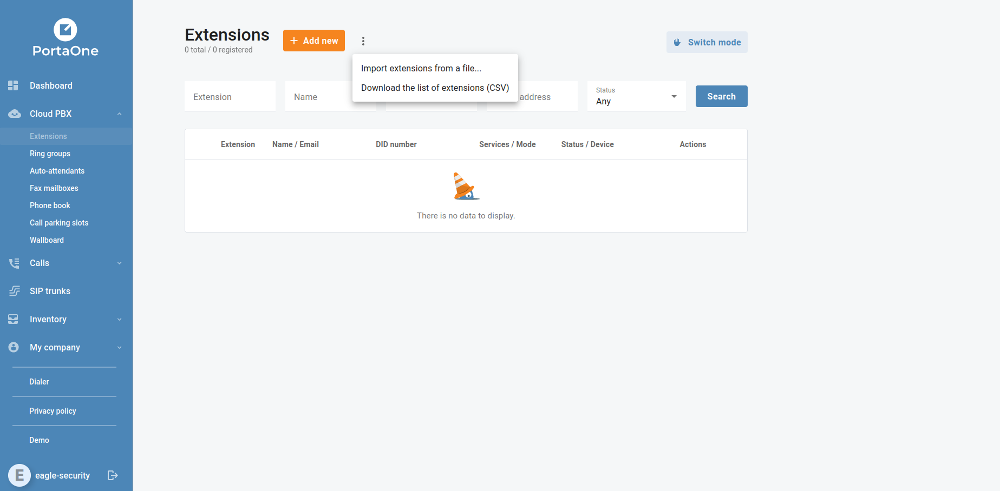

### Flexible Portal Configuration for SIP Trunk Management
If you are a Voice Service Provider, delivering those services to business customers over a SIP trunk is a key revenue stream – but how can you prevent churn and losses due to fraud and inefficiencies? Configure your portal to create active or inactive SIP trunks with ease: an "Active" SIP trunk is ready for immediate use, enabling seamless call delivery to and from a customer's PBX. Conversely, an "Inactive" SIP trunk requires manual activation by the service provider before it can be utilized. This may be required if you need to manually activate SIP trunks configured by your customers. Watch [this video](https://www.youtube.com/watch?v=M0IS5QXivnA) to learn how you can provide your customers with an easy way to manage their PBX systems, MS Teams, and call centers, while allowing you to offer competitive prices, more flexibility, and better customer service.
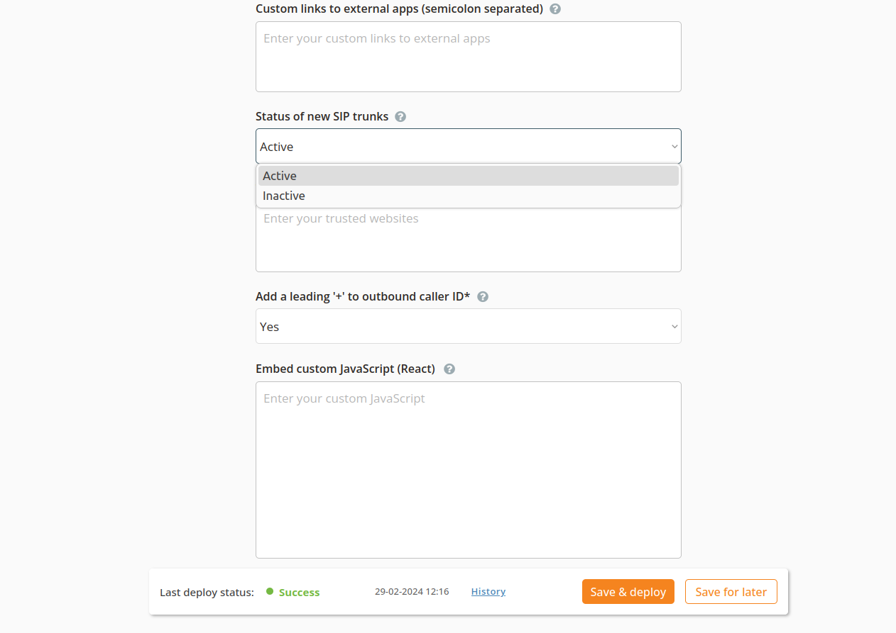
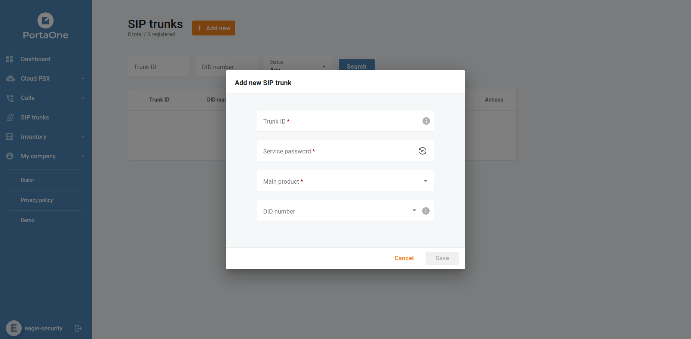

### Enhanced Call Control
Introducing a powerful switchboard feature that empowers users to manage current calls efficiently, including options to hold, disconnect, transfer, or add more participants. [In this video](https://www.youtube.com/watch?v=XM3tvqwoDa0), we will show you how this powerful feature can dramatically improve the efficiency of cloud call center operations while empowering managers, receptionists, and agents with more ways to optimize their customer experience and their time – even when understaffed.
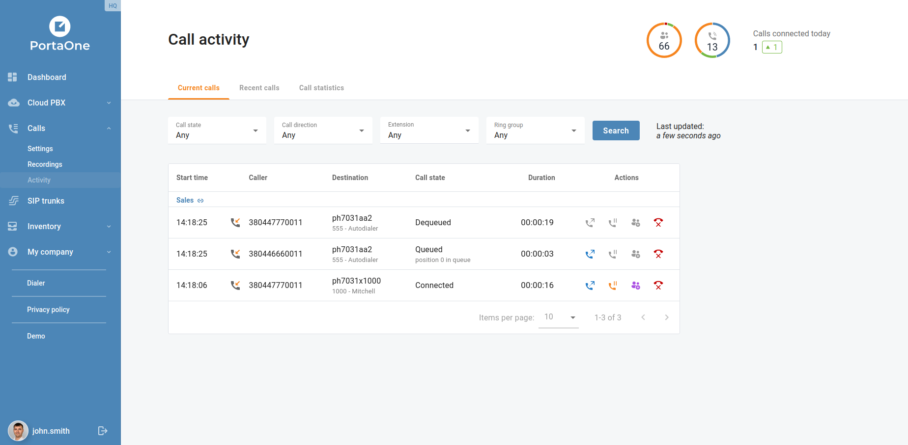

### Dark Theme for Wallboard
Customize your viewing experience by switching to a dark theme in full-screen mode on the Wallboard.
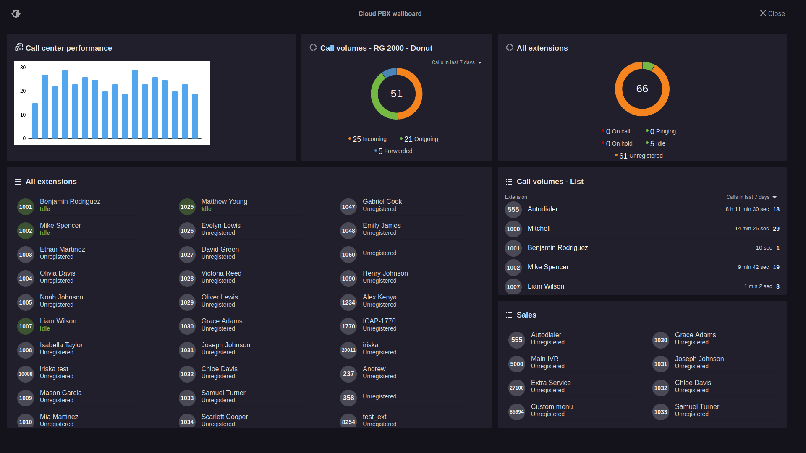

### Efficient Call Dispatch
Let your business customers ensure optimal agent utilization by efficiently dispatching calls to busy agents within call queues.
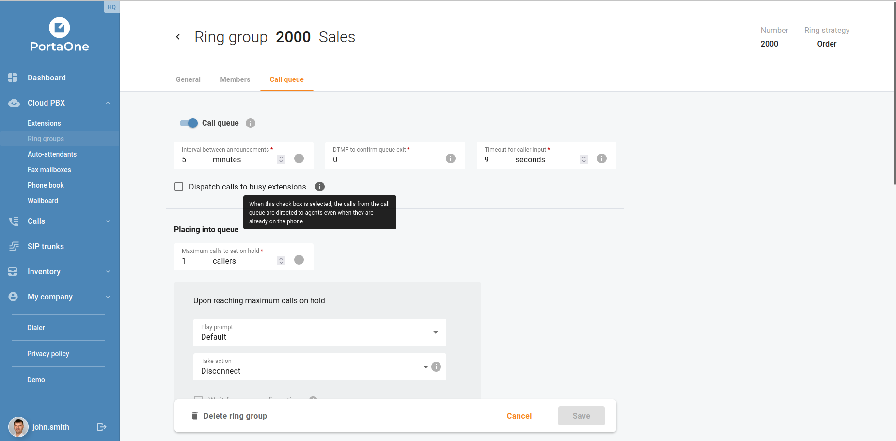

### Call Queue Exit Options
Do your business customers struggle with super-busy call queues? [In this video](https://www.youtube.com/watch?v=WyRAJ4buRPk), we will tell you how you can help your cloud PBX and call center customers avoid the two scenarios that are 100% certain to frustrate their callers: the dreaded disconnection, and getting caught in an endless wait loop. Learn how this flexible call queue configuration can help your business customers provide better service while reducing their call abandonment rate. Users now have the flexibility to configure exit options for callers within call queues, enhancing caller experience.
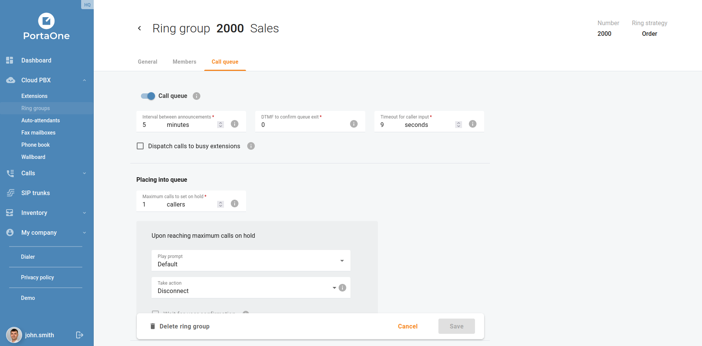

### Automatic Call Retrieval
Cloud PBX and call center customers can enable automatic retrieval of parked calls for enhanced efficiency and productivity: If the parked call was not retrieved within a configured period, call back the party who had parked it.

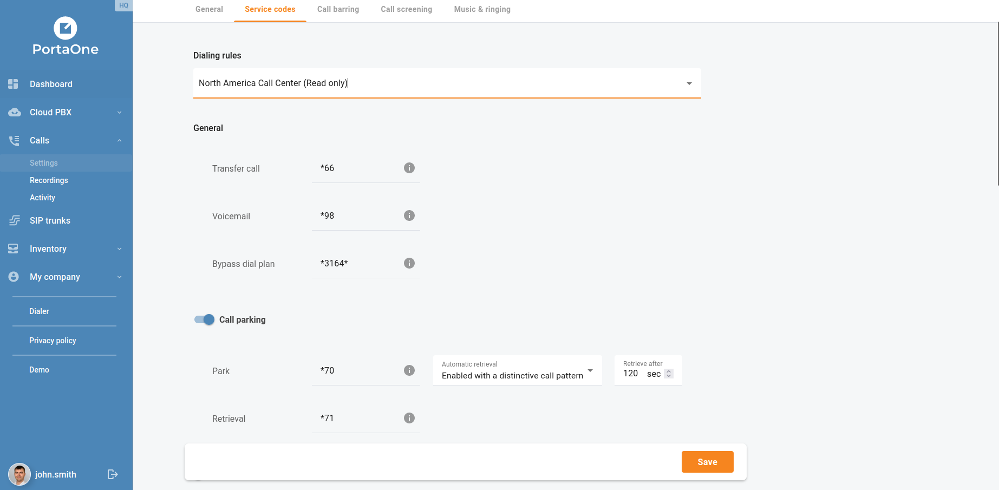

### Insightful Call Statistics
Let your cloud PBX and call center customers gain valuable insights into call performance with detailed call statistics.
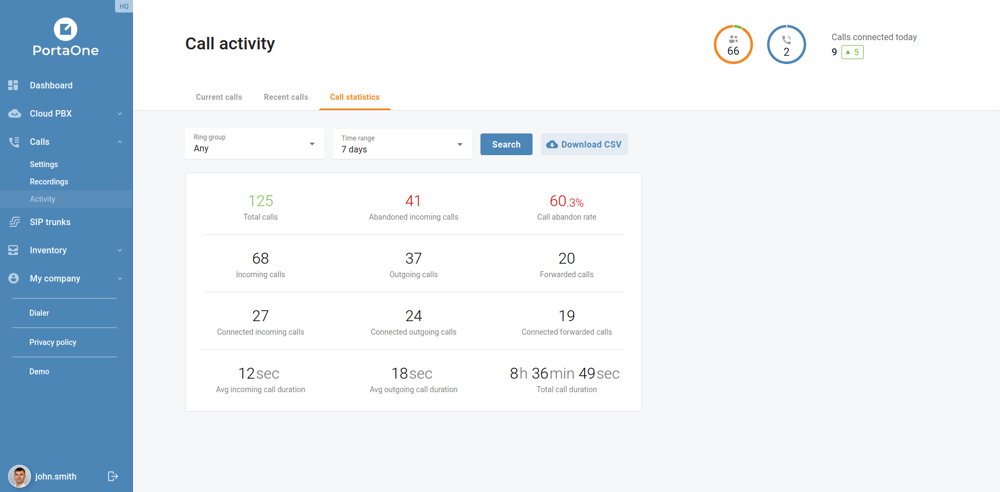

### Automated Wrap-Up Scheduling
How can agents handle dozens of incoming calls without sacrificing customer service? And how can call center managers support these front-line heroes to do their best work without burning out? Let them configure automated wrap-up scheduling for ring group members seamlessly. [In this video](https://www.youtube.com/watch?v=rJVTz3cuSnY), we will explain the flexibility of this solution in action to help you deliver a flexible, powerful cloud call center product to your enterprise customers.
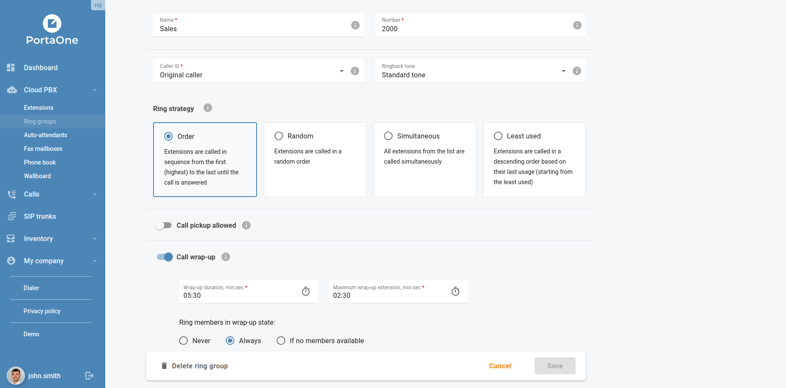

### Customized IVR Language
Now, businesses can set their preferred IVR language for extensions, auto-attendants, and SIP trunks for a more personalized experience.
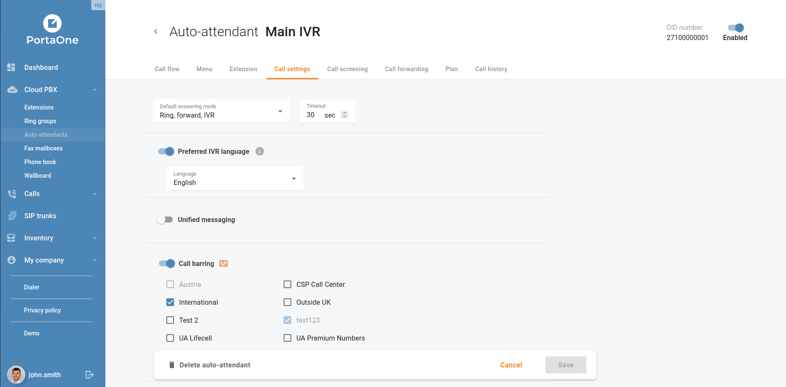

### Dashboard Enhancement
Let call center managers easily monitor the performance of agents with the new ring group widget on the dashboard.
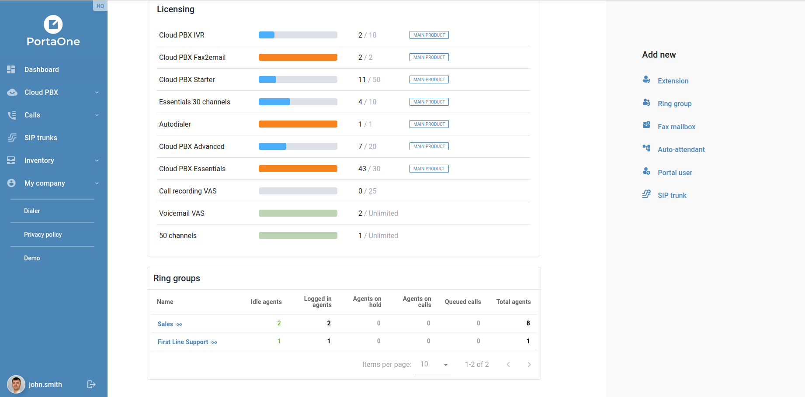

### Billing Transparency
Prepaid customers whose taxes are assessed at the moment of payment, will now clearly see that their taxes will be calculated and added to the amount charged with auto-payments. This will help you avoid disputes and ensures the billing transparency.
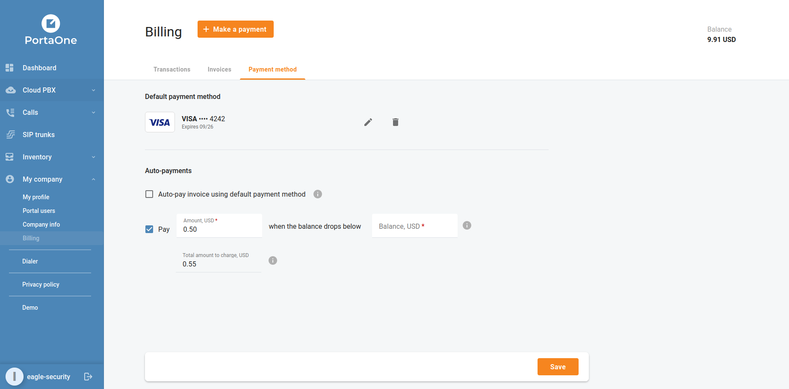