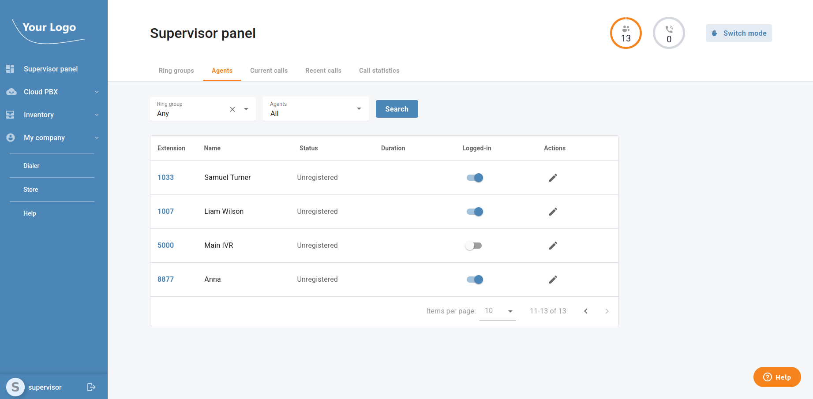
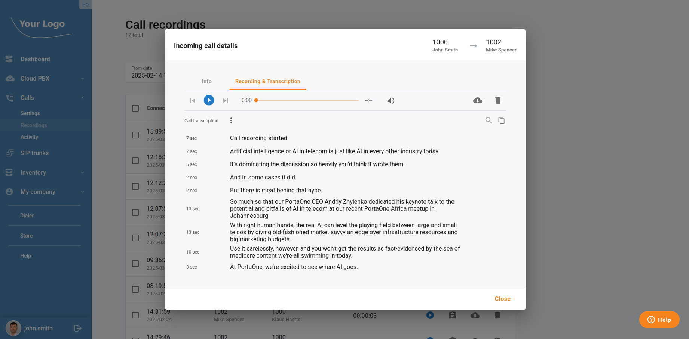

Exciting updates ahead! CloudPBX portal 3.3.5 is here for you, and it's all about making your customers' experience smoother, smarter, and more efficient. We've fine-tuned the platform with new features and optimizations based on what matters most to you. Dive in and see the difference! This article summarizes the changes in the portal between PortaSwitch MR110 and MR115.

<!--truncate-->

### Park/Retrieve Calls Using a Single Key on IP Phones

If cloud PBX and call center customers want to park and retrieve calls quickly and conveniently with a single button, they can now create parking slots to be used with line keys on the IP phones. PBX users can manage calls faster without having to remember and manually dial parking/retrieving codes and extensions. [In this video](https://www.youtube.com/watch?v=QxI0k3YrZBA), we explain all the benefits of this useful feature and answer a few FAQs.

### Supervisor Panel

Now, call center supervisors can view, listen to, or join calls-in-progress from a single, simple dashboard, with features like Spy, Whisper, or Barge-In mode. Using these tools, supervisors can evaluate, train, and provide backup to a company’s front-line customer service experts. Watch [this video](https://www.youtube.com/watch?v=gD1byz8vY1c) to learn how the supervisor panel can help call center supervisors increase their team’s efficiency and deliver an excellent customer experience.

### Transcription of Call Recordings

Let your cloud PBX and call center customers access transcriptions of their call recordings: an AI-driven service available via the [Add-On Mart](https://www.portaone.com/add-on-mart-modules/speech-to-text-whisper/), which can be offered to the customers who use the call recording feature. The speech-to-text integration allows you to connect to different AI transcription models based on your preferences or the language of the region where you provide your services. Watch [this video](https://www.youtube.com/watch?v=h4ctgI7Nk8k) to discover how call transcription makes accessing critical information a breeze!

### Colleague Status Visibility for Call Transfers & On-Spot Conferences

Now, users can easily see the real-time availability of their colleagues when transferring a call or adding a participant to a conference. This enhancement ensures smoother communication by displaying colleague statuses directly within the dialogue window, helping users make informed decisions and avoid unnecessary disruptions. Whether transferring a call or setting up a group discussion, this feature streamlines collaboration and improves overall call efficiency.

### **Call Console with Real-Time Updates**

Now, users can see a list of active calls that is constantly updated in real time, meaning there is no longer any need for time-consuming manual refreshes. Managers and supervisors can see changes in call status, call duration, and agent involvement as they happen, without any delays. So if a call is transferred or an agent joins a conference call, those updates will immediately appear in the Call Console. This allows your cloud PBX and call center customers to monitor and manage calls with greater accuracy and efficiency. In [this video](https://www.youtube.com/watch?v=nxF-urxkLgc), we demonstrate the way managers can use the new real-time information display to stay on top of call activity. Say goodbye to manual refreshes and hello to instant updates on call statuses, durations, and agent activity—instantly.

