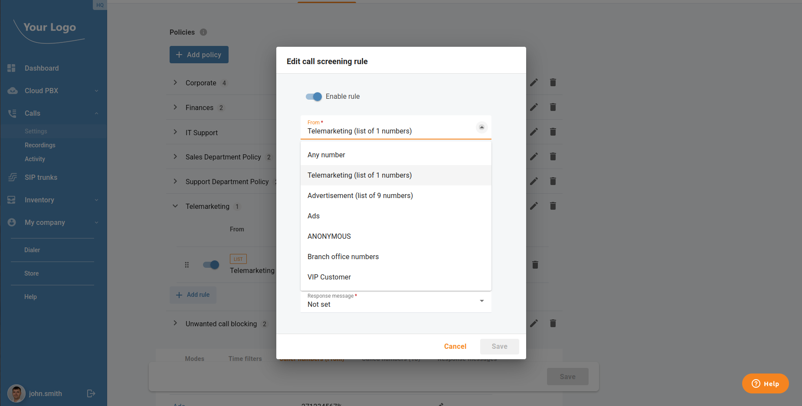
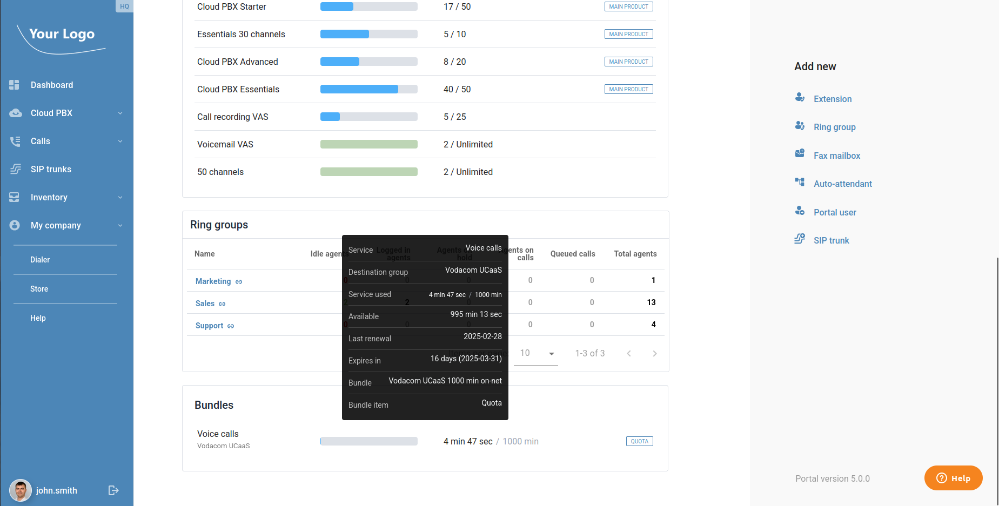
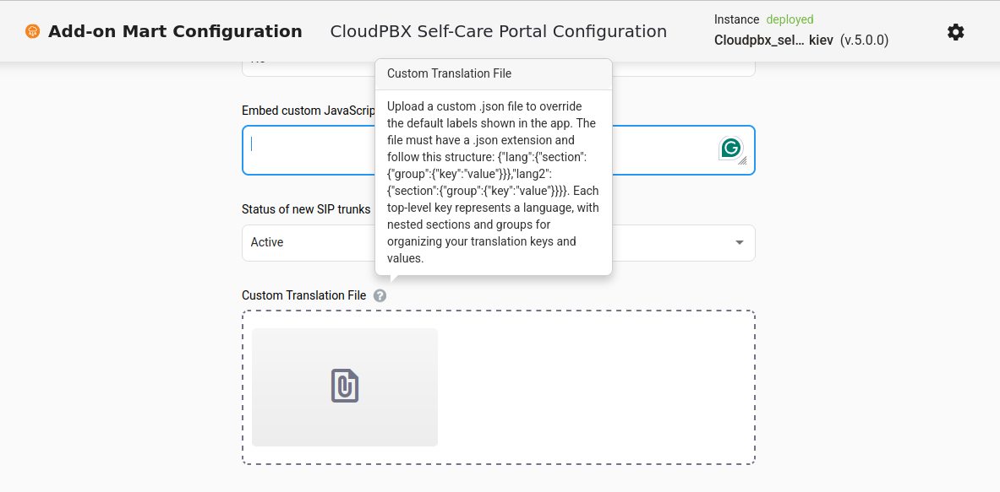
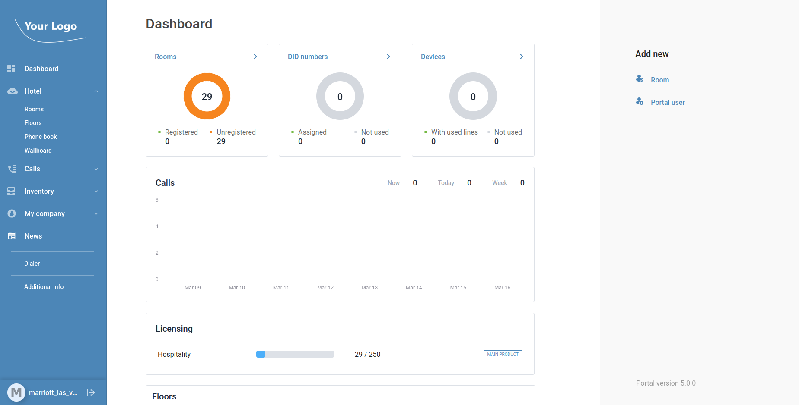
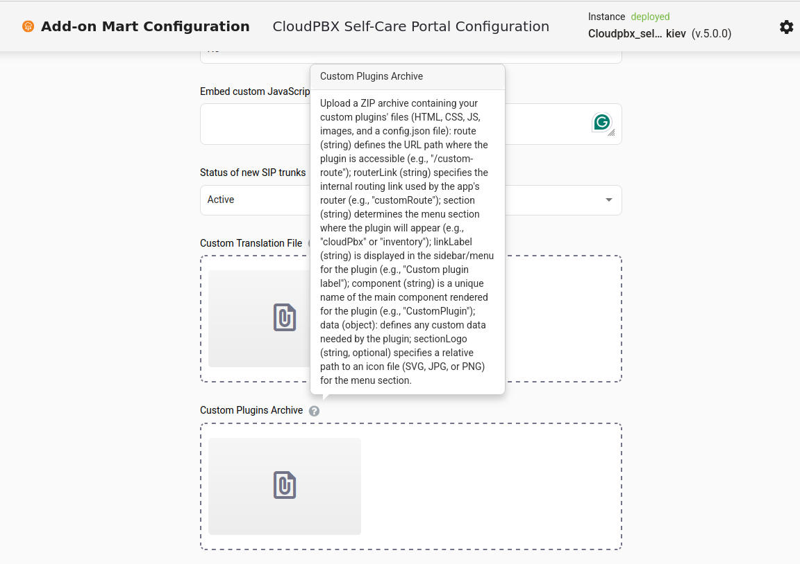
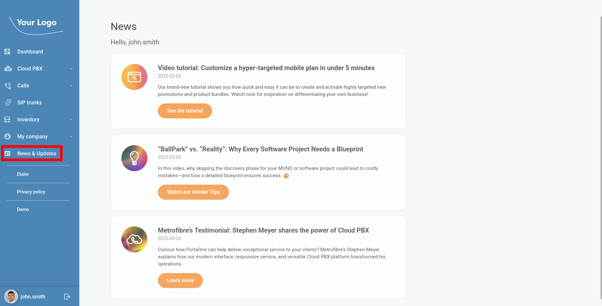
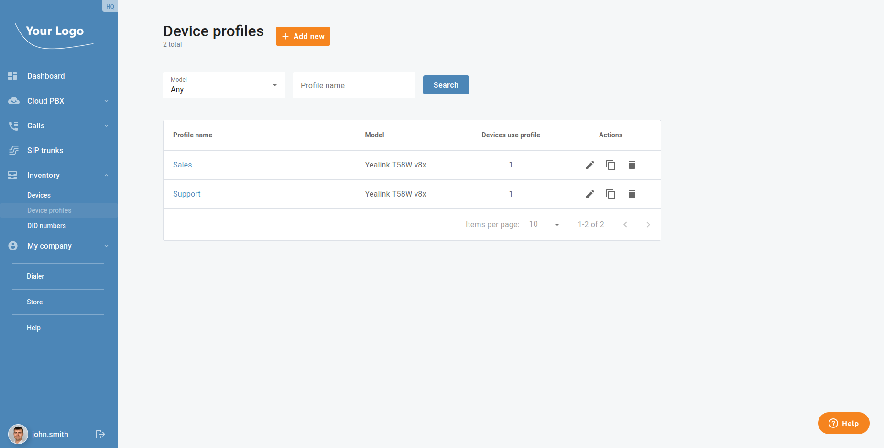
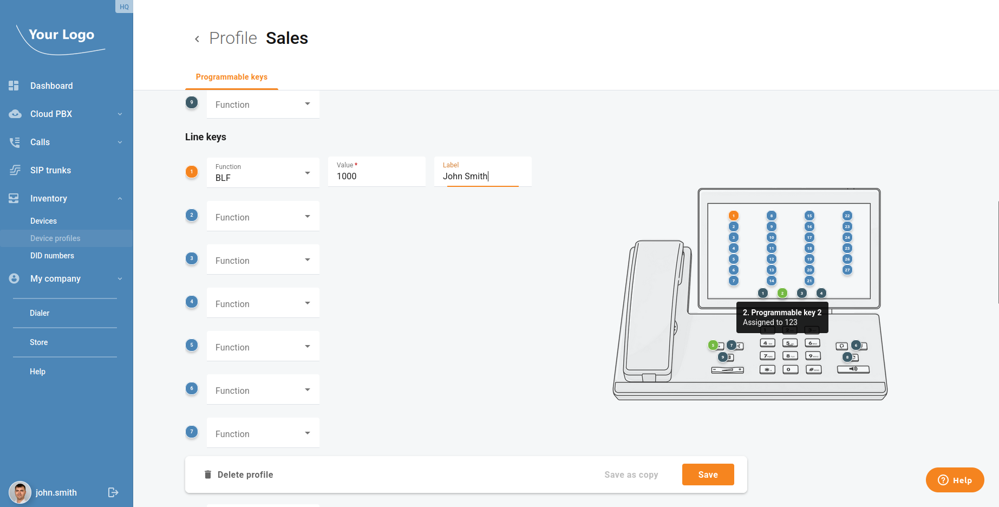
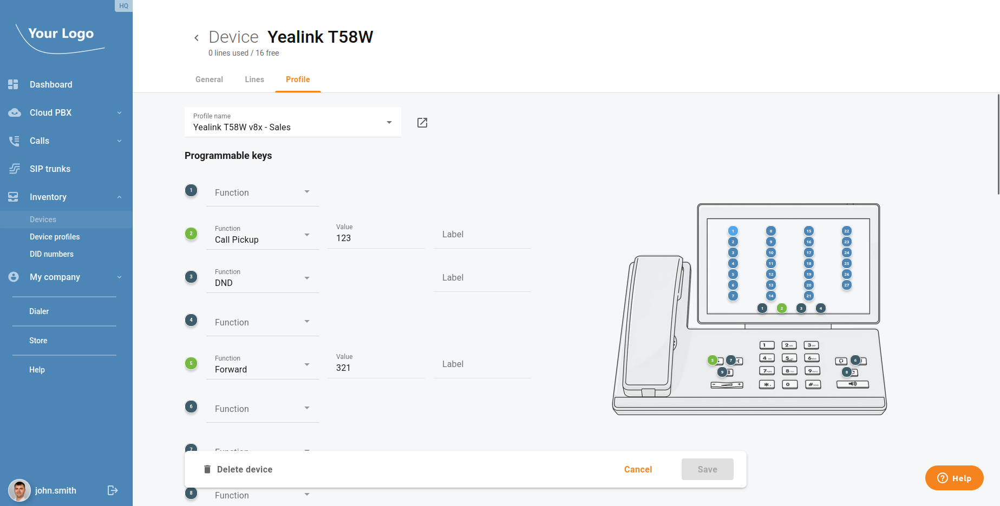
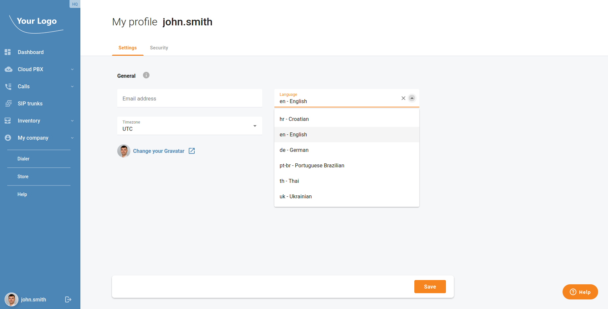

Explore the latest innovations in the CloudPBX portal with versions 3.3.x to 5.0.x! We've been working hard to refine features and introduce new tools to make your customers' communication experience more seamless and efficient. From smarter call management to improved collaboration, this update is packed with upgrades designed to boost productivity. Let’s dive into what’s new! This article summarizes the changes in the portal between PortaSwitch MR115 and MR120.

<!--truncate-->

### Easier Management of Call Screening Rules

Now, cloud PBX customers can create call screening rules based on the centralized phone number lists, e.g. "Telemarketers". Call screening rules include a condition, like “list of numbers from which calls originate,” and an action, such as “reject” or “send to voicemail.” Previously, these number lists were managed individually for each cloud PBX environment.

### Company Bundle Overview

Now, your customers can easily see all active bundles available for their company directly in the CloudPBX portal. This feature provides a clear overview of services, usage limits, and remaining quotas, helping businesses track their communication resources more effectively. With better visibility, companies can optimize their call plans, avoid unexpected overages, and ensure they are making the most of their subscribed services.

### Custom UI Label Localization

You as a service provider can now tailor the CloudPBX portal’s interface by preparing a JSON file with your preferred terminology, uploading it, and deploying the changes seamlessly. This feature allows for industry-specific customization, multilingual support, and brand consistency, ensuring a more intuitive experience for end users. By localizing labels, service providers can enhance usability, reduce confusion, and better align the portal with the customers’ needs.

### Custom Menu & Submenu Configuration

As a service provider, you can now enhance the portal flexibility by defining custom menus and submenus tailored to your users' needs. Embed your own web applications (e.g., CRM, number porting systems, or ticketing platforms) directly into the CloudPBX portal, allowing your users to access everything in one place without switching between apps.

### Self-Provisioning of Programmable Keys for Yealink T58W

Your cloud PBX and call center customers who use Yealink T58W can now configure phone keys for specific functions – such as monitoring extensions (BLF), call parking, or speed dialing – and apply this configuration to multiple IP phones. This feature eliminates the need to contact the service provider or manually configure each phone through its web interface. Contact our [Sales team](https://www.portaone.com/#contact) if you need this feature for other phone models.

### New Languages Supported by the User Interface

The CloudPBX portal has been enhanced to support additional languages, specifically **Thai** and **Croatian**. This improvement allows users who speak these languages to interact with the portal in their native tongue, providing a more seamless and accessible experience. The language support ensures that users can easily navigate and manage their CloudPBX settings without any language barriers. This update is part of the continuous effort to make the portal more user-friendly and adaptable for a global audience. Watch [this video](https://www.youtube.com/watch?v=kw8J469MjEw) to learn how to create and deploy a localized version of your CloudPBX portal in just 2-3 weeks.

