Explore the latest innovations in the CloudPBX portal from versions 6.x.x through 7.x.x. We’ve focused on refining existing features and introducing new tools to enhance your customers’ communication experience. From smarter call management to better collaboration, this update is packed with improvements designed to boost productivity. Let’s take a look at what’s new. This article summarizes the portal changes introduced between PortaSwitch MR120 and MR125.

### Talk time statistics

Users can now view talk time statistics in the portal and download a consolidated “total talk time” report for further analysis and sharing.

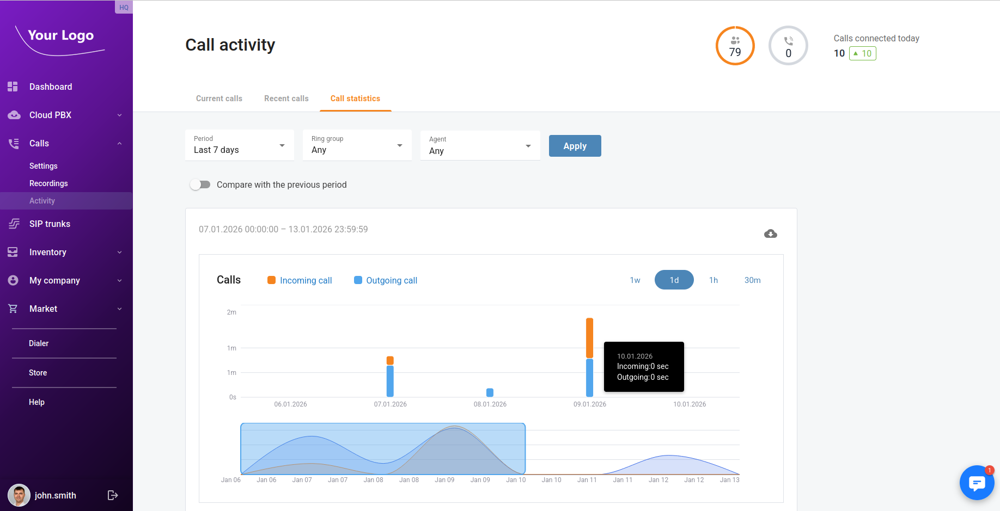

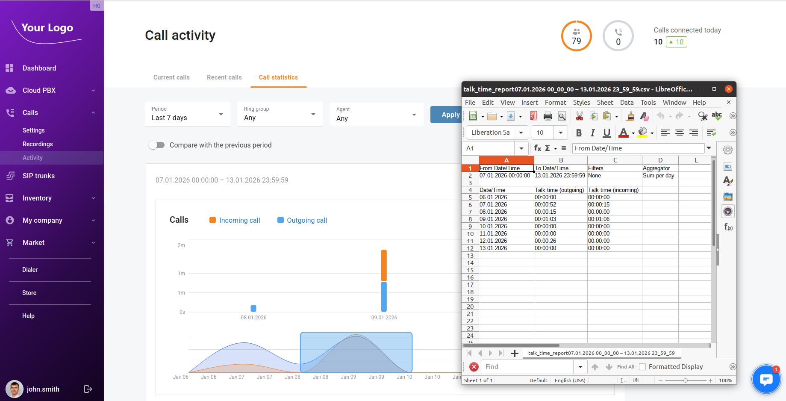

<!--truncate-->

### Audio preview for ring groups, call queues (MOH / ringback / prompts), and extension voicemail greetings

Users can play audio files directly in the portal, including system prompts, Music-on-Hold files, ringback tones for ring groups/call queues, and voicemail greetings.

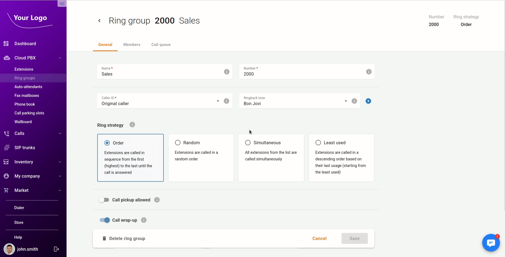

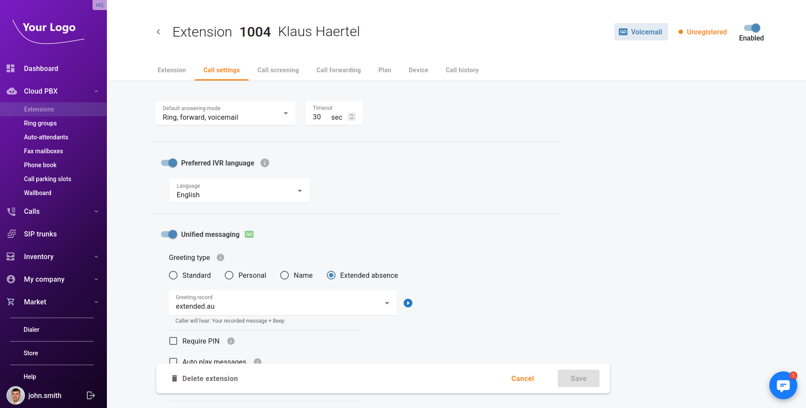

### Extension quick actions (shortcuts)

Users can use quick shortcuts to perform common actions on extensions—copy SIP credentials, access voicemail, and delete an extension—faster (e.g., from an extensions list, jump directly to a specific action instead of navigating multiple screens).

### Voicemail access in the portal

Users can access voicemails from the portal (e.g., browse messages, open details, and manage them).

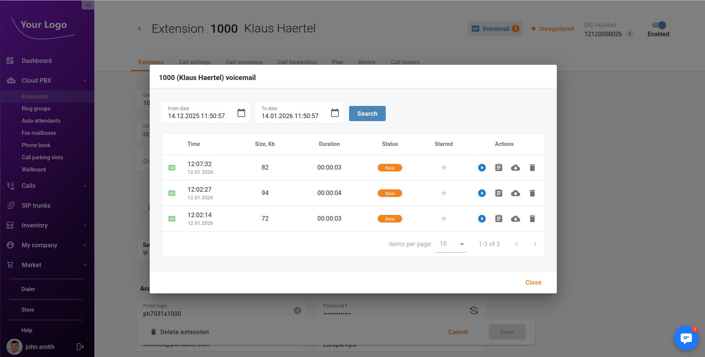

### Extension caller ID settings (display name and number)

Users can configure the outgoing caller ID for extensions by setting a display name and number.

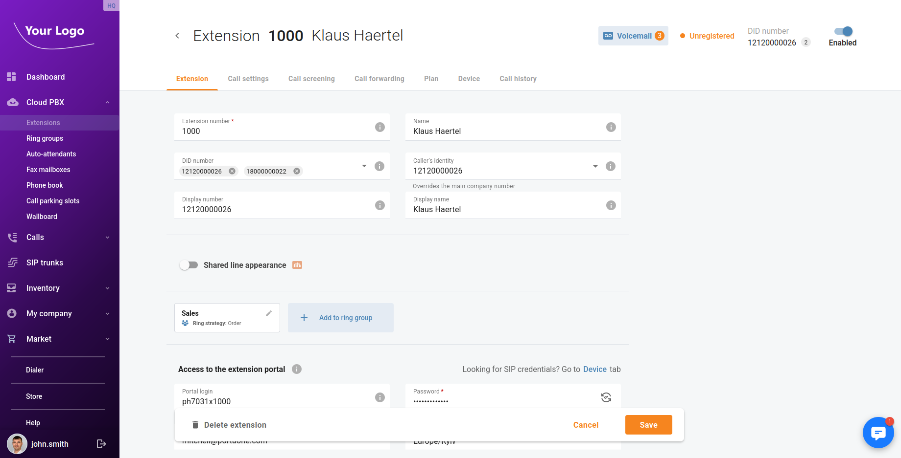

### New supported IP phone models: programmable keys for Yealink and Polycom

The portal now supports programming phone keys for additional IP phone models—Yealink SIP-T54W/T53/T53W/T33G and Polycom VVX 300/301/310/350/450—plus phone book provisioning for the Yealink models listed.

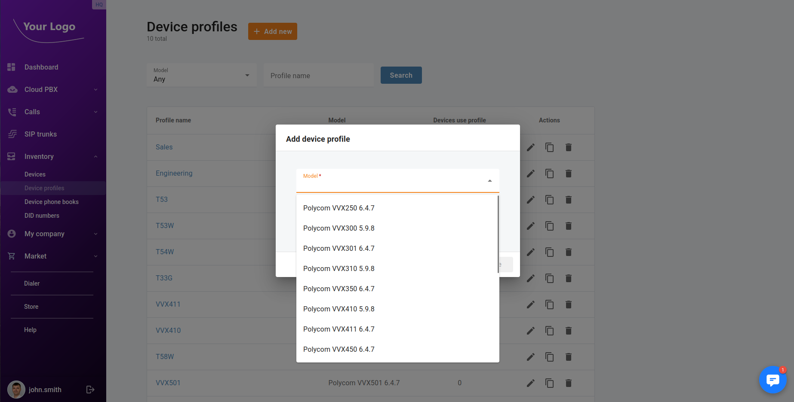

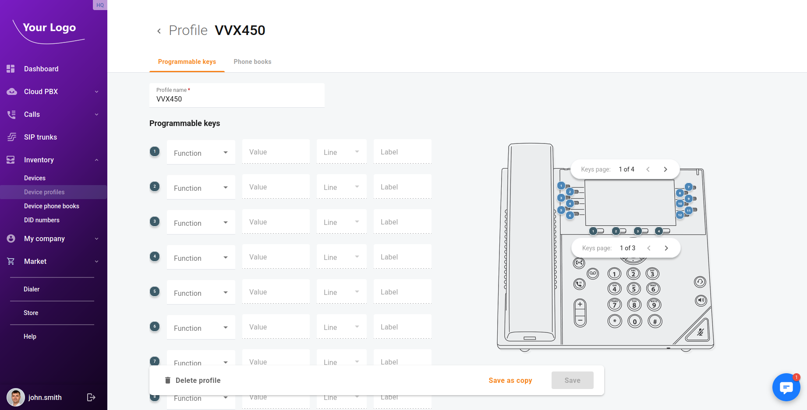

### Navigation panel gradients

The UI theme now supports gradient backgrounds—not just a single color—for the navigation panel, enabling more flexible branding and visual customization.

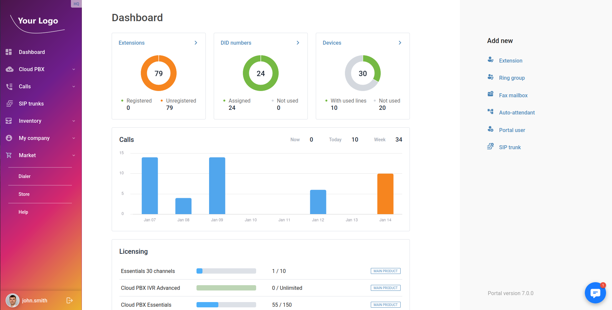

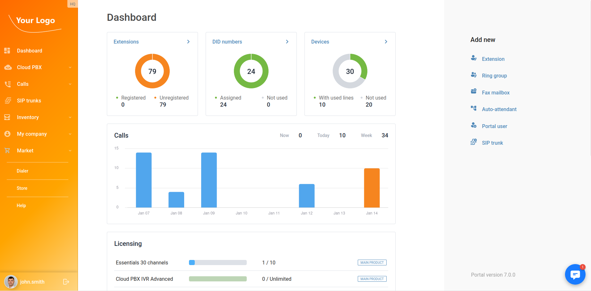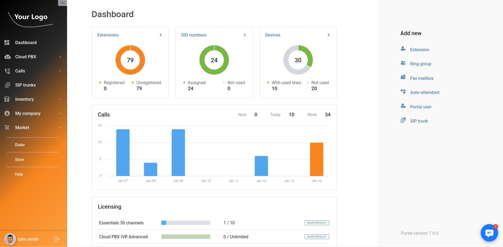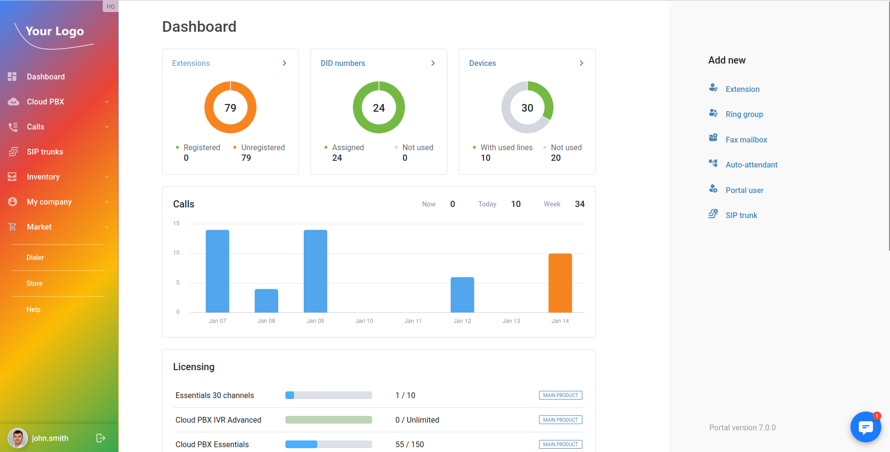
