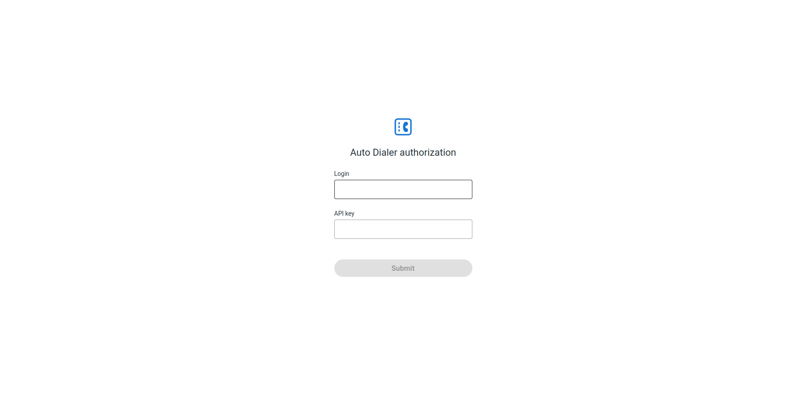
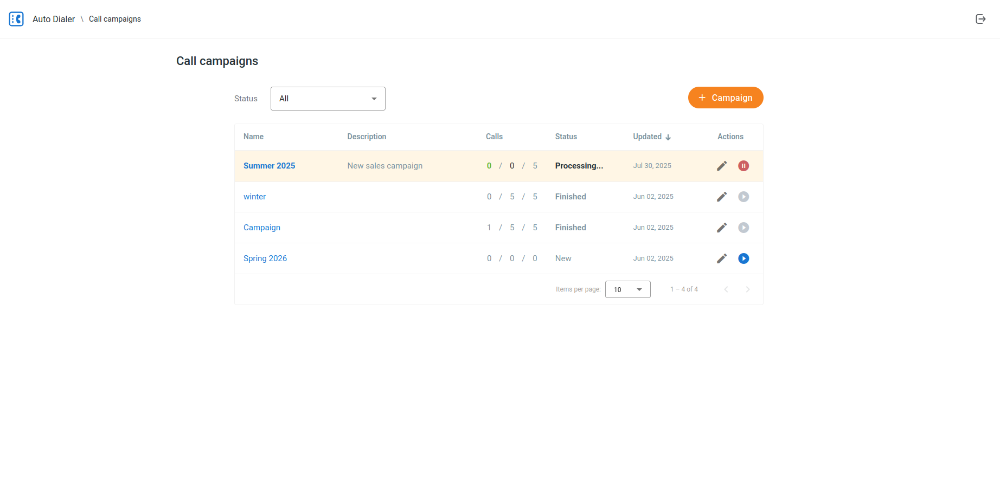
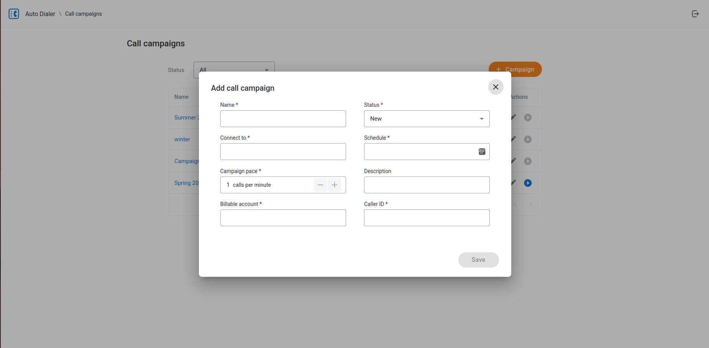
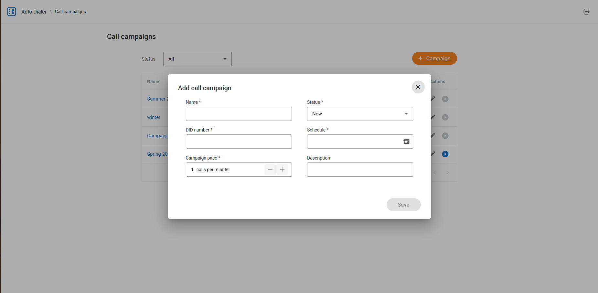
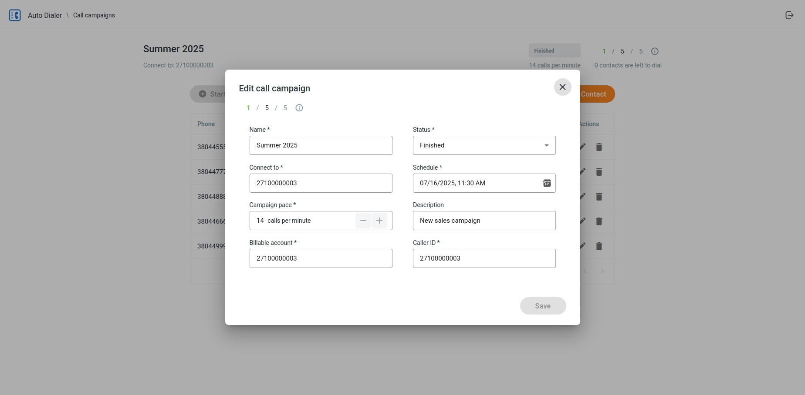
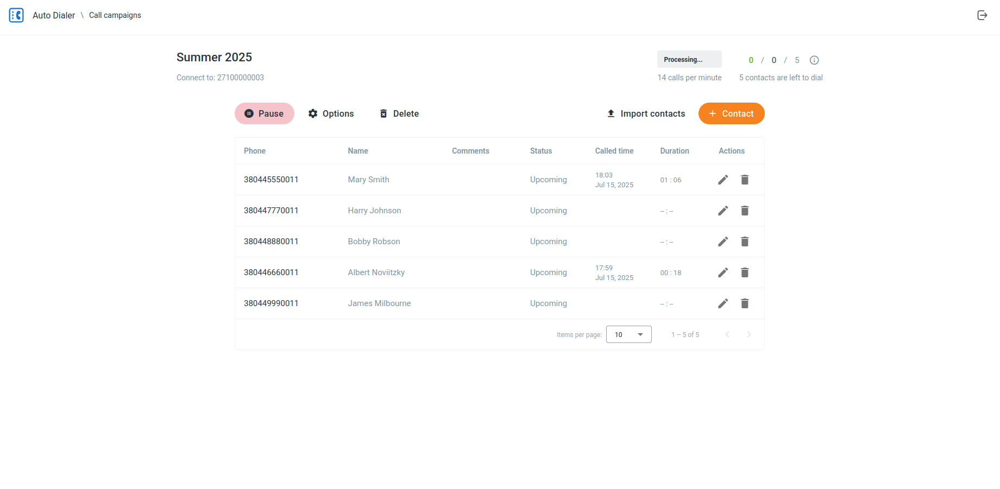
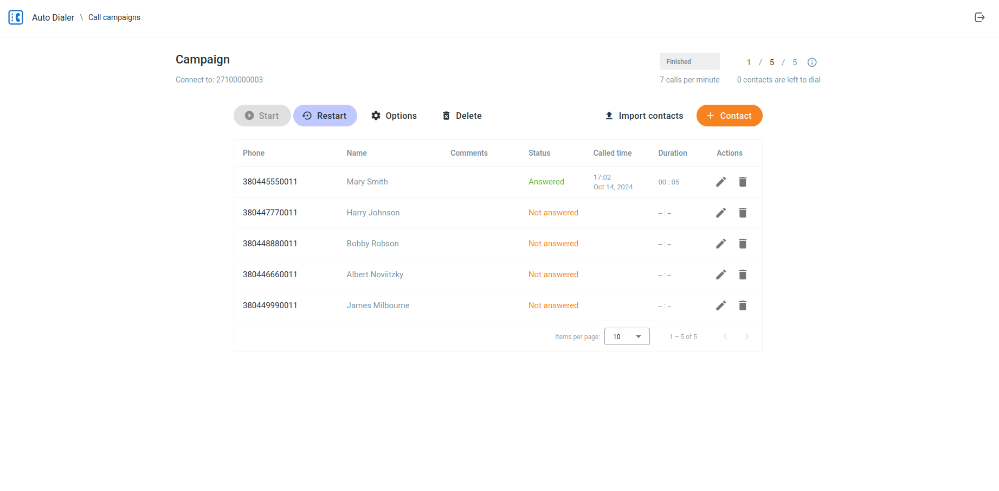
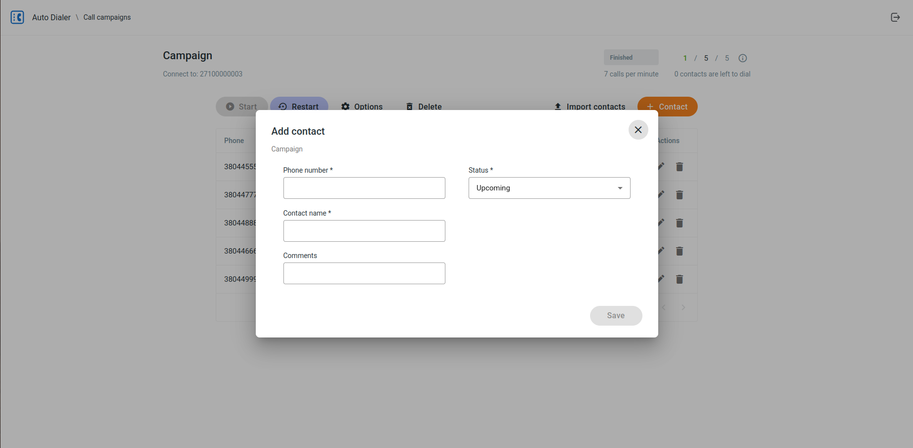
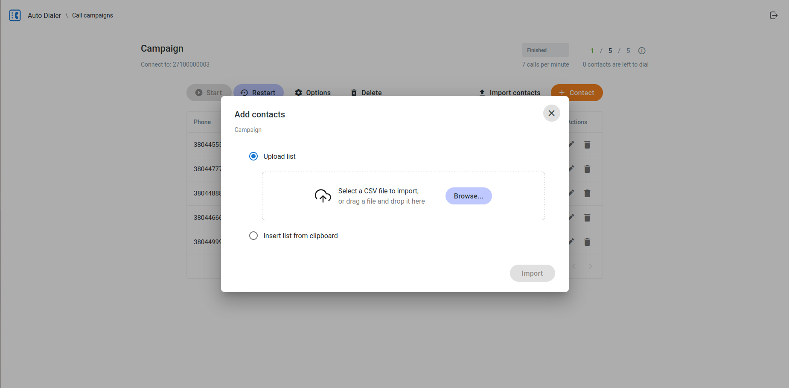

# Auto-Dialer User Guide

## Overview

An Auto-Dialer is a software tool that automates the process of dialing phone numbers. It is designed for businesses and organizations that need to make a high volume of outbound calls efficiently. The primary purpose of an Auto-Dialer is to increase the productivity of sales agents, customer service representatives, and other professionals by eliminating manual dialing and freeing them up to speak with connected customers and prospects.

The target audience for Auto-Dialers includes:

*   **Sales and Telemarketing Teams:** For lead generation, cold calling, and appointment setting.
*   **Customer Service Departments:** For proactive customer outreach, appointment reminders, and service updates.
*   **Market Research Firms:** For conducting surveys and gathering data.
*   **Political Campaigns:** For voter outreach and get-out-the-vote initiatives.
*   **Non-profit Organizations:** For fundraising and donor outreach.

## Getting Started

### Logging In

To start using the Auto-Dialer, you need to log in with your credentials.

1.  Open the Auto-Dialer application in your web browser.
2.  You will be redirected to the login page.
3.  Enter your **Login** and **API Key** in the corresponding fields.
4.  Click the **Submit** button.



If your credentials are correct, you will be redirected to the main page of the application, where you can manage your campaigns.

## Campaigns

Campaigns are the core of the Auto-Dialer. A campaign is a set of automated phone calls to a list of contacts.

### Viewing Campaigns

After logging in, you will see a list of all your campaigns. The list displays the following information for each campaign:

-   **Name**: The name of the campaign.
-   **Description**: The description of the campaign.
-   **Calls**: A summary of the campaign's progress, including the number of answered, not answered, and total calls.
-   **Status**: The current status of the campaign (e.g., New, Scheduled, Processing, Finished, etc.).
-   **Updated**: The date when the campaign is last updated.
-   **Actions**: The buttons to edit or launch a campaign.



### Creating a Campaign

The fields required to create a campaign depend on your application version.

#### For Version 2.x.x and Newer

To create a new campaign, follow these steps:

1.  Click the **Add campaign** button.
2.  A dialog will open where you can enter the campaign details:
	-   **Name**: A descriptive name for the campaign.
	-   **Status**: The initial status of the campaign.
	-   **Connect to**: The number to which the calls will be connected, such as a phone number of an auto-attendant, a short number of a hunt group, or that of a specific agent.
	-   **Schedule**: The date and time in your timezone when the campaign should start.
	-   **Campaign pace**: The number of calls to make per minute.
	-   **Description**: An optional description for the campaign.
	-   **Billable account**: The account to be billed for the calls.
	-   **Caller ID**: The phone number to be displayed as the caller ID.
3.  Click the **Save** button to create the campaign.



#### For Version 1.x.x

To create a new campaign, follow these steps:

1.  Click the **Add campaign** button.
2.  A dialog will open where you can enter the campaign details:
	-   **Name**: A descriptive name for the campaign.
	-   **Status**: The initial status of the campaign.
	-   **DID number**: The phone number to which the calls will be connected.
	-   **Schedule**: The date and time when the campaign should start.
	-   **Campaign pace**: The number of calls to make per minute.
	-   **Description**: An optional description for the campaign.
3.  Click the **Save** button to create the campaign.



### Campaign Use-Case Examples

Here are some examples of how you can use call campaigns to achieve your business goals:

*   **Sales and Lead Generation:**
	*   **Scenario:** A software company wants to generate new leads for its latest product.
	*   **Campaign:** Create a campaign to call a list of potential customers. When a call is answered, the Auto-Dialer connects the prospect to a live sales agent who can then provide more information and qualify the lead.

*   **Customer Service and Support:**
	*   **Scenario:** A healthcare provider needs to remind patients of their upcoming appointments.
	*   **Campaign:** Create a campaign to call patients a day before their scheduled appointment. The Auto-Dialer can play a pre-recorded message with the appointment details and offer an option to connect to the receptionist to reschedule if needed.

*   **Market Research:**
	*   **Scenario:** A marketing agency is conducting a survey to gauge public opinion on a new consumer product.
	*   **Campaign:** Create a campaign to call a random sample of people and play a pre-recorded message with the survey questions. The system can record the responses for later analysis.

*   **Event Invitations:**
	*   **Scenario:** A company is hosting a webinar and wants to invite its existing customers.
	*   **Campaign:** Create a campaign to call a list of customers and play a pre-recorded invitation with details about the webinar and instructions on how to register.

### Editing a Campaign

To edit an existing campaign, follow these steps:

1.  Click on the campaign you want to edit in the campaigns list.
2.  You will be redirected to the campaign details page.
3.  Click the **Options** button.
4.  A dialog will open where you can modify the campaign details. The available fields will depend on your application version.
5.  Click the **Save** button to save your changes.



### Deleting a Campaign

To delete a campaign, follow these steps:

1.  Click on the campaign you want to delete in the campaigns list.
2.  You will be redirected to the campaign details page.
3.  Click the **Delete** button.
4.  A confirmation dialog will appear. Click the **Delete** button to confirm the deletion.

### Campaign Actions

You can perform the following actions on a campaign:

-   **Start**: Starts a campaign that is not yet running.
-   **Stop**: Stops a campaign that is currently running.
-   **Pause**: Pauses a campaign that is currently running.
-   **Resume**: Resumes a campaign that is paused.
-   **Restart**: Restarts a campaign that has finished.

To perform an action on a campaign, click on the campaign in the campaigns list, and then click the corresponding button on the campaign details page.



### Campaign Statuses

A campaign can have one of the following statuses:

-   **New**: The campaign has been created but is not yet scheduled.
-   **Scheduled**: The campaign is scheduled to run at a future date and time.
-   **Processing**: The campaign is currently active and making calls.
-   **Paused**: The campaign has been temporarily stopped and can be resumed later.
-   **Finished**: The campaign has completed all its calls.
-   **Overdue**: The campaign was scheduled to run but did not start on time.
-   **Canceled**: The campaign has been canceled and will not run.

## Contacts

Contacts are the people who will be called in a campaign.

### Viewing Contacts

To view the contacts of a campaign, click on the campaign in the campaigns list. The campaign details page will display a list of all the contacts in the campaign.



### Adding a Contact

To add a new contact to a campaign, follow these steps:

1.  On the campaign details page, click the **Contact** button.
2.  A dialog will open where you can enter the contact details:
	-   **Phone number**: The phone number of the contact.
	-   **Name**: The first and last name of the contact.
	-   **Comments**: The internal comments about the contact.
	-   **Status**: The initial status of the contact.
3.  Click the **Save** button to add the contact to the campaign.



### Editing a Contact

To edit an existing contact, follow these steps:

1.  On the campaign details page, click the **Edit** button next to the contact you want to edit.
2.  A dialog will open where you can modify the contact details.
3.  Click the **Save** button to save your changes.

### Deleting a Contact

To delete a contact, follow these steps:

1.  On the campaign details page, click the **Delete** button next to the contact you want to delete.
2.  A confirmation dialog will appear. Click the **Delete** button to confirm the deletion.

### Importing Contacts

You can import a list of contacts from a CSV file. To import contacts, follow these steps:

1.  On the campaign details page, click the **Import contacts** button.
2.  A dialog will open where you can select a CSV file to upload.
3.  Select the file and click the **Import** button.



The contacts from the CSV file will be added to the campaign.

#### CSV Example

Here is an example of a valid CSV file format. You can copy this content into a new file with a `.csv` extension and use it to import contacts.

```csv
12025550101,John Doe,Google Ads
12025550102,Jane Smith,Website visitor
12025550103,Peter Jones,Whatsapp query
```

### Contact Statuses

Each contact within a campaign has a status that indicates the outcome of the call attempt. The possible statuses are:

-   **Upcoming**: The contact is in the queue to be called.
-   **Dialing**: The system is currently attempting to call the contact.
-   **On hold**: The call is connected and waiting for an agent.
-   **Answered**: The call was answered by the contact.
--   **Rejected**: The call was rejected by the contact.
-   **Not answered**: The call was not answered by the contact.

## Frequently Asked Questions (FAQ)

**1. What type of dialer is this?**

This application is a **power dialer**. It automatically dials numbers one by one from your contact list. When a call is answered, it is immediately connected to a preconfigured phone number, such as an auto-attendant, a hunt group or a specific agent. For more advanced call distribution, you can configure it to dispatch connected calls to available agents via a call queue.

**2. Can my agents preview contact information before a call?**

No, this application does not support a preview dialing mode. Agents cannot see a preview of the customer's information before or during the call, unless this is supported by their soft client integrated with a CRM. The call is connected automatically once the contact answers.

**3. Why can't I start a campaign or why are calls failing?**

If you are unable to make calls, it is likely an issue with your account permissions. Your account must be authorized to use the autodialing service. Please contact your administrator or service provider to ensure your user role has the "Call Control API" permission enabled.

## Troubleshooting

If you encounter any issues while using the Auto-Dialer, please try the following:

-   Make sure you are using a supported web browser, such as Chrome or Firefox.
-   Clear your browser's cache and cookies.
-   If the problem persists, please contact your service provider for assistance.
