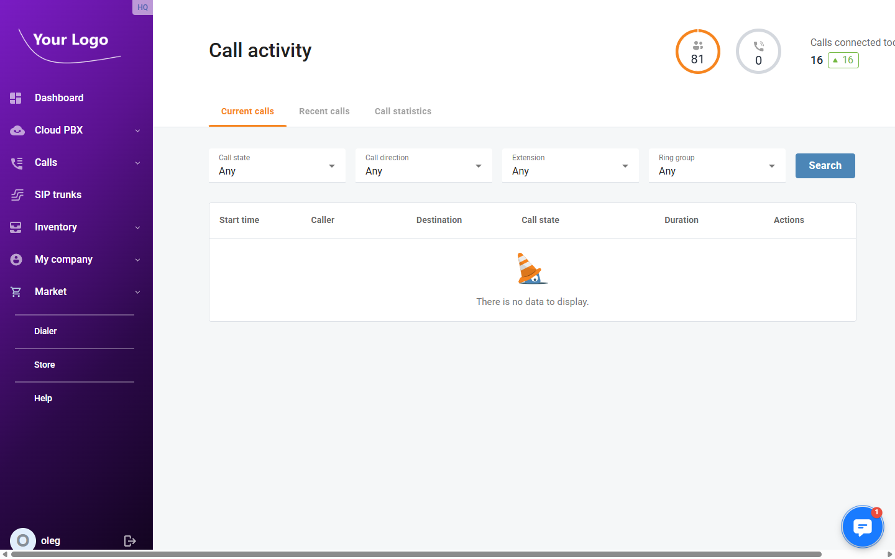
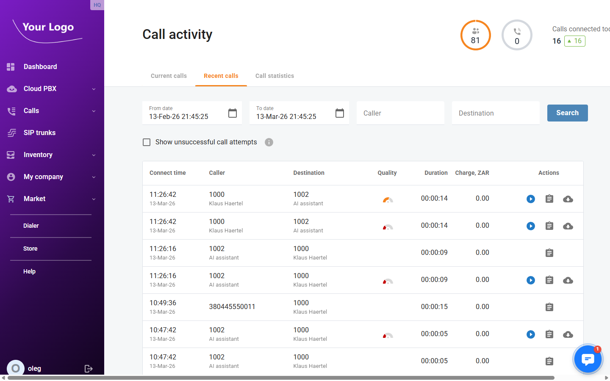
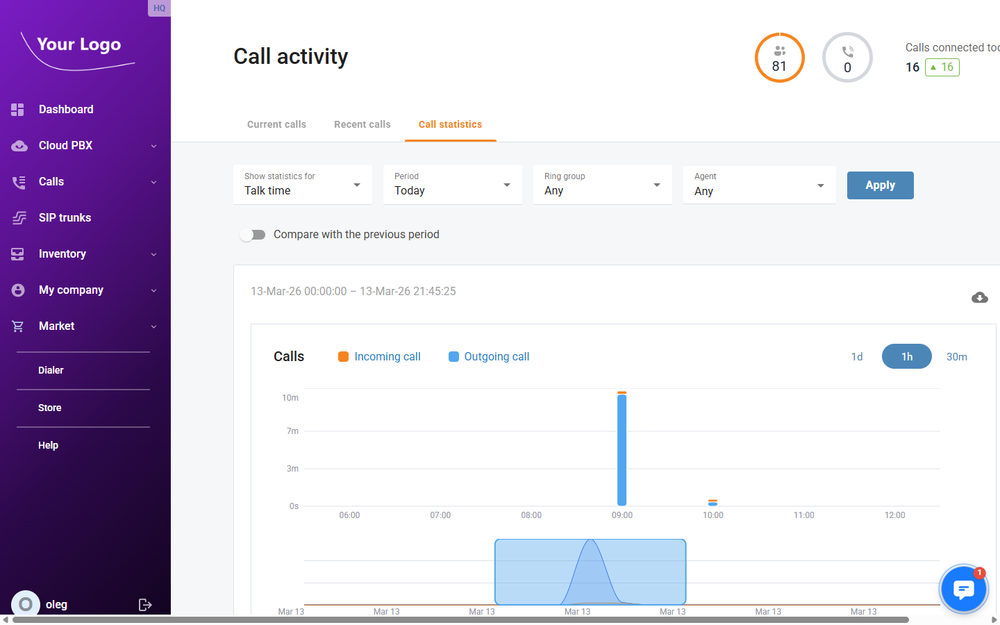

# Call Activity

## Overview

The **Call Activity** page provides a real-time and historical view of all calls on your Cloud PBX. It is split into three tabs: current live calls, recent call history, and aggregated call statistics.

Navigate to **Calls → Activity** (route: `/call-activity`).

## Current Calls Tab

The **Current Calls** tab shows all calls in progress at this moment. The list updates automatically.

### Filters

| Filter | Description |
|---|---|
| **Call state** | Filter by the current state of the call: Trying, Ringing, Connected, Holding, Queued, or Parked. |
| **Call direction** | Filter by direction: Incoming or Outgoing. |
| **Extension** | Show only calls involving a specific extension. |
| **Ring group** | Show only calls routed through a specific ring group. |

Click **Search** to apply filters.

### Columns

| Column | Description |
|---|---|
| **Start time** | Date and time the call began. |
| **Caller** | The extension or number that initiated the call. |
| **Destination** | The extension or number being called. |
| **Call state** | Current state of the call (Connected, Ringing, Holding, etc.). |
| **Duration** | How long the call has been active, updated in real time. |
| **Actions** | Call control buttons (see below). |

### Call Control Actions

Depending on your permissions, the following actions are available per call:

| Action | Description |
|---|---|
| **Transfer** | Transfer the call to another extension or external number. |
| **Put on hold** | Place the call on hold. |
| **Resume** | Resume a call that is currently on hold. |
| **Add extension** | Add another extension as a participant. |
| **Disconnect** | End the call. |
| **Spy** | Listen to a live call silently — the other parties cannot hear you. |
| **Whisper** | Speak to the agent only while monitoring; the caller cannot hear you. |
| **Barge** | Join the call as a full participant. |

:::note
Spy, Whisper, and Barge are only available when Call Supervision is enabled in [Call Settings](./Settings.md#call-supervision).
:::

## Recent Calls Tab

The **Recent Calls** tab shows the call history for the account.

### Filters

| Filter | Description |
|---|---|
| **From Date** | Start of the date/time range to search. |
| **To Date** | End of the date/time range to search. |
| **Caller** | Filter by the calling party number or name. |
| **Destination** | Filter by the called party number or name. |
| **Show unsuccessful call attempts** | Include calls that did not connect (busy, no answer, rejected). |

Click **Search** to apply filters.

### Columns

| Column | Description |
|---|---|
| **Connect time** | Date and time the call connected. |
| **Caller** | Calling party — number and name if resolved. |
| **Destination** | Called party — number and name if resolved. |
| **Quality** | Call quality indicator, if available. |
| **Duration** | Length of the call in HH:MM:SS format. |
| **Charge** | Cost charged for the call in the account currency. |
| **Actions** | Per-row actions: play recording, view call details, download recording, delete recording. |

### Row Actions

| Button | Description |
|---|---|
| ▶ **Play** | Opens an inline audio player to listen to the recording without leaving the page. |
| 📋 **Details** | Opens the Call Detail Record dialog with full call metadata (connect/disconnect times, disconnect reason, country, area, charge). |
| ☁ **Download** | Downloads the recording file. |
| 🗑️ **Delete** | Deletes the recording after a confirmation prompt. |

:::note
Available action buttons depend on the permissions assigned to your portal user role.
:::

## Call Statistics Tab

The **Call Statistics** tab displays a bar chart of call metrics over a selected time period.

### Filters

| Filter | Description |
|---|---|
| **Show statistics for** | The metric to chart: **Connected calls**, **Talk time**, **Hold time**, or **Wrap-up time**. |
| **Period** | Time range: Today, Yesterday, Last 7 days, Last 14 days, Last 30 days, or Custom. |
| **Ring group** | Limit statistics to calls routed through a specific ring group (optional). |
| **Agent** | Limit statistics to a specific agent/extension (optional). |

Use the **Show** / **Hide** buttons next to **Incoming** and **Outgoing** to include or exclude each call direction from the chart.

Click **Download CSV** to export the underlying data as a spreadsheet.
