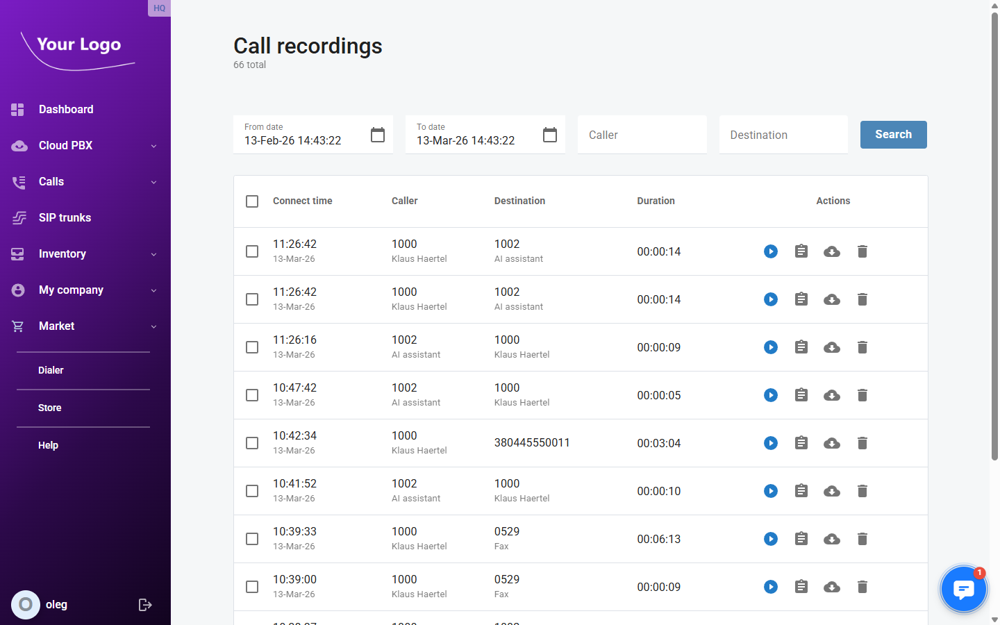
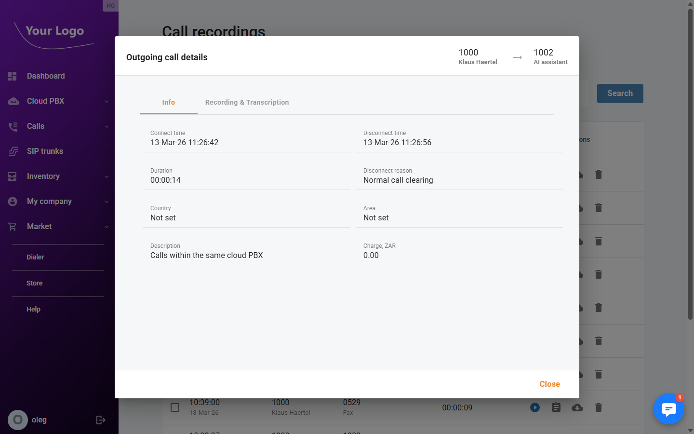
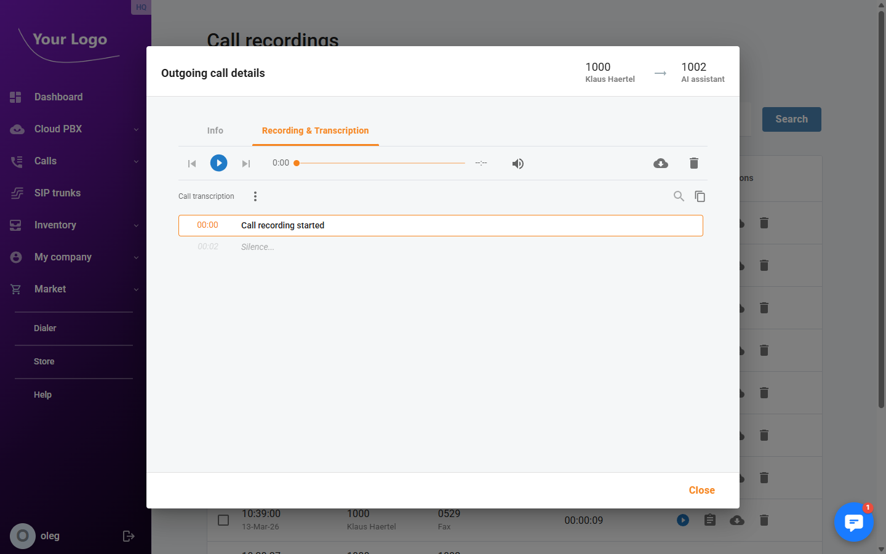

# Call Recordings

## Overview

The **Call Recordings** page lets you find, play, download, and delete recordings of past calls. Recordings are generated when call recording is enabled on an extension or ring group. Each recorded call appears as a row in the list with its timestamp, participants, and duration.

Navigate to **Calls → Call recordings**.

## Recordings List

### Filters

Use the filter bar at the top of the page to narrow results:

| Filter | Description |
|--------|-------------|
| **From** | Start of the date/time range. Defaults to one month before today. |
| **To** | End of the date/time range. Defaults to the current date and time. |
| **Caller** | Filter by the calling party number or name. Partial matches are supported. |
| **Destination** | Filter by the called number or name. Partial matches are supported. |

Click **Search** to apply the filters.

### Columns

| Column | Description |
|--------|-------------|
| **Connect time** | Date and time when the call was connected, shown in your local timezone. |
| **Caller** | The calling party — number and name (if resolved). |
| **Destination** | The called party — number and name (if resolved). |
| **Duration** | Length of the call in HH:MM:SS format. |
| **Actions** | Per-recording actions: play, view details, download, delete. |

### Actions

Each row in the list has up to four action buttons:

| Button | Description |
|--------|-------------|
| ▶ **Play** | Opens an inline audio player below the row to listen to the recording without leaving the page. |
| 📋 **Details** | Opens the [Call Detail Record](#call-detail-record) dialog with full call information. |
| ☁ **Download** | Downloads the recording file. The filename includes the call date, time, and account identifier. |
| 🗑️ **Delete** | Deletes the recording after a confirmation prompt. |

:::note
Available action buttons depend on the permissions assigned to your portal user role.
:::

## Call Detail Record

Click the **Details** button on any row to open the call detail dialog. The dialog has two tabs.

### Info Tab

The **Info** tab shows the complete metadata for the call.

| Field | Description |
|-------|-------------|
| **Connect time** | Date and time the call connected (local timezone). |
| **Disconnect time** | Date and time the call ended (local timezone). |
| **Duration** | Total call length in HH:MM:SS format. |
| **Disconnect reason** | The SIP or system reason the call ended (e.g., `NORMAL_CLEARING`). |
| **Country** | Country associated with the called number, if available. |
| **Area** | Geographic subdivision (state, region) of the called number, if available. |
| **Description** | Any description text attached to the call record. |
| **Charge** | Billing amount charged for this call, in your account currency. |

### Recording Tab

The **Recording** tab contains the audio player for the recorded file.

- Use the audio player to play the recording directly in your browser.
- Click **Download** to save the file locally.
- Click **Delete** to remove the recording permanently.

If no recording file is available for the selected call, the tab displays a message indicating there is no recording.

## Bulk Delete

To delete multiple recordings at once:

1. Select the checkboxes next to the recordings you want to remove.
2. A bar appears at the bottom of the page showing how many items are selected.
3. Click **Delete** in the bar and confirm the prompt.

:::warning
Deleted recordings cannot be recovered. Make sure you have downloaded any files you need before deleting.
:::
