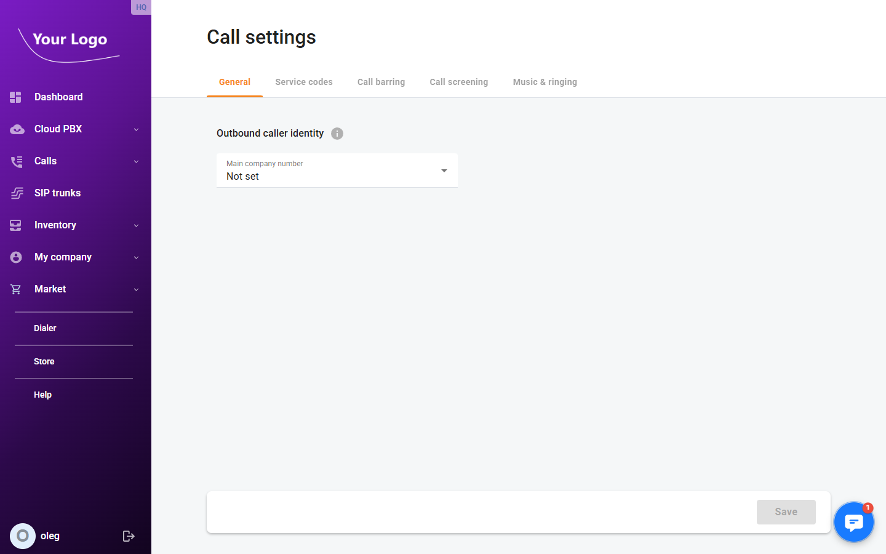
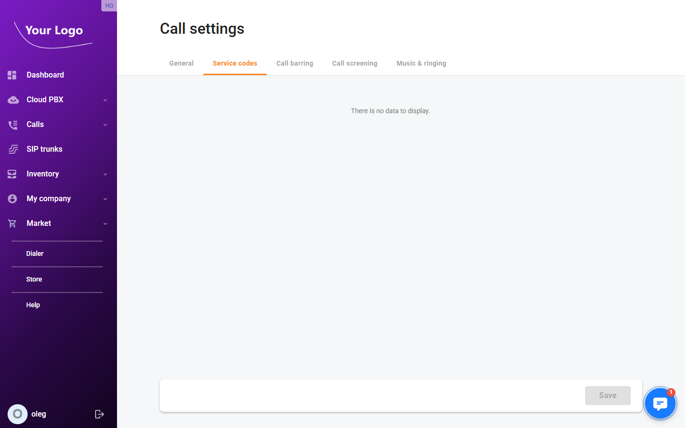
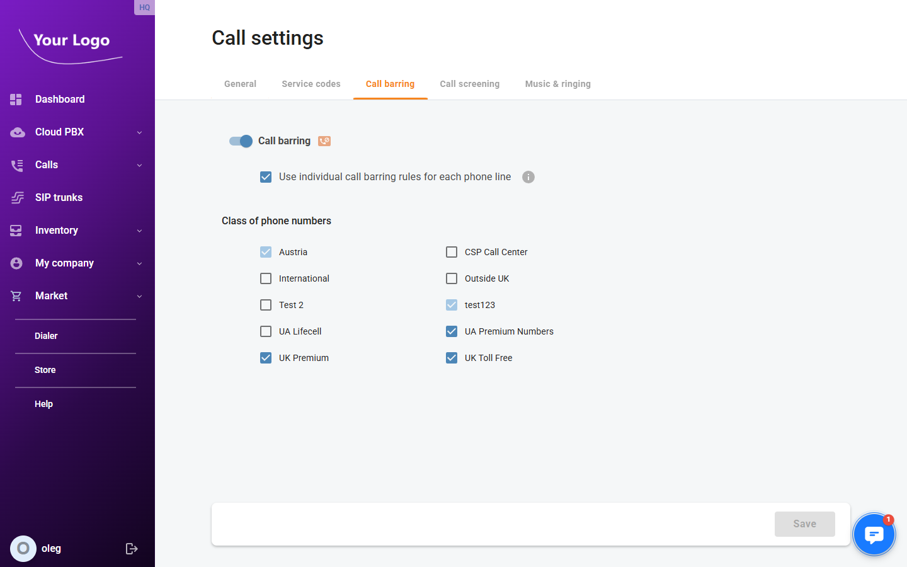
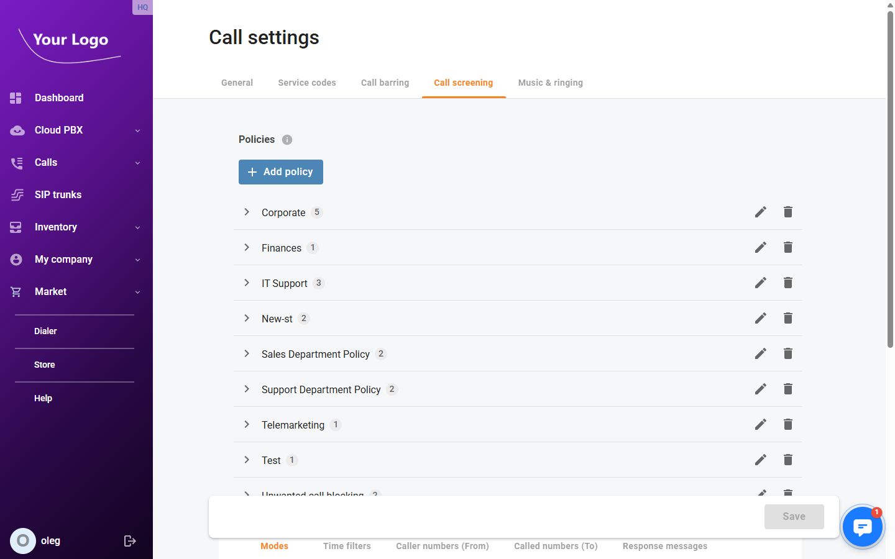
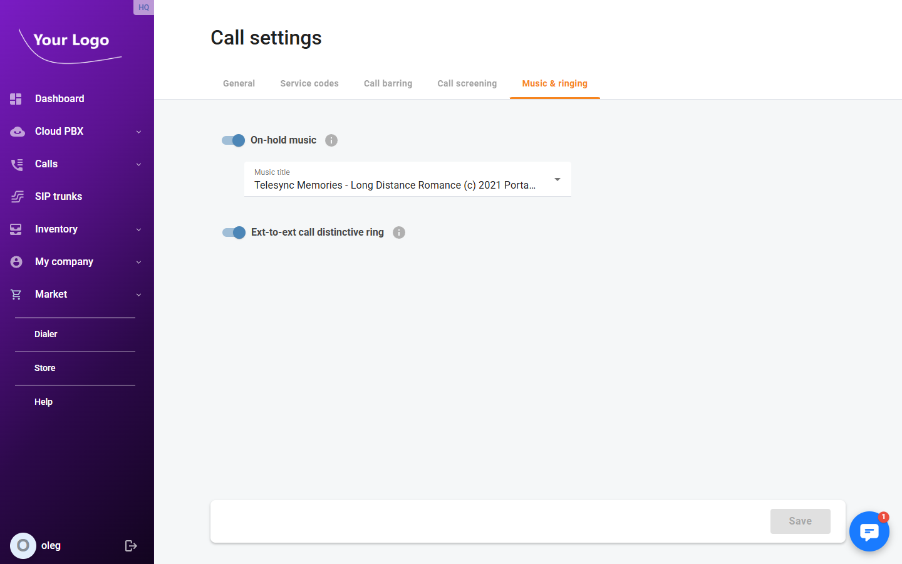

# Call Settings

## Overview

The **Call Settings** page contains company-wide telephony configuration for your Cloud PBX. Settings here apply globally to all extensions unless overridden at the extension level.

Navigate to **Calls → Settings** (route: `/call-settings`).

Click **Save** after making changes on any tab.

## General Tab

| Field | Description |
|---|---|
| **Outbound display number** | The number presented to called parties for outbound calls made from the company. Select from the DID numbers assigned to your account. |

## Service Codes Tab

Service codes are short DTMF sequences that users dial on their phones to activate features. If your account has multiple dialling rules, a **Dialling rules** selector appears at the top of the tab — configure codes for each rule separately.

### General

| Field | Description |
|---|---|
| **Transfer call** | Code to initiate a call transfer. |
| **Voicemail** | Code to access the voicemail system. |
| **Bypass dial plan** | Code to bypass dial plan restrictions and dial a number directly. |

### Call Parking

Enable the **Call parking** toggle to activate parking codes.

| Field | Description |
|---|---|
| **Park** | Code to park the current call into an available parking slot. |
| **Automatic retrieval** | What happens when a parked call times out: **Disabled**, **Enabled with the default call pattern**, or **Enabled with a distinctive call pattern**. |
| **Retrieve after** | Number of seconds before automatic retrieval is triggered. |
| **Retrieve** | Code to retrieve a parked call from a slot. |

### Paging / Intercom

Enable the **Paging / Intercom** toggle to activate paging.

| Field | Description |
|---|---|
| **Paging prefix** | Prefix to dial before an extension number to send a one-way audio announcement to that extension. |

### Group Pickup

Enable the **Group pickup** toggle to activate group call pickup.

| Field | Description |
|---|---|
| **Group pickup prefix** | Prefix to dial to answer a ringing call in the same pickup group as the user. |

### Private Call

| Field | Description |
|---|---|
| **Hide CLI** | Code to suppress the caller ID for the next outbound call. |
| **Show CLI** | Code to restore the caller ID for the next outbound call. |

### Call Recording

| Field | Description |
|---|---|
| **Start recording** | Code to begin recording the current call. |
| **Start recording DTMF** | Alternative in-call DTMF sequence to start recording. |
| **Stop recording** | Code to stop an active recording. |
| **Stop recording DTMF** | Alternative in-call DTMF sequence to stop recording. |

### Call Supervision

Enable the **Call supervision** toggle to allow supervisors to monitor live calls.

| Field | Description |
|---|---|
| **Spy mode** | Prefix to listen to a live call silently — the other parties cannot hear the supervisor. |
| **Spy mode DTMF** | In-call DTMF to switch to spy mode while already connected to the call. |
| **Whisper mode** | Prefix to speak to the agent only, while the caller cannot hear the supervisor. |
| **Whisper mode DTMF** | In-call DTMF to switch to whisper mode. |
| **Barge-in mode** | Prefix to join the call as a full participant. |
| **Barge-in mode DTMF** | In-call DTMF to switch to barge-in mode. |

### Call Screening

| Field | Description |
|---|---|
| **Individual management** | Code for a user to manage their own call screening settings from a phone. |
| **Cloud PBX management** | Code for an administrator to manage company-level call screening settings from a phone. |

### Ring Group Login / Logout

| Field | Description |
|---|---|
| **Login to ring group** | Code to log in to a ring group and begin receiving its calls. |
| **Logout of ring group** | Code to log out of a ring group and stop receiving its calls. |

## Call Barring Tab

Call barring restricts outbound dialling to certain classes of phone numbers.

Use the **Call barring** toggle to enable or disable barring for the account.

Enable **Use individual call barring rules for each phone line** to allow each extension to maintain its own barring settings instead of following the company-wide rules.

The **Class of phone numbers** list shows each configured barring class with a toggle to allow or deny dialling numbers in that class.

## Call Screening Tab

Call screening policies define how incoming calls are handled based on the caller number, time of day, and configured rules. Policies created here can be assigned to individual extensions or ring groups.

### Policies

The policies panel lists all configured screening policies. Click **+ Add new** to create a policy and enter its **Name**.

Select a policy to configure its detail across three sub-tabs:

#### Time Filters

Define time-based conditions — days of the week and time ranges — that control when a policy is active.

#### Modes

Map each time filter to a response behaviour: ring the extension, play a message, reject the call, and so on.

#### Response Messages

Manage the audio messages played to callers when a mode triggers a response (for example, "We are closed — please call back during business hours").

## Music & Ringing Tab

| Setting | Description |
|---|---|
| **On-hold music** | Enable the toggle to play music to callers placed on hold. Select the audio file from the dropdown that appears. |
| **Ext-to-ext call distinctive ring** | Enable the toggle to play a different ringtone for internal calls (extension-to-extension), so users can distinguish them from external calls. |
