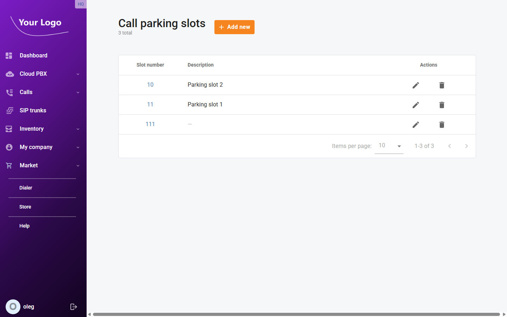
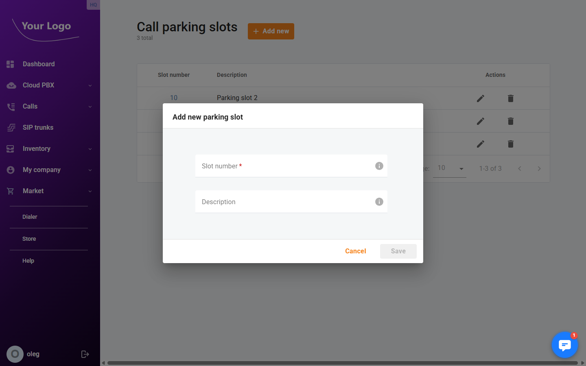

# Call Parking Slots

## Overview

**Call parking slots** are dedicated extension numbers that allow users to place an active call on hold and retrieve it from any phone in the Cloud PBX. A caller parks a call by transferring it to the slot number; any other user can then pick it up by dialling the same slot number.

Open menu **"Cloud PBX > Call parking slots"** (route: `/parking-slots`).

## Call Parking Slots List

The list shows all configured parking slots.

| Column | Description |
|---|---|
| **Slot number** | The extension number dialled to park or retrieve a call. |
| **Description** | An optional label to identify the slot (e.g. its location or purpose). |
| **Actions** | **Edit** (✏️) – modify the slot; **Delete** – remove the slot. |

Click **+ Add new** to create a parking slot.

## Adding a Call Parking Slot

| Field | Description |
|---|---|
| **Slot number*** | The extension number users dial to park or retrieve a call on this slot. |
| **Description** | An optional free-text label for the slot. |

Fill in the required fields and click **Save**.

## Editing a Call Parking Slot

Click the **Edit** icon (✏️) next to a slot to update its number or description, then click **Save**.
