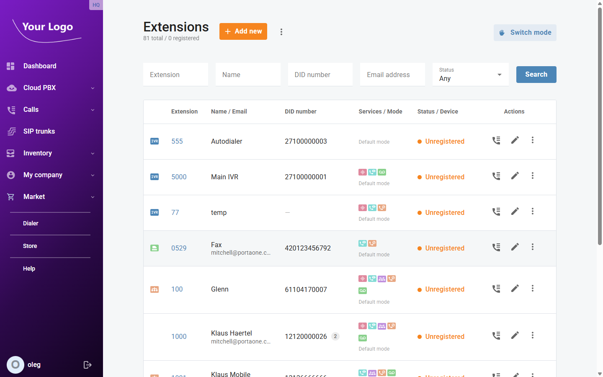
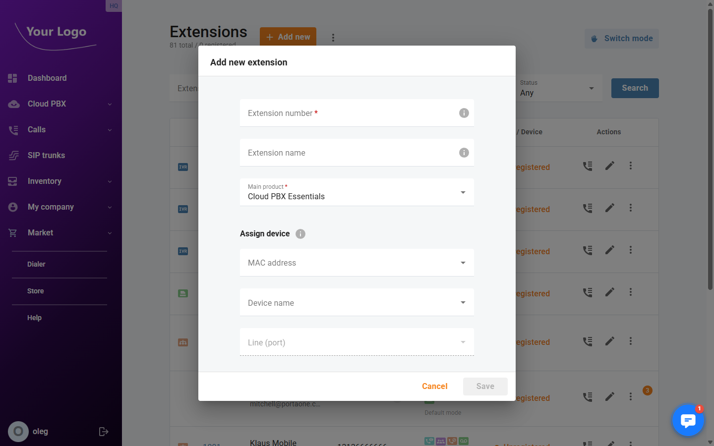
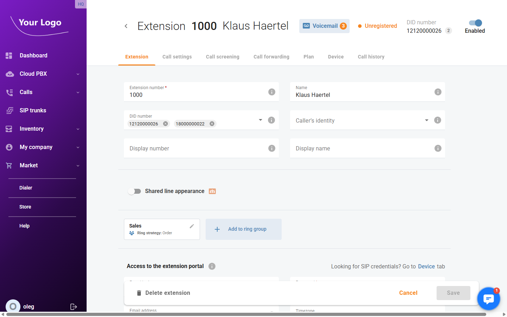
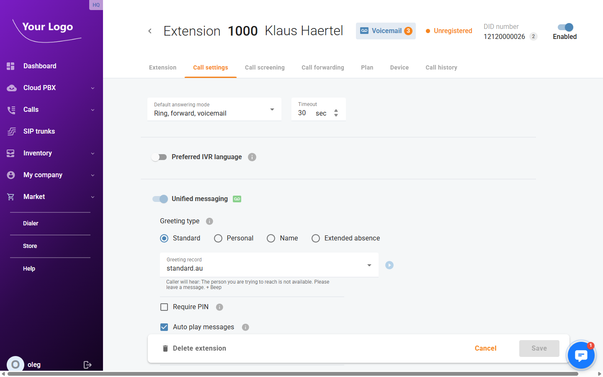
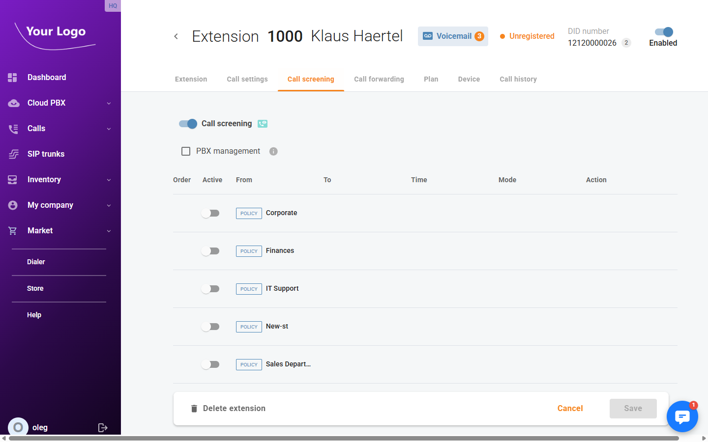
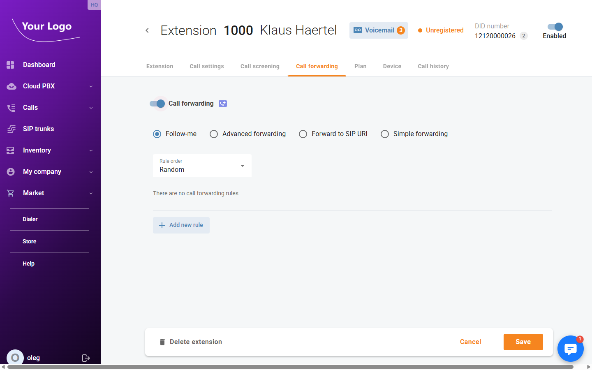
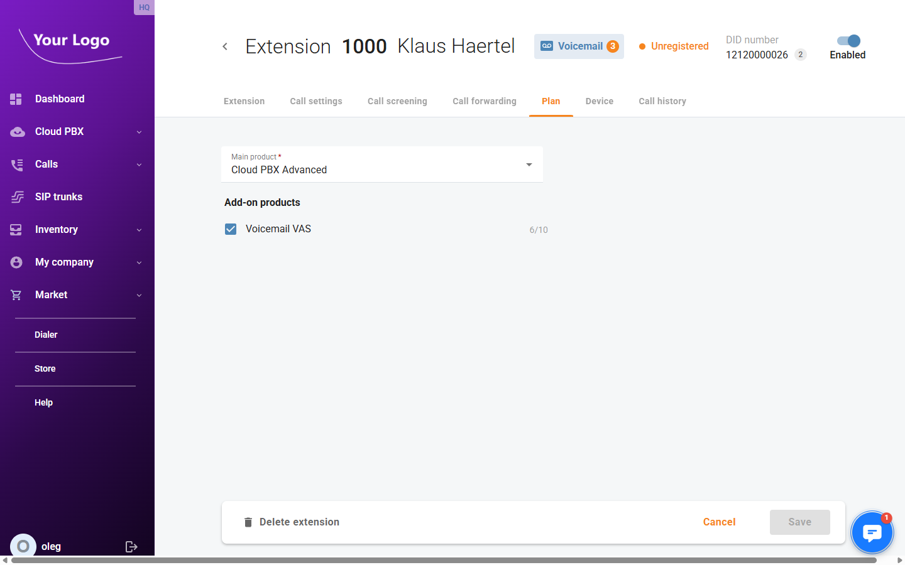
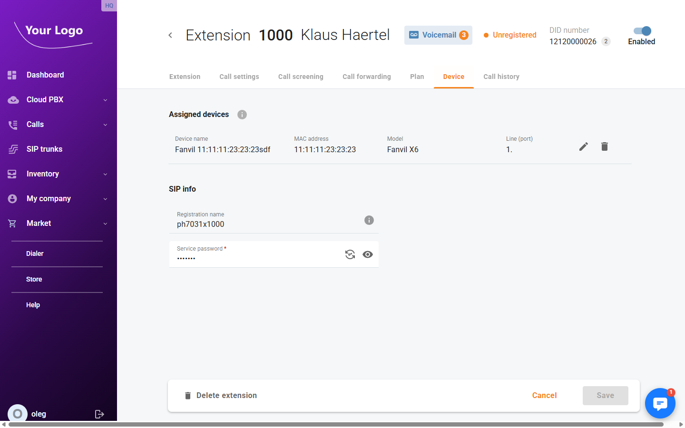
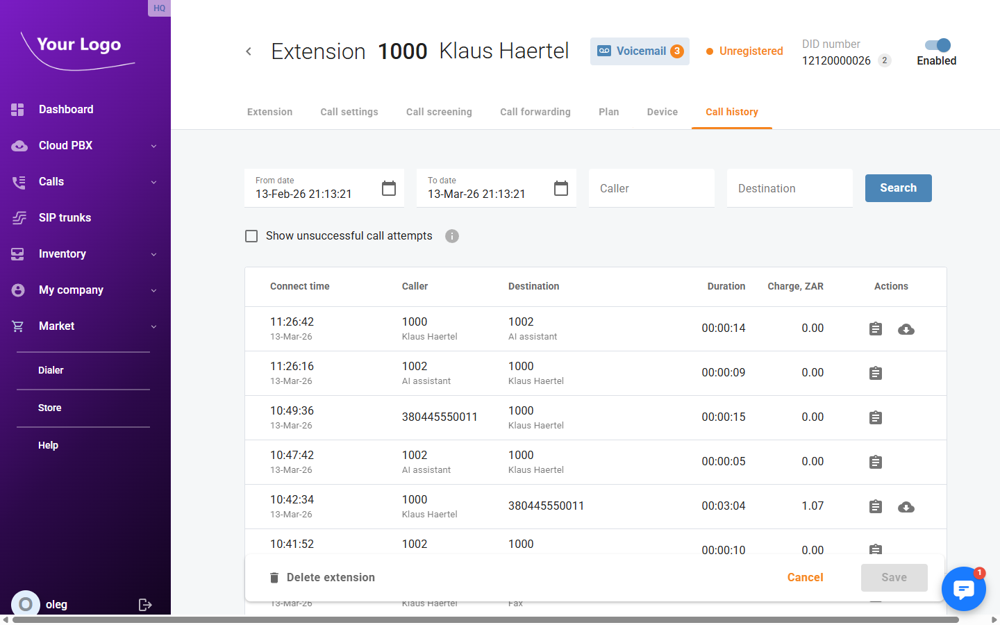

# Extensions

## Overview

**Extensions** are the individual phone lines assigned to users within your Cloud PBX. Each extension has a unique number and an optional DID (direct inward dialling) number for external calls. Extensions support voicemail, call forwarding, call screening, call recording, and other features depending on the assigned plan.

Open menu **"Cloud PBX > Extensions"** (route: `/extensions`).

## Extensions List

The list shows all extensions in your account. The status counter at the top shows total extensions and how many are currently registered.

| Column | Description |
|---|---|
| **Extension** | The internal extension number. The icon indicates the extension type (regular, IVR, fax mailbox, etc.). |
| **Name / Email** | The extension owner's display name and email address. |
| **DID number** | The direct inward dialling number(s) assigned for external calls. A badge shows the total count when multiple numbers are assigned. |
| **Services / Mode** | Coloured chips indicating active service add-ons (voicemail, call recording, etc.) and the current answering mode. |
| **Status / Device** | Registration status (e.g. *Registered*, *Unregistered*) and the number of assigned devices. |
| **Actions** | **Call history** – view the call log for this extension; **Edit** (✏️) – open the extension detail page; **More** (⋮) – additional options. |

Use the **Extension**, **Name**, **DID number**, **Email address**, and **Status** filters to search. Click **Search** to apply.

Click **+ Add new** to create a new extension.

## Adding an Extension

Fill in the required fields and click **Save** to create the extension.

## Extension Detail

Click the **Edit** icon (✏️) next to an extension to open its detail page. The header shows the extension number, name, voicemail status, registration status, DID number count, and an **Enabled** toggle. The detail page contains seven tabs.

### Extension Tab

| Field | Description |
|---|---|
| **Extension number*** | The internal extension number used to call this extension within the PBX. |
| **Name** | The display name of the extension owner. |
| **DID number** | External DID number(s) assigned to this extension (multi-select chip field). |
| **Caller's identity** | Controls which caller ID is presented on outgoing calls (dropdown). |
| **Display number** | Custom number to show as the outgoing caller ID. |
| **Display name** | Custom name to show as the outgoing caller ID. |
| **Shared line appearance** | Toggle to allow multiple devices to share this extension line simultaneously. |

**Ring group membership** – Cards show the ring groups this extension belongs to. Click **+ Add to ring group** to assign the extension to additional ring groups.

**Access to extension portal** – Grants the extension user access to their self-care portal.

| Field | Description |
|---|---|
| **Portal login** | Username for the self-care portal login. |
| **Password*** | Password for the self-care portal login. |
| **Email address** | Email address linked to the portal account. |
| **Timezone** | Timezone used in the portal for this extension user. |
| **Office** | The branch office associated with this extension (read-only). |

**Emergency location** – Address used for emergency (e.g. 112/911) calls.

| Field | Description |
|---|---|
| **Address** | Street address provided to emergency services. |
| **Postal code** | Postal or ZIP code. |

Click **Save** to apply changes.

### Call Settings Tab

| Field | Description |
|---|---|
| **Default answering mode** | Determines how incoming calls are handled (e.g. *Ring, forward, voicemail*). |
| **Timeout (sec)** | Number of seconds to ring before moving to the next action in the answering mode. |
| **Preferred IVR language** | Toggle to override the system IVR language for this extension. |

**Unified messaging** – Toggle to enable voicemail for this extension.

| Field | Description |
|---|---|
| **Greeting type** | The voicemail greeting style: *Standard*, *Personal*, *Name*, or *Extended absence*. |
| **Greeting record** | Select a pre-recorded greeting file from the dropdown. |
| **Require PIN** | If enabled, a PIN is required to access the voicemail inbox. |
| **Auto play messages** | Automatically play new voicemail messages when accessing the inbox. |
| **Announce date/time** | Announce the date and time before each voicemail message. |
| **Email address** | Email address to receive voicemail notifications or attachments. |
| **Email option** | What to send by email: notification only, or message file attachment. |
| **File format** | Audio format for voicemail message email attachments (e.g. MP3, WAV). |

**Call barring** – Toggle to restrict outgoing calls. When enabled, select the categories of calls to block (e.g. international, premium rate).

**Call recording** – Toggle to enable call recording for this extension.

| Field | Description |
|---|---|
| **Outgoing** | Record outgoing calls made from this extension. |
| **Incoming** | Record incoming calls to this extension. |
| **Redirected** | Record calls that are redirected through this extension. |
| **Play announcement to all** | Play a recording notification to all call parties when recording is active. |

### Call Screening Tab

Enable the **Call screening** toggle to activate call screening rules for this extension.

The **PBX management** checkbox delegates management of this extension's call screening rules to the PBX administrator.

The rule table lists available call screening policies. Each policy can be individually toggled on or off for this extension.

| Column | Description |
|---|---|
| **Order** | The priority order in which rules are evaluated. |
| **Active** | Toggle to enable or disable this policy for the extension. |
| **From** | The caller source the rule applies to. Policies defined at company level show a **POLICY** badge. |
| **To** | The destination the rule applies to. |
| **Time** | The time period during which the rule is active. |
| **Mode** | The screening action (e.g. allow, block). |
| **Action** | Edit or delete the rule. |

### Call Forwarding Tab

Enable the **Call forwarding** toggle to redirect incoming calls for this extension.

Select the forwarding type:

| Type | Description |
|---|---|
| **Follow-me** | Forward calls according to a prioritised list of rules. Set **Rule order** (e.g. *Random*) and click **+ Add new rule** to define forwarding destinations and conditions. |
| **Advanced forwarding** | Configure complex forwarding conditions with time schedules and multiple destinations. |
| **Forward to SIP URI** | Forward all calls unconditionally to a specified SIP URI. |
| **Simple forwarding** | Forward all calls unconditionally to a single phone number. |

### Plan Tab

| Field | Description |
|---|---|
| **Main product*** | The primary service plan assigned to this extension (e.g. *Cloud PBX Advanced*). |
| **Add-on products** | Optional add-on services available under the main plan (e.g. *Voicemail VAS*). Each add-on shows the number in use versus the total allowed. |

### Device Tab

**Assigned devices** – Lists the hardware devices (IP phones, softphones) registered to this extension.

| Column | Description |
|---|---|
| **Device name** | Name of the registered device. |
| **MAC address** | The hardware MAC address of the device. |
| **Model** | Device model identifier. |
| **Line** | The line or port number on the device assigned to this extension. |
| **Actions** | Edit the device assignment or remove the device from this extension. |

**SIP info** – Credentials used for SIP registration.

| Field | Description |
|---|---|
| **Registration name** | The SIP username used to register this extension. |
| **Service password*** | The SIP authentication password. |

### Call History Tab

The **Call history** tab displays a log of all calls associated with this extension.

Use the filters at the top to narrow results:

| Filter | Description |
|---|---|
| **From date** | Start of the date range to search. |
| **To date** | End of the date range to search. |
| **Caller** | Filter by the calling party number or name. |
| **Destination** | Filter by the destination number or name. |
| **Show unsuccessful call attempts** | When checked, includes calls that did not connect. |

Click **Search** to apply filters.

The results table shows:

| Column | Description |
|---|---|
| **Connect time** | Date and time the call was connected. |
| **Caller** | Extension number and name of the calling party. |
| **Destination** | Extension number and name of the called party. |
| **Duration** | Length of the call in hh:mm:ss format. |
| **Charge** | Cost charged for the call in the account currency. |
| **Actions** | **Call details** – view the full call record; **Download** – download the call recording (if available). |
