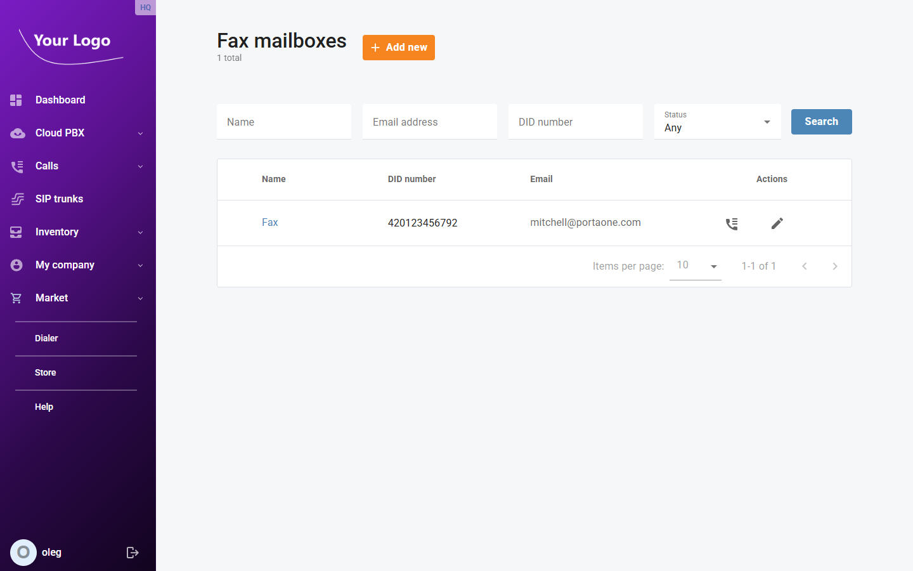
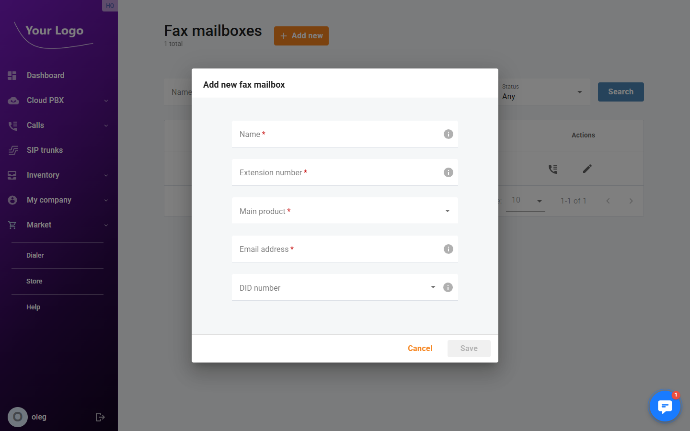
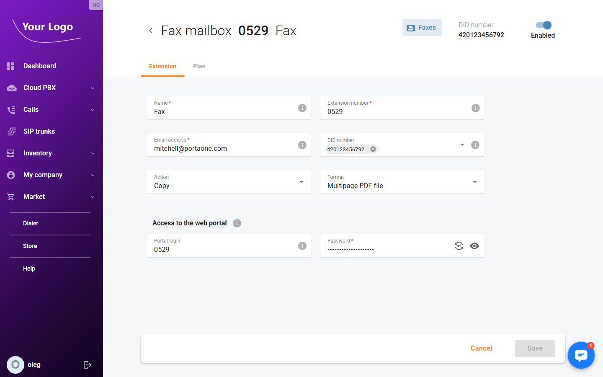
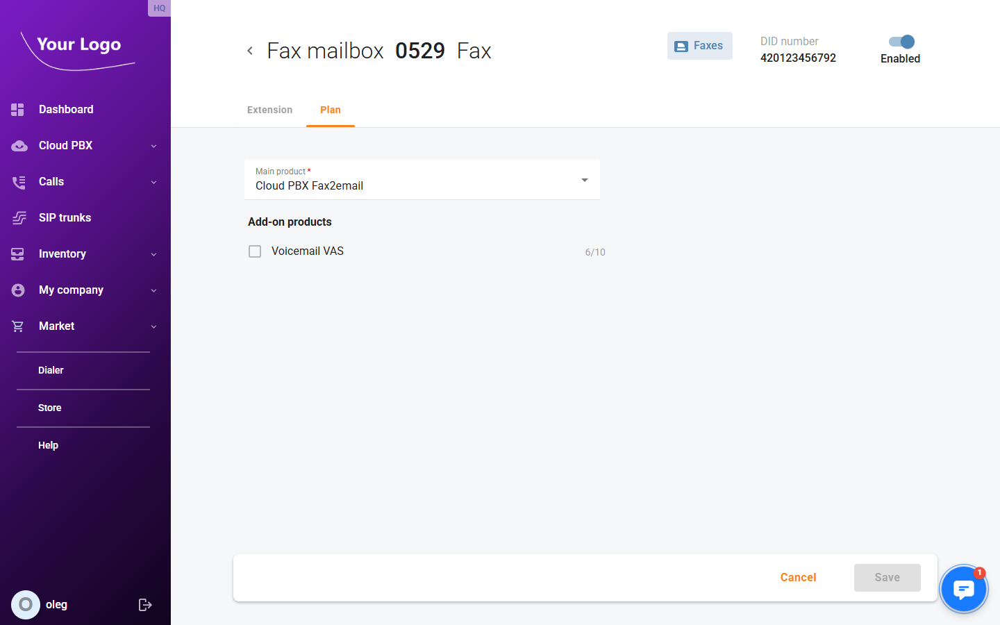

# Fax Mailboxes

## Overview

**Fax mailboxes** allow your Cloud PBX to receive incoming faxes and deliver them as email attachments. Each fax mailbox has a dedicated extension number and an optional DID number for receiving faxes from external callers. Received faxes are forwarded to a configured email address in the format and action of your choice.

Open menu **"Cloud PBX > Fax mailboxes"** (route: `/fax-mailboxes`).

## Fax Mailboxes List

The list shows all fax mailboxes in your account.

| Column | Description |
|---|---|
| **Name** | The name of the fax mailbox. |
| **DID number** | The external DID number assigned for receiving faxes. |
| **Email** | The email address where received faxes are delivered. |
| **Actions** | **Transmission history** – view the fax transmission log; **Edit** (✏️) – open the fax mailbox detail; **Delete** – remove the fax mailbox. |

Use the **Name**, **Email address**, **DID number**, and **Status** filters to search. Click **Search** to apply.

Click **+ Add new** to create a fax mailbox.

## Adding a Fax Mailbox

| Field | Description |
|---|---|
| **Name*** | A display name for the fax mailbox. |
| **Extension number*** | The internal extension number used to identify this fax mailbox within the PBX. |
| **Main product*** | The service plan to assign to this fax mailbox (e.g. *Cloud PBX Fax2email*). |
| **Email address*** | The email address that will receive incoming faxes as attachments. |
| **DID number** | An external DID number for receiving faxes from outside the PBX (optional). |

Fill in the required fields and click **Save**.

## Fax Mailbox Detail

Click the **Edit** icon (✏️) to open a fax mailbox. The header shows the extension number, name, a **Faxes** button to view the transmission log, the assigned DID number, and an **Enabled** toggle. The detail page contains two tabs.

### Extension Tab

| Field | Description |
|---|---|
| **Name*** | The display name of the fax mailbox. |
| **Extension number*** | The internal extension number. |
| **Email address*** | The email address that receives incoming fax attachments. |
| **DID number** | External DID number(s) assigned to this fax mailbox (multi-select). |
| **Action** | What to do with the fax file after delivery: *Copy* keeps a copy on the server; other options may remove it after forwarding. |
| **Format** | The file format for fax email attachments (e.g. *Multipage PDF file*). |

**Access to the web portal** – Allows the fax mailbox owner to log in to the self-care portal to view received faxes.

| Field | Description |
|---|---|
| **Portal login** | Username for the self-care portal. |
| **Password*** | Password for the self-care portal login. |

### Plan Tab

| Field | Description |
|---|---|
| **Main product*** | The service plan assigned to this fax mailbox (e.g. *Cloud PBX Fax2email*). |
| **Add-on products** | Optional add-on services available under the main plan. Each add-on shows current usage versus total allowed. |

## Transmission History

Click the **Transmission history** icon in the Actions column to open the fax log for a mailbox. The log shows all fax transmissions within the selected date range.

| Column | Description |
|---|---|
| **Connect time** | Date and time the fax was transmitted. |
| **Sender** | Extension number and name of the sending party. |
| **Recipient** | Extension number and name of the receiving party. |
| **Charge** | Cost charged for the transmission in the account currency. |

Use the **From date**, **To date**, and **Sender** filters to narrow the results.
