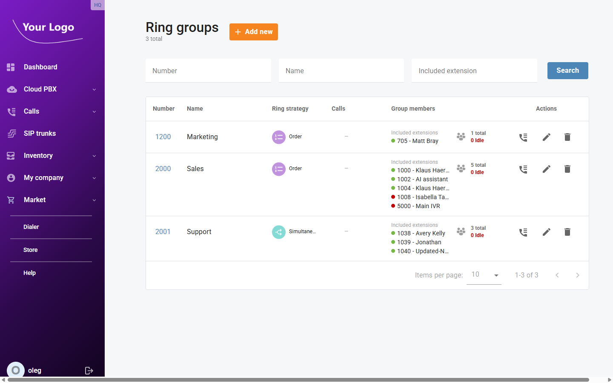
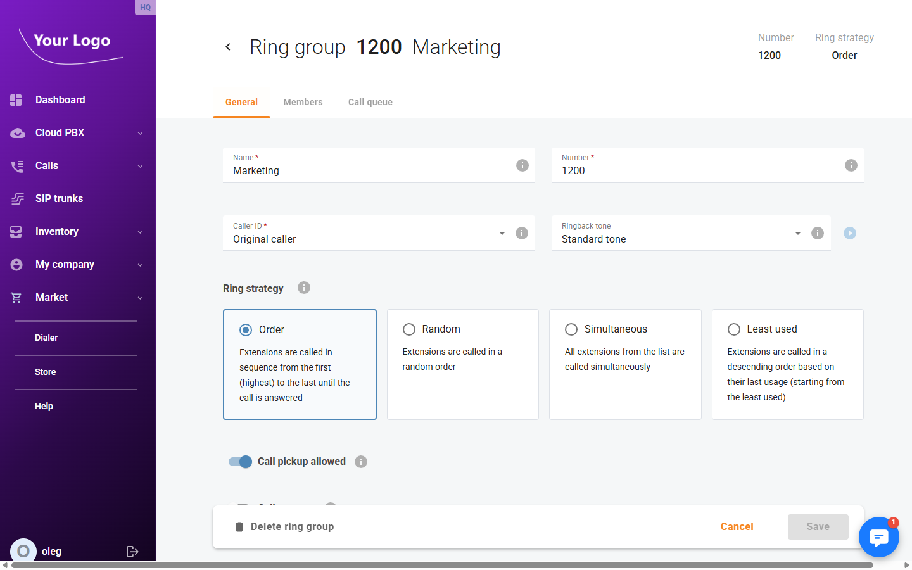
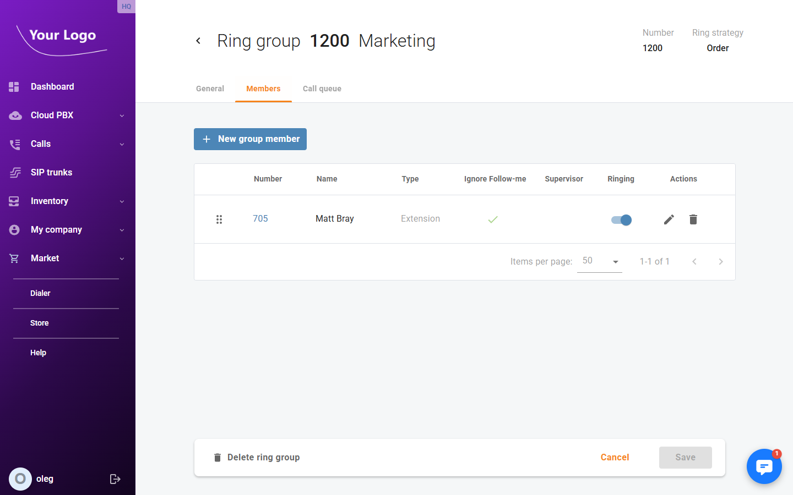
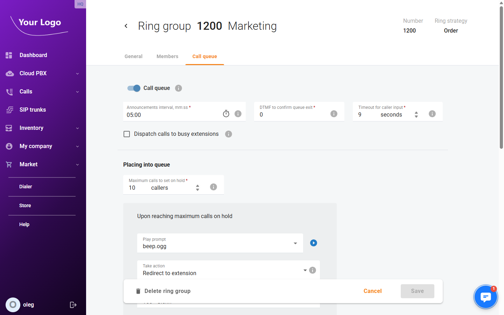

# Ring Groups

## Overview

**Ring groups** distribute incoming calls to a set of member extensions. When a call arrives at the ring group number, the system rings the members according to the configured strategy. An optional call queue holds callers when all members are busy, playing hold music and announcements until an agent is available.

Open menu **"Cloud PBX > Ring groups"** (route: `/ring-groups`).

## Ring Groups List

| Column | Description |
|---|---|
| **Number** | The ring group's internal extension number. |
| **Name** | The ring group name. |
| **Ring strategy** | How member extensions are rung (Order, Random, Simultaneous, or Least used). |
| **Calls** | Number of calls currently active in the group. |
| **Group members** | Member extensions with colour-coded presence indicators (green = idle, red = busy) and a total/idle count. |
| **Actions** | **Call history** – view the call log; **Edit** (✏️) – open the ring group; **Delete** (🗑️) – remove the ring group. |

Use the **Number**, **Name**, and **Included extension** filters to search. Click **Search** to apply.

Click **+ Add new** to create a new ring group.

## Ring Group Detail

Click **Edit** to open a ring group. The header shows the ring group number and the active ring strategy. The detail page contains three tabs.

### General Tab

| Field | Description |
|---|---|
| **Name*** | The ring group name. |
| **Number*** | The internal number dialled to reach this ring group. |
| **Caller ID*** | Controls what caller ID is presented to ring group members when a call arrives (e.g. *Original caller*). |
| **Ringback tone** | The ringback tone played to the caller while waiting for a member to answer (dropdown, with a preview play button). |

**Ring strategy** – Select how member extensions are called:

| Strategy | Description |
|---|---|
| **Order** | Extensions are called in sequence from the first (highest priority) to the last until the call is answered. |
| **Random** | Extensions are called in a random order each time. |
| **Simultaneous** | All extensions in the group are called at the same time. |
| **Least used** | Extensions are called starting from the one that has been used least recently. |

| Field | Description |
|---|---|
| **Call pickup allowed** | Toggle to allow extensions outside the group to pick up calls ringing in this group. |
| **Call wrap-up** | Toggle to enable a post-call wrap-up period, preventing new calls from being dispatched to an agent immediately after a call ends. |

Click **Save** to apply changes.

### Members Tab

The **Members** tab lists all extensions assigned to this ring group.

| Column | Description |
|---|---|
| **Number** | The extension number of the member. |
| **Name** | The extension owner's display name. |
| **Type** | Member type (e.g. *Extension*). |
| **Ignore Follow-me** | If checked, the member's personal call forwarding (follow-me) rules are bypassed when calls arrive via this ring group. |
| **Supervisor** | Marks this member as a supervisor, enabling call monitoring features for the group. |
| **Ringing** | Toggle to enable or disable ringing for this member without removing them from the group. |
| **Actions** | Edit the member's ring group settings or remove the member from the group. |

Click **+ New group member** to add an extension to the ring group.

### Call Queue Tab

Enable the **Call queue** toggle to place callers in a queue when all members are busy.

**General queue settings:**

| Field | Description |
|---|---|
| **Announcements interval, mm:ss*** | How often the system plays queue position or wait-time announcements to the caller. |
| **DTMF to confirm queue exit*** | The DTMF key a caller presses to leave the queue voluntarily. Set to *0* to disable self-service exit. |
| **Timeout for caller input*** | Seconds the system waits for DTMF input before timing out. |
| **Dispatch calls to busy extensions** | If checked, the system will dispatch calls to extensions that are currently on another call. |

**Placing into queue:**

| Field | Description |
|---|---|
| **Maximum calls to set on hold*** | Maximum number of callers that can wait in the queue simultaneously. |

When the queue is full, the **Upon reaching maximum calls on hold** settings determine what happens to additional callers:

| Field | Description |
|---|---|
| **Play prompt** | Audio prompt played to the caller before the overflow action is taken. |
| **Take action** | What to do with the caller (e.g. *Redirect to extension*). |
| **Extension*** | Target extension for the redirect action (visible when *Redirect to extension* is selected). |
| **Wait for user confirmation** | If enabled, the receiving extension must press a key to accept the transferred call. |

**Waiting in queue:**

| Field | Description |
|---|---|
| **Announce the caller's position in the queue** | Play the caller's current position in the queue at each announcement interval. |
| **Announce estimated wait time** | Play the estimated time to answer at each announcement interval. |
| **Play music on hold** | Select the music-on-hold track played to queued callers. |
| **Maximum waiting time, mm:ss*** | Maximum time a caller can wait in the queue before the timeout action triggers. |

When the maximum waiting time is reached, the **When waiting time passes** settings apply:

| Field | Description |
|---|---|
| **Play prompt** | Audio prompt played before the timeout action. |
| **Take action** | What to do with the caller (e.g. *Redirect to extension*, *None*). |
| **Wait for user confirmation** | If enabled, the receiving extension must accept the transferred call. |

**Ringing operators:**

| Field | Description |
|---|---|
| **Maximum ringing time** | How long (in seconds) each agent's extension rings before the call moves on to the next agent. |

When an agent does not answer within the maximum ringing time, the **When ringing time passes** settings apply:

| Field | Description |
|---|---|
| **Play prompt** | Audio prompt played before the no-answer action. |
| **Take action** | What to do with the call when the ringing time expires. |
| **Wait for user confirmation** | If enabled, the next receiving extension must accept the transferred call. |
