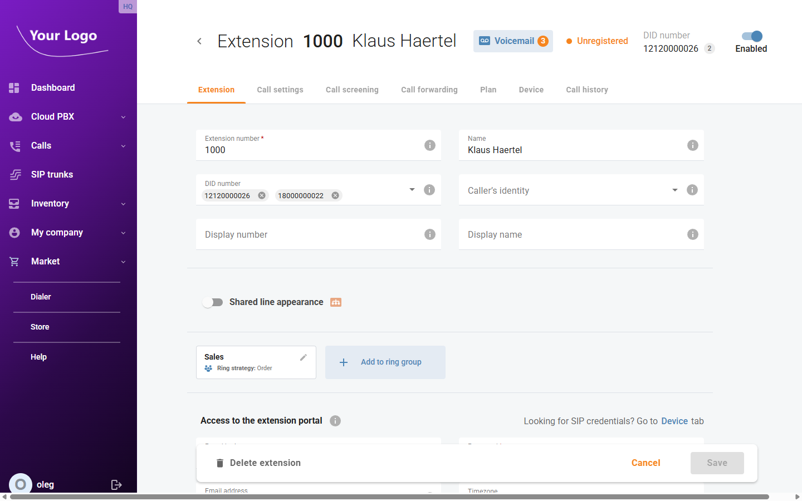
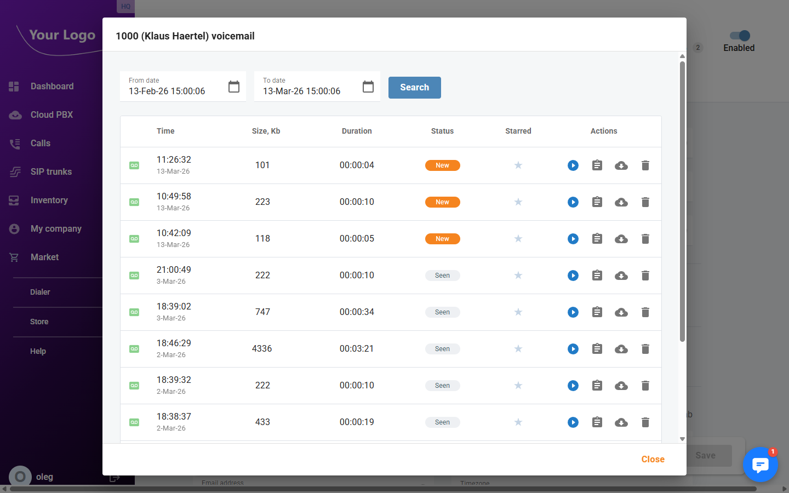
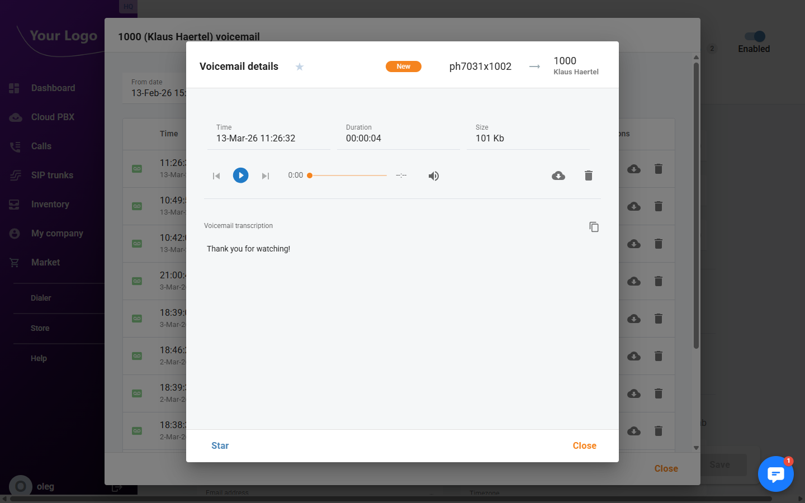

# Voicemail

## Overview

Each extension can have a personal voicemail inbox. When a caller cannot reach an extension, they are guided to leave a message. Voicemail messages are stored in PortaSwitch and can be played, downloaded, or deleted directly from the portal.

The voicemail inbox is accessed from the **Extension detail page**, not from a separate menu. A badge on the **Voicemail** button shows how many unread messages are waiting.

## Accessing Voicemail Messages

1. Navigate to **Cloud PBX → Extensions**.
2. Open the extension whose voicemail you want to review by clicking the edit icon (✏️) in its row.
3. In the extension header, click the **Voicemail** button. The badge on it shows the number of new (unread) messages.

The **Voicemail** dialog opens, listing all messages for the extension.

## Voicemail List

### Filters

Use the date range filters to narrow down the messages shown:

| Filter | Description |
|--------|-------------|
| **From** | Start of the date/time range to display. |
| **To** | End of the date/time range to display. |

Click **Search** to apply the filter.

### Columns

| Column | Description |
|--------|-------------|
| **Time** | Date and time the message was delivered. |
| **Size, Kb** | File size of the voicemail recording. |
| **Duration** | Length of the message in HH:MM:SS format. |
| **Status** | One or more badges: **New** (unread), **Seen** (played), **Answered**. |
| **Starred** | Star icon — click to mark or unmark a message as a favourite. |
| **Actions** | Per-message actions: play, view details, download, delete. |

### Actions

| Button | Description |
|--------|-------------|
| ▶ **Play** | Plays the message in an inline audio player directly in the list. |
| 📋 **Details** | Opens the [Voicemail Detail](#voicemail-detail) dialog with full message information. |
| ☁ **Download** | Downloads the voicemail audio file (WAV format). |
| 🗑️ **Delete** | Deletes the message after confirmation. |

## Voicemail Detail

Click the **Details** button to open the full detail view for a message.

The detail dialog header shows the message status badges, the caller's number, and the destination extension. The dialog provides:

| Field | Description |
|-------|-------------|
| **Time** | Delivery date and time of the message. |
| **Duration** | Length of the voicemail recording. |
| **Size** | File size of the recording. |

Below the metadata, an **audio player** lets you listen to the message directly in the browser.

If transcription is enabled on the account, the **voicemail transcription** text is shown below the player. Use the copy icon to copy the transcript to the clipboard.

Use the **Download** button to save the WAV file locally, or **Delete** to permanently remove the recording.

## Configuring Voicemail (Unified Messaging)

Voicemail behaviour for each extension is configured under the extension's **Unified messaging** settings.

Navigate to **Cloud PBX → Extensions**, open the extension, and scroll to the **Unified messaging** section on the **Extension** tab.

| Setting | Description |
|---------|-------------|
| **Greeting type** | Choose between **Standard** (system default), **Personal** (custom recording), **Name** (name recording), or **Extended absence**. |
| **Greeting record** | Preview or manage the active greeting. The caller hears this before leaving a message. |
| **Require PIN** | If enabled, a PIN is required to retrieve messages by phone. |
| **Auto play messages** | Automatically plays new messages when the extension owner dials into voicemail. |
| **Announce date/time** | Announces the date and time of each message before it plays. |
| **Email address** | When set, voicemail notifications (and optionally the audio file) are sent to this address. |
| **Email option** | Controls what is included in the email: notification only, or notification with recording attached. |
| **File format** | Audio format for the attached recording (e.g. WAV, MP3). |

:::tip
If you want callers to reach voicemail after a number of rings with no answer, open the extension's **Call settings** tab and set the **Default answering mode** to **Ring then Voicemail**. Use the **Timeout** parameter to control how long the phone rings before the call is forwarded to voicemail.
:::
