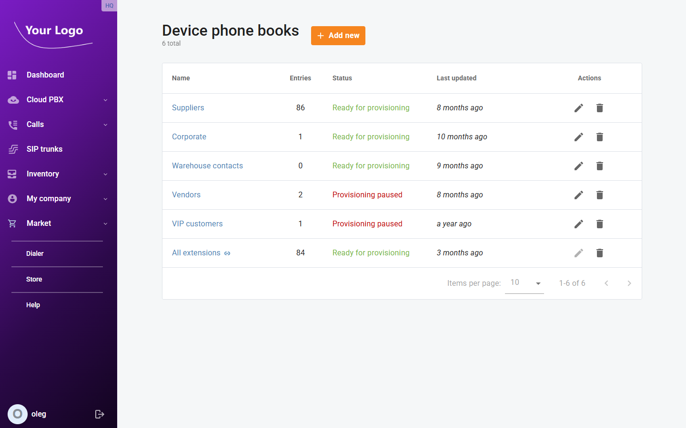
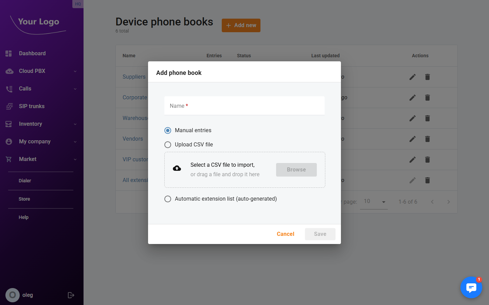
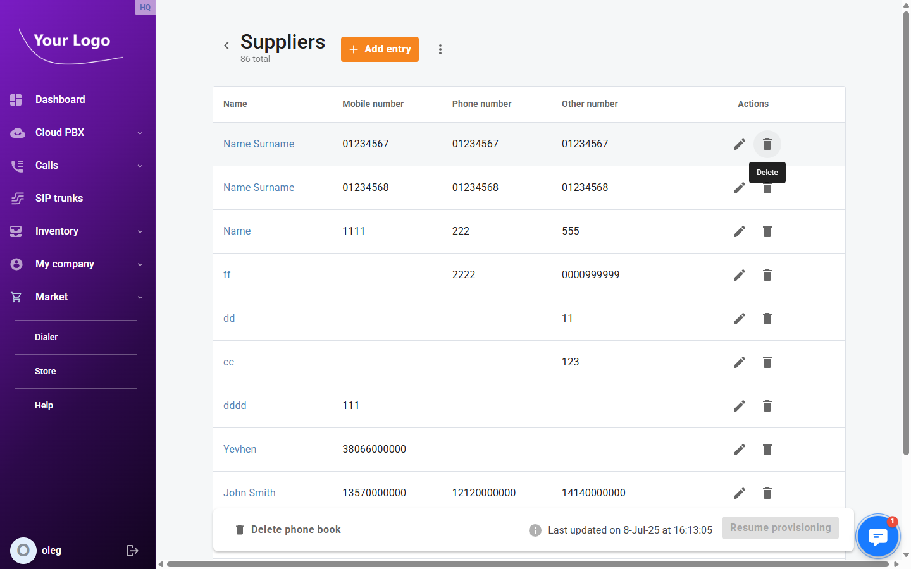
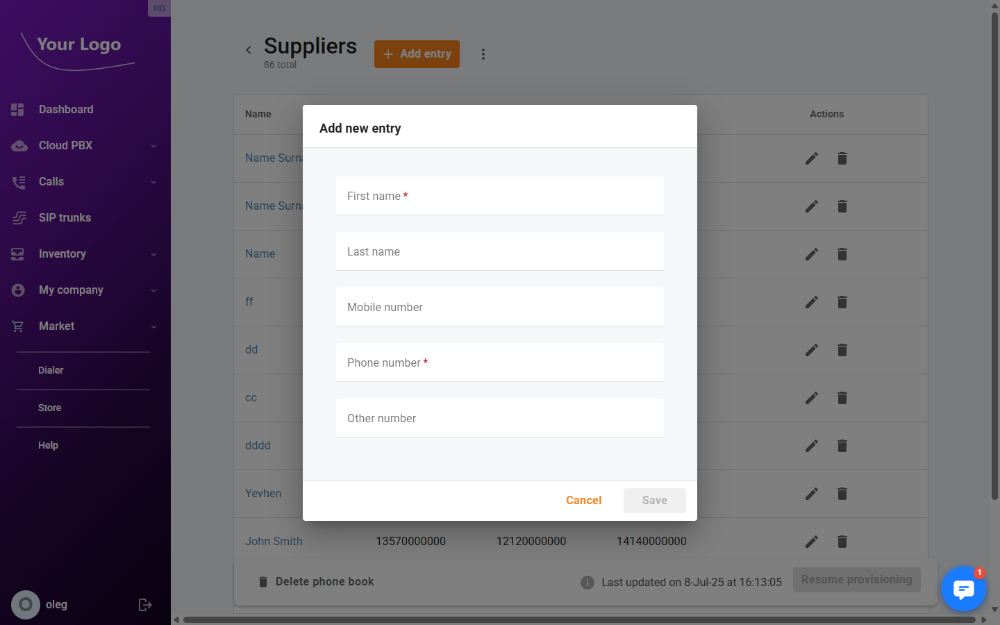

# Device Phone Books

## Overview

A **device phone book** is a contact list that is pushed to IP phones through the auto-provisioning system. When a phone book is enabled in a [device profile](./Device_Profiles.md), every phone using that profile will display the phone book's contacts in its directory.

Phone books can be populated in three ways:

| Mode | Description |
|------|-------------|
| **Manual** | Contacts are added and edited individually through the portal |
| **Auto-sync** | The phone book is automatically populated from your company's extensions. The list stays up to date as extensions are added or removed |
| **CSV import** | Contacts are imported from a comma-separated file |

## Device Phone Books List

Navigate to **Inventory → Device phone books**.

| Column | Description |
|--------|-------------|
| **Name** | Name of the contact list. Auto-sync phone books show a ⇄ icon next to the name |
| **Entries** | Number of contacts currently in the phone book |
| **Status** | **Ready for provisioning** (green) — active and pushed to devices; **Provisioning paused** (red) — draft state, not yet pushed |
| **Last updated** | Date and time the phone book was last modified |
| **Actions** | Edit or delete the phone book |

## Creating a Phone Book

1. Click **+ Add phone book**.
2. Enter a **Name** for the phone book.
3. Select the creation **Mode**:

   - **Manual** — creates an empty phone book. Contacts are added individually after creation.
   - **Auto-sync** — creates a phone book that is automatically populated with your company's extensions. No manual entry is needed; the list updates as extensions change.
   - **CSV** — drag and drop or select a CSV file to import contacts in bulk.

4. Click **Save**.

:::note Draft state
Phone books created via CSV import start in **draft** state while the import is processed. Once the import completes, click **Resume provisioning** on the phone book's detail page to activate it and push it to devices.
:::

## Managing Contacts

Click any phone book to open its detail page. The page lists all contacts and shows the total record count.

| Column | Description |
|--------|-------------|
| **Name** | Contact's first and last name combined |
| **Mobile number** | Mobile phone number |
| **Phone number** | Office or main phone number |
| **Other number** | Additional phone number |
| **Actions** | Edit or delete the entry |

### Adding a Contact

1. Click **+ Add entry** (not available for auto-sync phone books).
2. Fill in the **Add entry** dialog:

| Field | Description |
|-------|-------------|
| **First name** | Contact's first name (required) |
| **Last name** | Contact's last name |
| **Mobile number** | Mobile phone number |
| **Phone number** | Office or main phone number (required) |
| **Other number** | Any additional number |

3. Click **Save**.

### Editing and Deleting Contacts

Click the edit icon on any row to modify a contact's details. Click the delete icon and confirm to remove a contact.

:::note Auto-sync phone books
Contacts in auto-sync phone books are managed automatically. The **Add entry** button and manual edit/delete actions are disabled for auto-sync phone books.
:::

## Importing Contacts from CSV

To bulk-import contacts into an existing phone book:

1. Open the phone book detail page.
2. Click **⋮ More** → **Import from file**.
3. Drag and drop your CSV file or click to select it.
4. Confirm the import.

The CSV file should contain columns for first name, last name, mobile number, office number, and other number.

## Exporting Contacts

To download all contacts as a CSV file, open the phone book and click **⋮ More** → **Download all entries**.

## Renaming a Phone Book

Open the phone book detail page and click **⋮ More** → **Rename**. Enter the new name and save.

## Assigning Phone Books to Devices

Phone books are assigned to phones through device profiles, not directly to individual devices:

1. Go to **Inventory → Device profiles**.
2. Open the profile used by your phones.
3. Go to the **Phone books** tab and enable the desired phone books.
4. Click **Save**.

All phones using that profile will receive the updated contact list on their next provisioning cycle.

## Deleting a Phone Book

Click the **Delete** icon on the phone book list. If the phone book is currently assigned to one or more device profiles, you must remove it from those profiles first.
