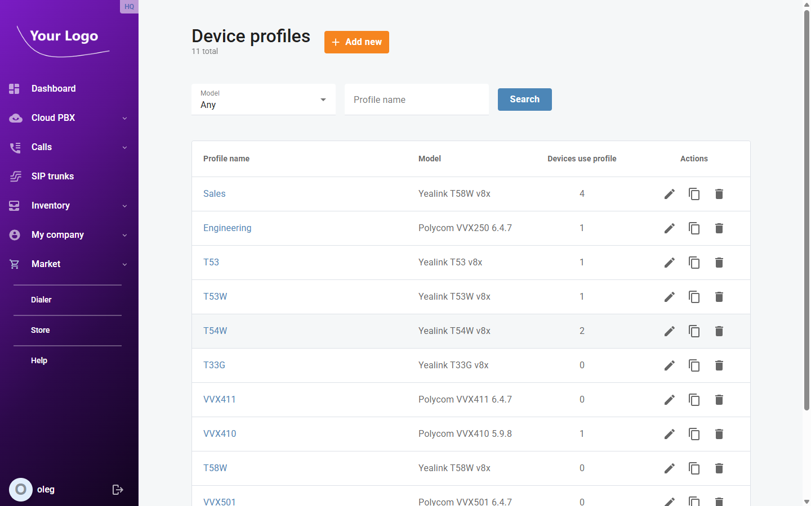
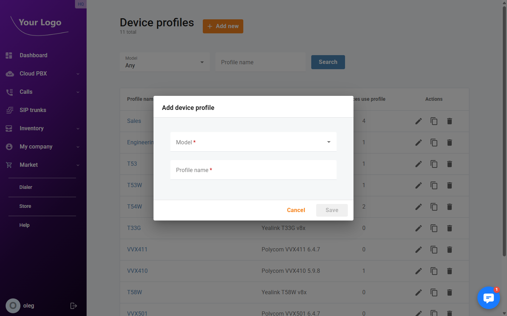
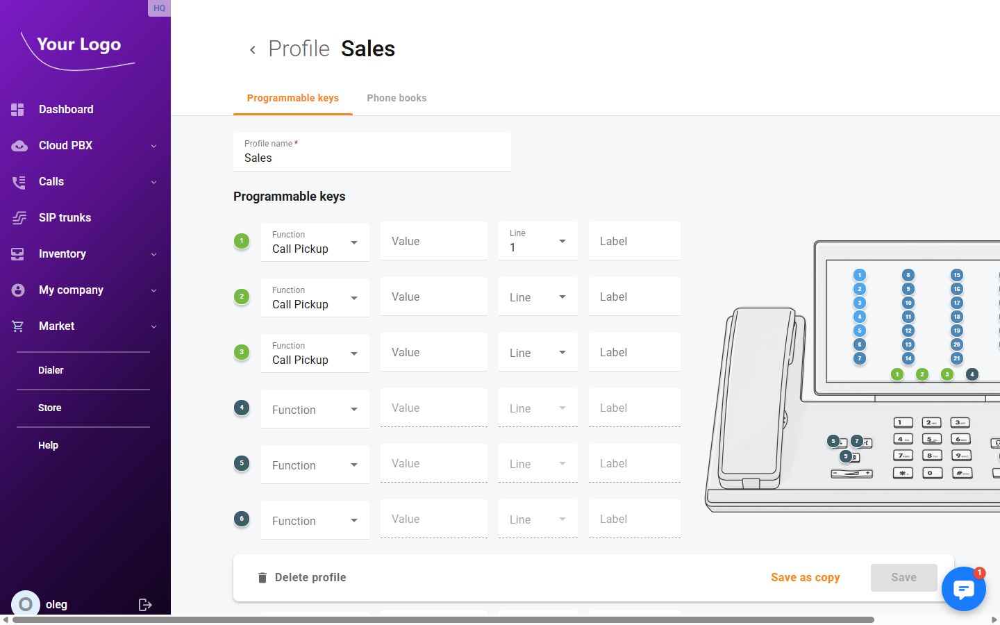
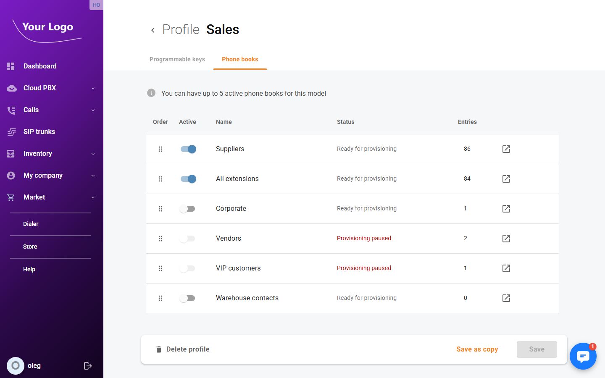

# Device Profiles

## Overview

A **device profile** is a configuration template for a specific IP phone model. When a profile is assigned to a device, PortaSwitch automatically generates a configuration file for that phone containing all SIP settings, programmable key definitions, and phone book assignments. The phone downloads this file on boot — no manual configuration on the phone is needed.

### How Auto-Provisioning Works

1. A device profile is created for a phone model (e.g. Yealink T46U).
2. The profile is assigned to one or more registered devices.
3. When a phone boots, it contacts the provisioning server using its MAC address.
4. PortaSwitch generates a MAC-specific configuration file from the profile template and serves it to the phone.
5. The phone applies the configuration, registers with the SIP server, and is ready to use.

Configuration files are regenerated automatically whenever a profile is saved, so changes are pushed to all phones using that profile on their next reboot or provisioning cycle.

## Device Profiles List

Navigate to **Inventory → Device profiles**.

| Column | Description |
|--------|-------------|
| **Profile name** | Name of the configuration template |
| **Model** | The phone model this profile is designed for |
| **Devices use profile** | Number of phones currently using this profile |
| **Actions** | Edit (✏️), copy (🗂️), or delete (🗑️) the profile |

Use the **Profile name** and **Model** filters to find a specific profile.

## Creating a Profile

1. Click **+ Add device profile**.
2. In the **Add device profile** dialog, select the **Model** and enter a **Profile name**.

3. Click **Save**. The new profile opens for editing.

:::tip Copying an existing profile
To create a new profile based on an existing one, click the **Copy** icon on the profile list. All programmable key settings and phone book assignments are duplicated into the new profile.
:::

## Configuring a Profile

Click any profile to open its detail page. The page has two tabs: **Programmable keys** and **Phone books**.

---

### Programmable Keys Tab

The **Programmable keys** tab is where you define the behaviour of each physical button on the phone.

Phones typically have three types of configurable buttons:

| Button Type | Description |
|-------------|-------------|
| **Soft keys** | Context-sensitive buttons displayed on the phone's screen |
| **Line keys** | Physical buttons on the side of the phone, used for line appearances or speed dials |
| **Expansion keys** | Keys on an optional expansion module attached to the phone |

For each key you can set:

| Field | Description |
|-------|-------------|
| **Action** | What the key does when pressed. Options include: Speed dial, BLF (Busy Lamp Field), Call transfer, Conference, Do Not Disturb, Forward calls, Retrieve parking slot, Phone book directory, and others |
| **Value** | The target for the action — for example the extension number for a Speed dial or BLF key |
| **Label** | Text displayed on the phone's screen next to the key |

Click **Save** to apply all key configurations.

#### Common Key Actions

| Action | Use case |
|--------|----------|
| **Speed dial** | One-touch dialling to a frequently called number or extension |
| **BLF** (Busy Lamp Field) | Monitor another extension's status — the key lights up when that extension is busy |
| **Call transfer** | Transfers the active call to a predefined destination |
| **Do Not Disturb** | Toggles Do Not Disturb on/off for the phone |
| **Retrieve parking slot** | Picks up a parked call from a specific parking slot |
| **Phone book directory** | Opens a specific device phone book on the phone's display |

---

### Phone Books Tab

The **Phone books** tab controls which device phone books are pushed to phones using this profile and in what priority order.

Each available phone book is listed with a toggle. Enable the toggle to include that phone book in the provisioned configuration. The phone's display will show enabled phone books in the contacts directory.

The header shows how many phone books are currently active versus the maximum supported by the model (e.g. **Active phone books: 2 / 3**).

If the model supports reordering, drag phone books up and down to set the priority order in which they appear on the phone.

Click **Save** to apply changes.

:::note
Phone books must first be created in **Inventory → Device phone books** before they can be enabled here.
:::

## Assigning a Profile to Devices

A profile can be applied to devices in two ways:

**From the device detail page:**
Open the device, go to the **Profile** tab, select the profile, and click **Save**.

**Bulk assignment from the Devices list:**
1. Go to **Inventory → Devices**.
2. Select one or more devices using the checkboxes.
3. Click **Assign profile** in the actions bar that appears.
4. Choose the profile and confirm.

All selected devices will use the chosen profile on their next provisioning cycle.

## Deleting a Profile

A profile can be deleted from the profile list using the **Delete** icon. Devices that were using the deleted profile will retain their last provisioned configuration until a new profile is assigned or the device is re-provisioned.
