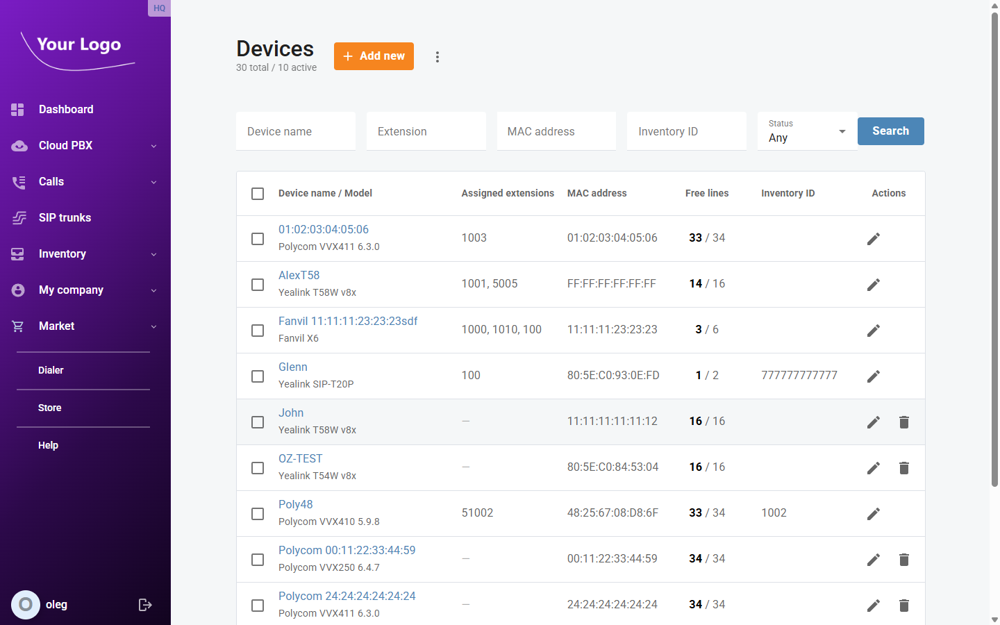
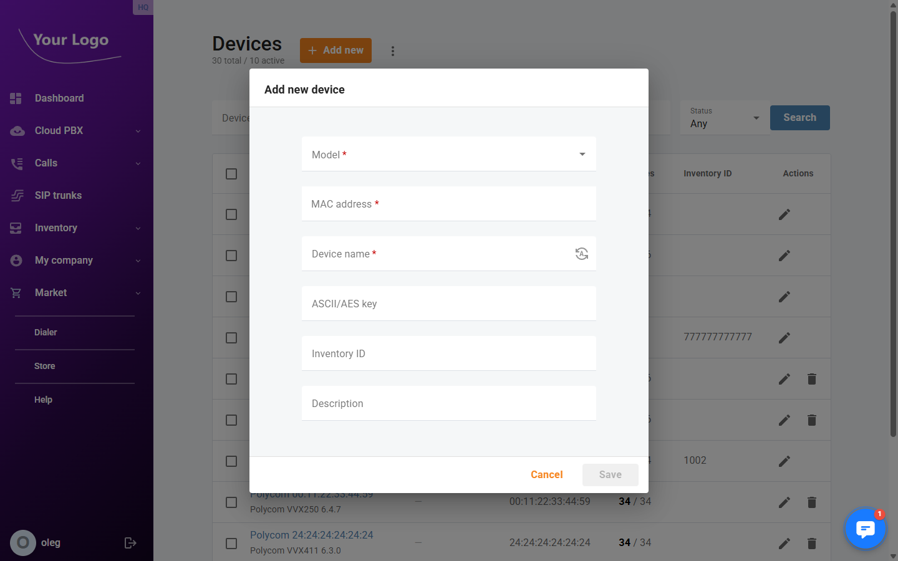
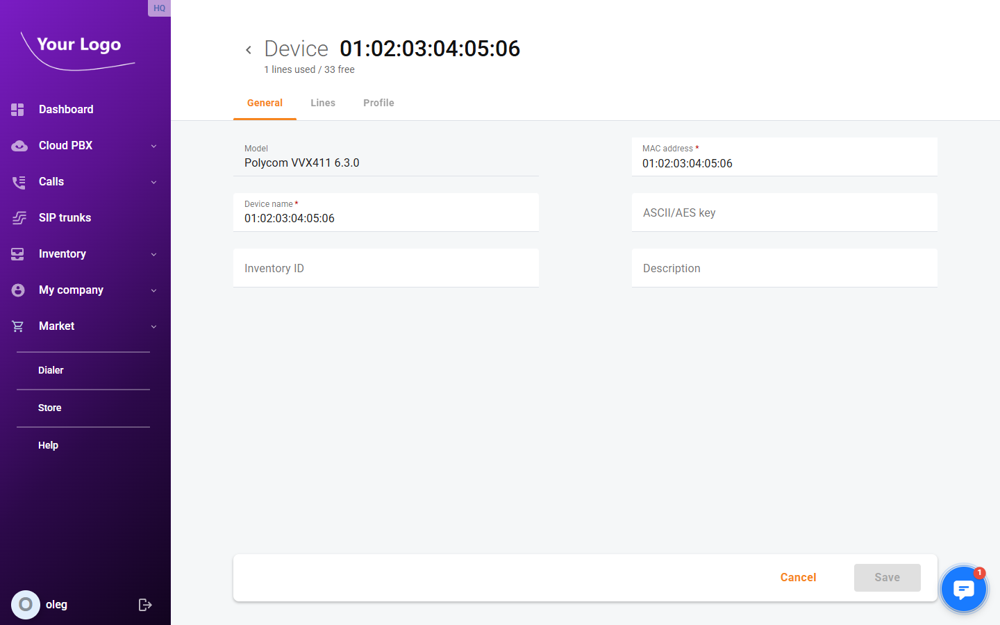
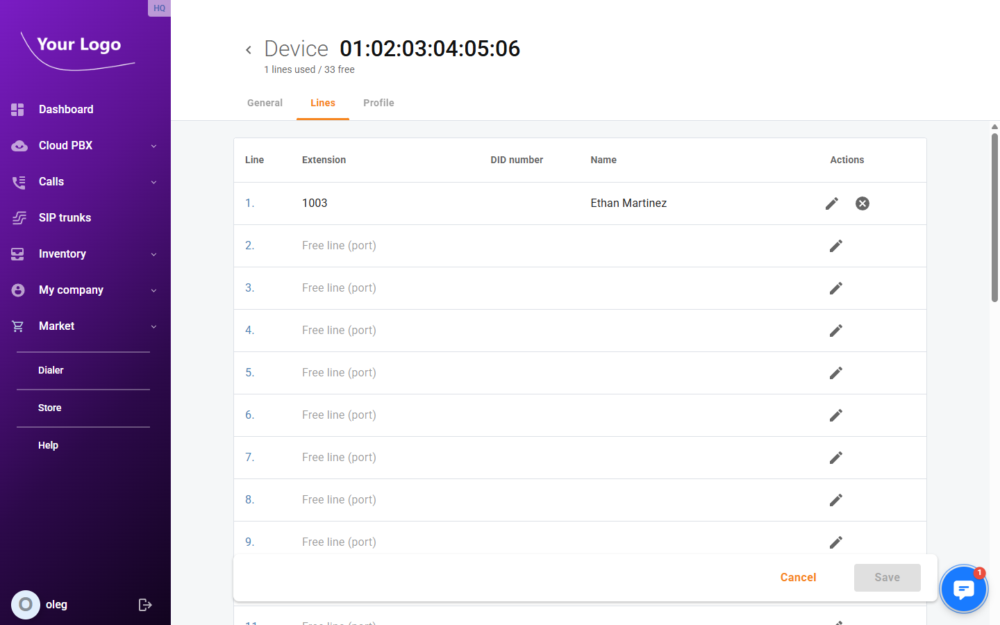
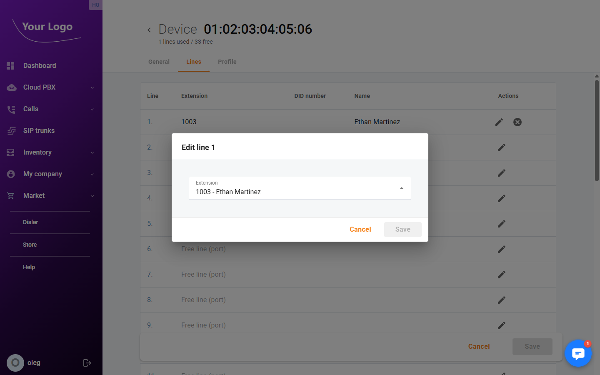
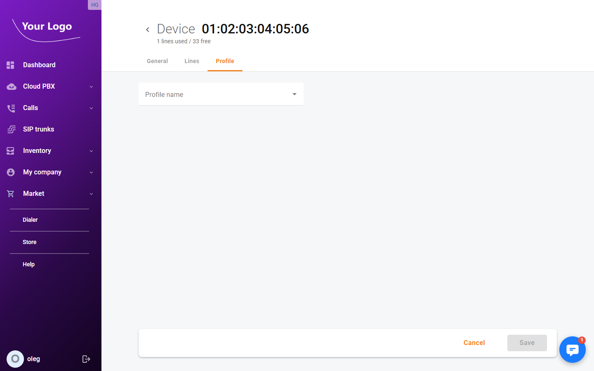

# Devices

## Overview

The **Devices** section is where you register and manage the IP phones used by your company. Each device entry links a physical phone — identified by its MAC address and model — to the platform so that:

- The phone can be automatically configured (provisioned) without manual setup.
- Individual phone lines (ports) can be assigned to extensions, giving that phone a direct number.
- You can monitor which phones are in use and how many of their lines are free.

PortaSwitch generates a configuration file unique to each phone's MAC address. When the phone boots, it downloads this file and registers automatically — no manual SIP configuration on the phone is required provided auto-provisioning is enabled.

## Devices List

Navigate to **Inventory → Devices** to see all registered phones.

| Column | Description |
|--------|-------------|
| **Device name / Model** | Friendly name and the manufacturer model of the phone |
| **Assigned extensions** | Extensions currently assigned to lines on this device |
| **MAC address** | The hardware identifier used to generate the device's configuration file |
| **Free lines** | How many phone lines are unassigned out of the total available (e.g. `4 / 6`) |
| **Inventory ID** | Optional internal reference code for asset tracking |
| **Actions** | Edit or delete the device |

Use the filter fields above the list to search by **Device name**, **Extension**, **MAC address**, **Inventory ID**, or **Status** (Not used / Used / Completely used).

## Adding a Device

1. Click **+ Add new device** on the Devices page.
2. Fill in the **Add new device** dialog:

| Field | Required | Description |
|-------|----------|-------------|
| **Model** | Yes | Select the phone manufacturer and model from the list of supported devices |
| **MAC address** | Yes | The phone's hardware address, printed on a label on the device (format: `xx:xx:xx:xx:xx:xx`) |
| **Device name** | Yes | A friendly label for this phone. Click the auto-generate icon to create one from the model and MAC address |
| **ASCII / AES key** | No | Encryption key for the configuration file (Yealink: 16 chars; others: 16, 32, or 64 chars) |
| **Inventory ID** | No | Optional internal asset tracking reference (max 64 characters) |
| **Description** | No | Free-text notes about this device (max 255 characters) |

3. Click **Save**. The device is created and you are taken to its detail page.

:::tip Importing multiple devices
To add many phones at once, use **Import devices from a file** (available from the list page actions menu). Prepare a CSV file with one device per row (model, MAC address, name) and upload it.
:::

## Device Details

Click any device in the list to open its detail page. The header shows the device name, model, and a summary of used and free lines.

The detail page has up to three tabs: **General**, **Lines**, and **Profile**.

---

### General Tab

The **General** tab displays the device's hardware identity and optional metadata.

| Field | Description |
|-------|-------------|
| **Model** | Read-only. The phone model selected at creation time |
| **MAC address** | The phone's hardware address. Can be corrected if entered incorrectly |
| **Device name** | Editable friendly label |
| **ASCII / AES key** | Encryption key for the provisioned configuration file |
| **Inventory ID** | Optional internal asset tracking code |
| **Description** | Free-text notes |

Click **Save** to apply changes.

---

### Lines Tab

The **Lines** tab shows every physical phone line (port) on the device and the extension assigned to it.

| Column | Description |
|--------|-------------|
| **Line** | Port number on the phone (Line 1, Line 2, …) |
| **Extension** | The extension currently registered on this line |
| **DID number** | The phone number associated with this extension |
| **Extension name** | The display name of the extension user |

#### Assigning an Extension to a Line

1. Click the edit icon on the desired line.
2. In the **Assign extension** dialog, search for and select an extension.

3. Click **Save**.

The phone will pick up the new assignment the next time it downloads its configuration file (typically at next boot, or when provisioning is forced).

#### Releasing a Line

To free a line, click the release icon on that line and confirm. The extension is unlinked but neither the extension nor the device is deleted.

---

### Profile Tab

The **Profile** tab lets you apply a **device profile** to this phone, which controls its full configuration: SIP settings, programmable key actions, and phone book assignments.

Select a profile from the **Device profile** dropdown and click **Save**. The phone will download the updated configuration at its next provisioning cycle.

:::note
The Profile tab only appears for device models that support auto-provisioning profiles. If the tab is absent, the device's configuration must be managed on the phone directly.
:::

## Deleting a Device

A device can only be deleted when all of its lines are free (no extensions assigned). To delete:

1. Open the device detail page.
2. Go to the **Lines** tab and release all assigned extensions.
3. Click **Delete device** and confirm.
