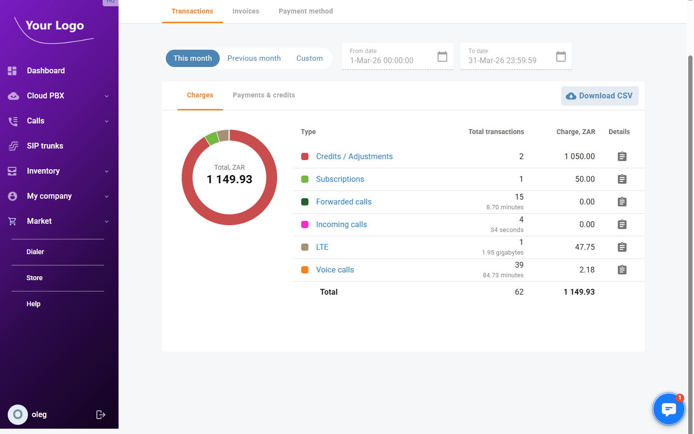
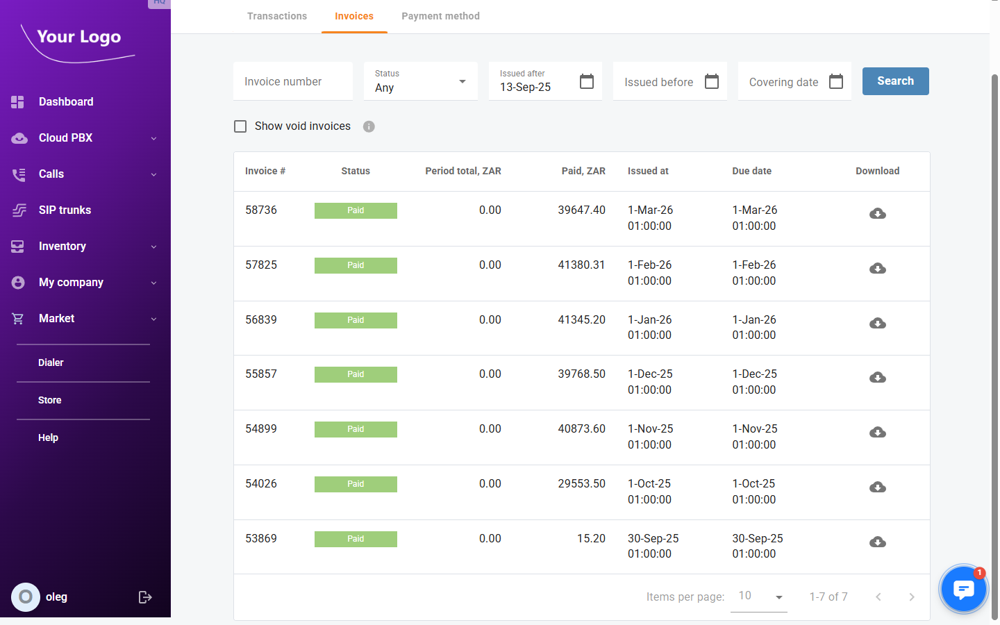
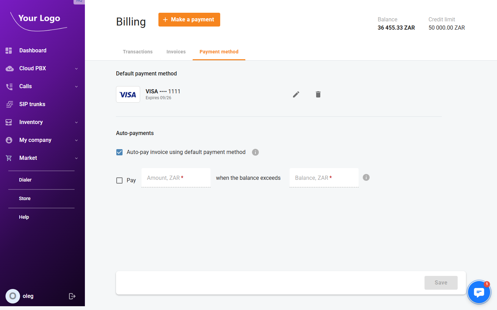

# Billing

## Overview

Open menu "**My company** \> **Billing**" to view your account's financial status, review charges and payments, download invoices, and manage your payment method.

The page header displays your current **Balance** and **Credit limit**, and provides the **+ Make a payment** button to top up your account on demand.

---

## Transactions

The **Transactions** tab shows a summary of all charges and payments for a selected time period.

### Period Selection

Use the period buttons at the top to filter the data:

| Option | Description |
|--------|-------------|
| **This month** | Shows transactions for the current calendar month (default). |
| **Previous month** | Shows transactions for the previous calendar month. |
| **Custom** | Enables the **From date** and **To date** pickers for a custom range. |

### Charges

The **Charges** sub-tab shows a breakdown of all service charges for the selected period. A donut chart on the left visualises the share of each service type in the total.

| Column | Description |
|--------|-------------|
| **Type** | Service type (e.g. Subscriptions, Voice calls, Incoming calls, LTE). Each type is colour-coded in the donut chart. Click the type name to view individual transaction records. |
| **Total transactions** | Number of billing events for this type. For call-type services, also shows the total duration or volume (e.g. minutes, gigabytes). |
| **Charge** | Total amount billed for this type in the account currency. |
| **Details** | Opens a detailed transaction list for this service type. |

A **Total** summary row at the bottom aggregates all types.

### Payments & Credits

The **Payments & credits** sub-tab shows all incoming payments and credit adjustments for the selected period, using the same table structure:

| Column | Description |
|--------|-------------|
| **Type** | Payment or adjustment type (e.g. Credits / Adjustments). |
| **Total transactions** | Number of payment events. |
| **Amount** | Total amount received or credited in the account currency. |
| **Details** | Opens the detailed transaction list. |

### Download CSV

Click **Download CSV** (available on both sub-tabs) to export the current period's transaction summary as a CSV file.

---

## Invoices

The **Invoices** tab lists all invoices issued for your account.

### Filters

| Filter | Description |
|--------|-------------|
| **Invoice number** | Filter by a specific invoice number. |
| **Status** | Filter by invoice status: **Any**, **Paid**, **Unpaid**, or other values. |
| **Issued after** | Show only invoices issued on or after this date. |
| **Issued before** | Show only invoices issued on or before this date. |
| **Covering date** | Show only invoices whose billing period covers this date. |
| **Show void invoices** | When checked, void (cancelled) invoices are included in the list. |

Click **Search** to apply the filters.

### Invoice List Columns

| Column | Description |
|--------|-------------|
| **Invoice #** | Unique invoice number. |
| **Status** | Payment status badge — **Paid** (green), **Unpaid** (red), or other statuses. |
| **Period total** | Total amount charged for the billing period covered by this invoice. |
| **Paid** | Amount already paid against this invoice. |
| **Issued at** | Date and time the invoice was generated. |
| **Due date** | Payment deadline for this invoice. |
| **Download** | Click the download icon (☁) to save the invoice as a PDF file. |

---

## Payment Method

The **Payment method** tab lets you store a card for automatic payments and configure when those payments are triggered.

### Default Payment Method

This section displays the currently saved card. The card type logo, masked card number (last 4 digits), and expiry date are shown.

| Action | Description |
|--------|-------------|
| ✏️ **Edit** | Update the stored card details. |
| 🗑️ **Delete** | Remove the default payment method. |
| **Add method** | Add a new card if no default method is set. |

:::note
A payment method can only be saved after the first manual payment is made via the **Make a payment** dialog.
:::

### Auto-Payments

Configure the conditions under which the system charges your default payment method automatically.

| Setting | Description |
|---------|-------------|
| **Auto-pay invoice using default payment method** | When enabled, the saved card is automatically charged at the end of each billing period to settle the invoice. |
| **Pay [amount] when the balance exceeds [threshold]** | When enabled, the system automatically charges the specified amount to the saved card whenever your balance exceeds the defined threshold. Enter the **Amount** and the **Balance** threshold in your account currency. |

Click **Save** to apply changes to the auto-payment settings.

---

## Making a Manual Payment

Click **+ Make a payment** in the page header to open the payment dialog. Fill in the card details and the amount to pay. You can optionally check **Save as default payment method** to store the card for future auto-payments.

| Field | Description |
|-------|-------------|
| **Cardholder name** | Full name as it appears on the card. |
| **Card number** | 16-digit card number. |
| **Expiration date** | Month and year the card expires. |
| **CVV** | 3- or 4-digit security code. |
| **Billing address** | Street address associated with the card. |
| **Country / State / City / Postal code** | Billing address details. |
| **Amount** | Amount to pay in the account currency. |
| **Save as default payment method** | When checked, this card is stored for future automatic payments. |
