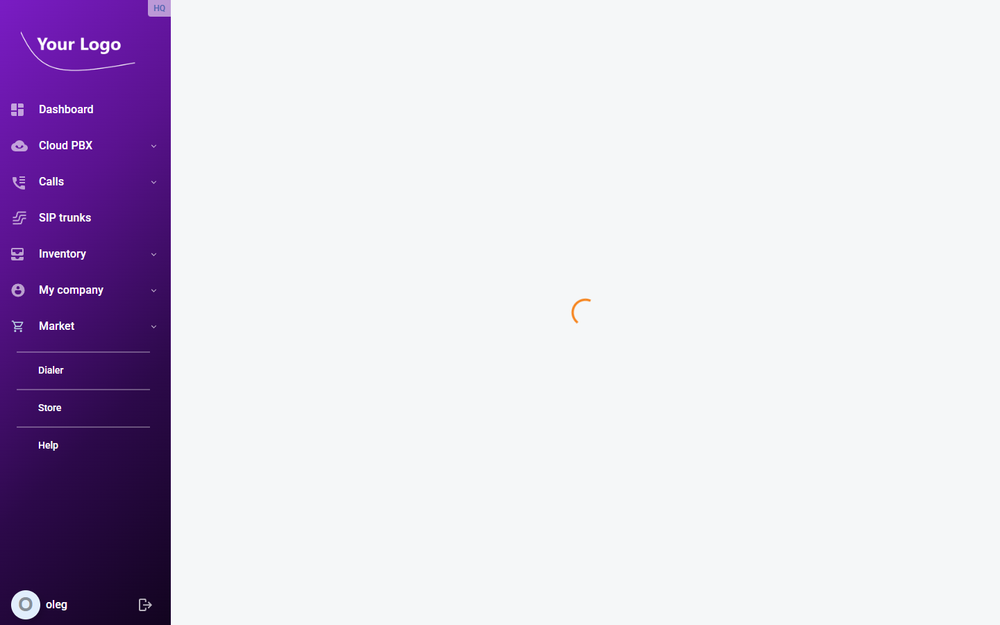

# Company Info

## Overview

**Company Info** stores the contact and address details for your organisation as registered with the service provider. This information may appear on invoices and other correspondence.

Open menu "**My company** \> **Company info**" (route: `/my-company`).

If your organisation has branch offices, the page shows two tabs: **Main (HQ)** and **Branch (Site)**. If there are no branches, all fields appear on a single form.

## Main (HQ) Tab

### Company Name

| Field | Description |
|---|---|
| **Company name** | The registered name of your organisation. |

### General Information

| Field | Description |
|---|---|
| **Salutation** | Title or salutation for the primary contact (e.g. *Mr*, *Ms*, *Dr*). |
| **First name** | First name of the primary contact person. |
| **Middle name** | Middle name or initial of the primary contact (optional). |
| **Last name** | Last name of the primary contact person. |
| **Email address** | Contact email address for the organisation. |
| **Fax** | Fax number in international format. |
| **Phone** | Primary phone number in international format. |
| **Date and time format** | The date/time display format used throughout the portal for this account (e.g. *DD-MM-YYYY HH24:MI:SS*). |

### Address

| Field | Description |
|---|---|
| **Country** | Country where the organisation is located (dropdown). |
| **City** | City or town. |
| **Address line 1** | Street address, building number, etc. |
| **Address line 2** | Additional address details (suite, floor, P.O. box, etc.). Optional. |
| **Province/state** | Province or state (dropdown, enabled after selecting a country). |
| **Postal code** | Postal or ZIP code. |

### Additional Contact

| Field | Description |
|---|---|
| **Contact person** | Name of an alternative or secondary contact. |
| **Additional phone** | Secondary phone number in international format. |

Click **Save** to apply any changes.

## Branch (Site) Tab

If your Cloud PBX account includes branch offices, the **Branch (Site)** tab lets you view the contact details for each branch. Select a branch from the dropdown to switch between offices.

| Branch office details are read-only in the portal. Contact your service provider to update branch information. |
| --- |
