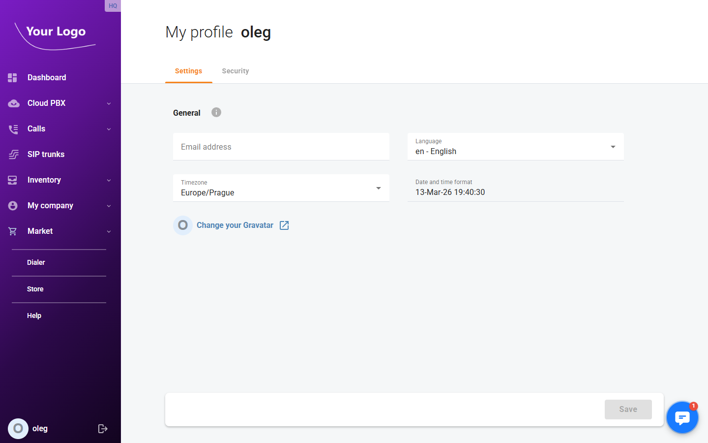
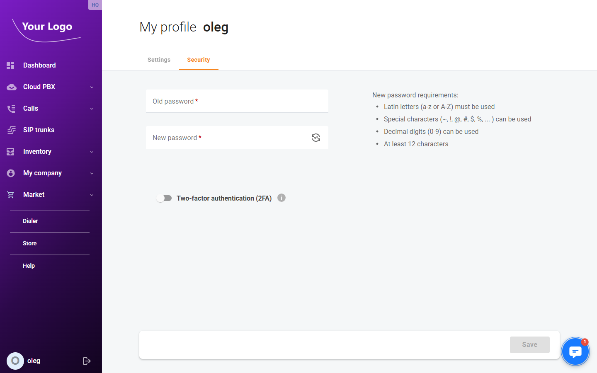

# My Profile

## Overview

**My Profile** lets you manage your own account settings — display preferences and login security. Open menu "**My company** \> **My profile**", or click your login name in the bottom-left corner of the page.

The page shows two tabs: **Settings** and **Security**.

## Settings Tab

The **Settings** tab contains general display preferences for your user account.

| Field | Description |
|---|---|
| **Email address** | Your email address. Used for system notifications. |
| **Language** | Portal interface language (e.g. *en – English*). |
| **Timezone** | Your local timezone. Affects how dates and times are displayed throughout the portal. |
| **Date and time format** | Read-only preview of the current date/time based on the selected timezone. |

### Gravatar

The portal uses [Gravatar](https://gravatar.com) for user avatars. Click **Change your Gravatar** to open the Gravatar website and upload or update your profile picture. The avatar is linked to your email address.

Click **Save** to apply any changes.

## Security Tab

The **Security** tab lets you change your password and manage two-factor authentication.

### Change Password

| Field | Description |
|---|---|
| **Old password** ✱ | Your current password, required to authorise the change. |
| **New password** ✱ | Your new password. Use the 🔄 icon to generate a secure random password. |

**New password requirements:**
- Latin letters (a–z or A–Z) must be used
- Special characters (`~`, `!`, `@`, `#`, `$`, `%`, `…`) can be used
- Decimal digits (0–9) can be used
- At least 12 characters

### Two-Factor Authentication (2FA)

Enable the **Two-factor authentication (2FA)** toggle to add a second layer of security to your login. Once enabled, you will need to enter a one-time password (OTP) from an authenticator app (e.g. Google Authenticator) every time you sign in.

See [Two-Factor Authentication](../Security/Two-factor-authentication.md) for detailed setup instructions.

Click **Save** to apply any changes.
