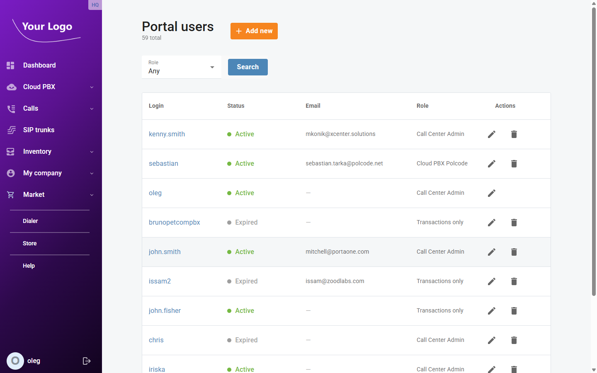
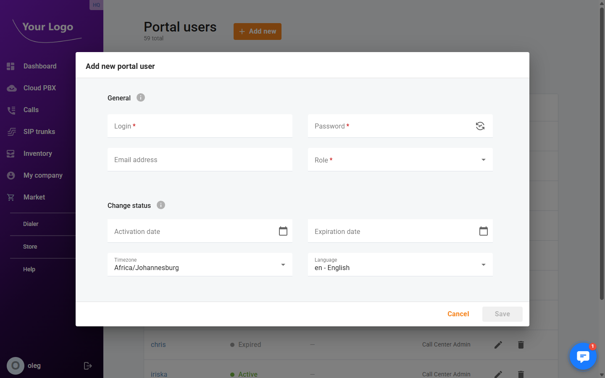
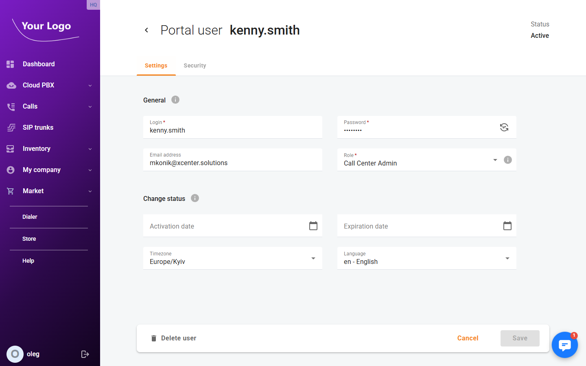
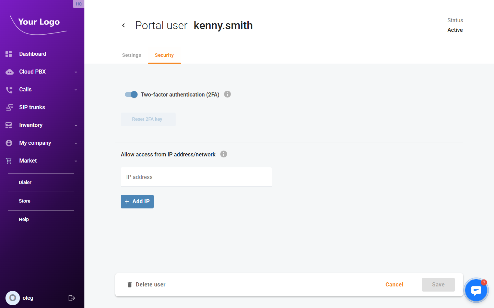

# Portal Users

## Overview

**Portal Users** is where you manage who has access to your Cloud PBX portal and what they can do. Each portal user has a login, a role that defines their permissions, and optionally an email address and access restrictions.

Open menu "**My company** \> **Portal users**" to see the list of all users.

## Portal Users List

The list shows the total number of portal users and the following columns:

| Column | Description |
|---|---|
| **Login** | The username used to sign into the portal. Click the login to open the user's detail page. |
| **Status** | ● **Active** – the user can log in; ● **Expired** – the user's account has passed its expiration date. |
| **Email** | The user's email address (optional). |
| **Role** | The permission role assigned to this user (e.g. *Call Center Admin*, *Transactions only*). |
| **Actions** | ✏️ Edit the user · 🗑️ Delete the user. |

Use the **Role** filter to narrow the list to users with a specific role, then click **Search**.

## Add a New Portal User

Click **+ Add new** to open the **Add new portal user** dialog.

### General

| Field | Description |
|---|---|
| **Login** ✱ | Unique username for signing into the portal. Maximum 64 characters. |
| **Password** ✱ | Initial password. Use the 🔄 icon to generate a secure random password. Maximum 32 characters. |
| **Email address** | Optional. Used for notifications. |
| **Role** ✱ | Permission role that controls what this user can see and do in the portal. |

### Change Status

| Field | Description |
|---|---|
| **Activation date** | Date from which the user can log in. Leave blank to activate immediately. |
| **Expiration date** | Date after which the user can no longer log in. Leave blank for no expiration. |
| **Timezone** | User's local timezone, used for date/time display and scheduling. |
| **Language** | Portal interface language for this user. |

Click **Save** to create the user.

## Edit a Portal User

Click the ✏️ icon in the **Actions** column, or click the login name, to open the user's detail page.

The page header shows the user's login and their current **Status** (Active / Expired).

### Settings Tab

The **Settings** tab contains the same **General** and **Change status** fields as the creation dialog (see above). All fields can be edited except **Role**, which is read-only for your own user.

### Security Tab

The **Security** tab provides two security controls:

#### Two-Factor Authentication (2FA)

Toggle **Two-factor authentication (2FA)** on or off for this user. When enabled, the user must enter a one-time password from an authenticator app on each login. The **Reset 2FA key** button forces the user to re-scan the QR code on their next login — useful when a user gets a new mobile device.

See [Two-Factor Authentication](../Security/Two-factor-authentication.md) for full setup details.

#### Allow Access From IP Address/Network

Restrict this user's login to specific IP addresses or network ranges (CIDR notation). Click **+ Add IP** to add an address. You can add multiple entries.

| Field | Description |
|---|---|
| **IP address** | An IPv4 address or CIDR range (e.g. `192.168.1.0/24`) from which this user is allowed to log in. |

| If any IP restrictions are configured, the user can only log in from those addresses. Access from all other IPs is denied. |
| --- |

## Delete a Portal User

Open the user's detail page and click **Delete user** in the footer bar, then confirm the deletion.

| You cannot delete your own user account. |
| --- |
