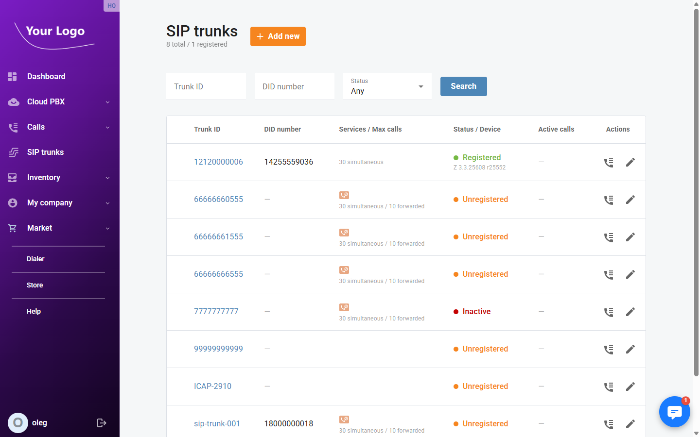
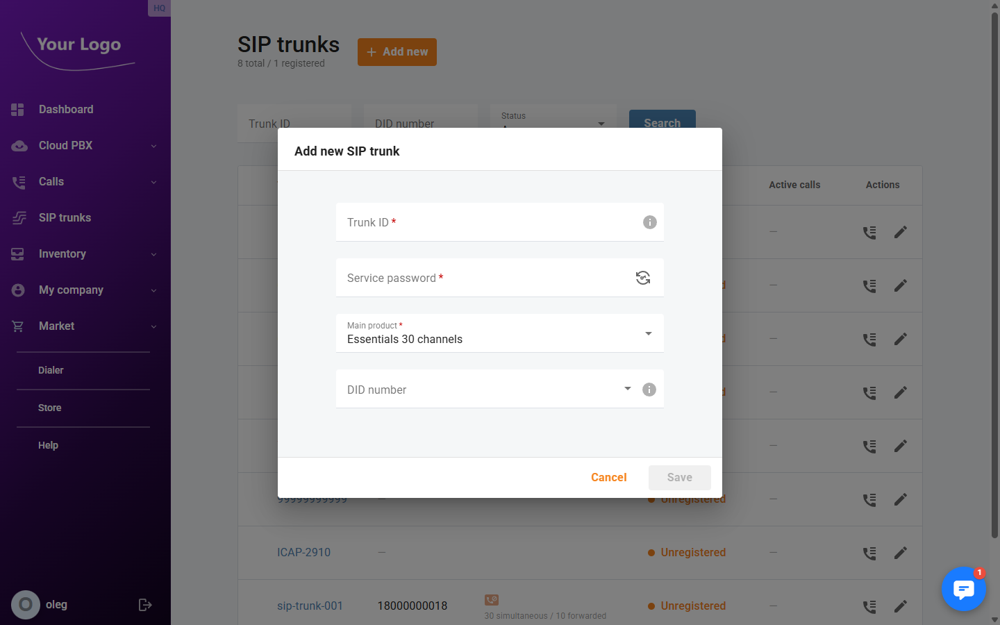
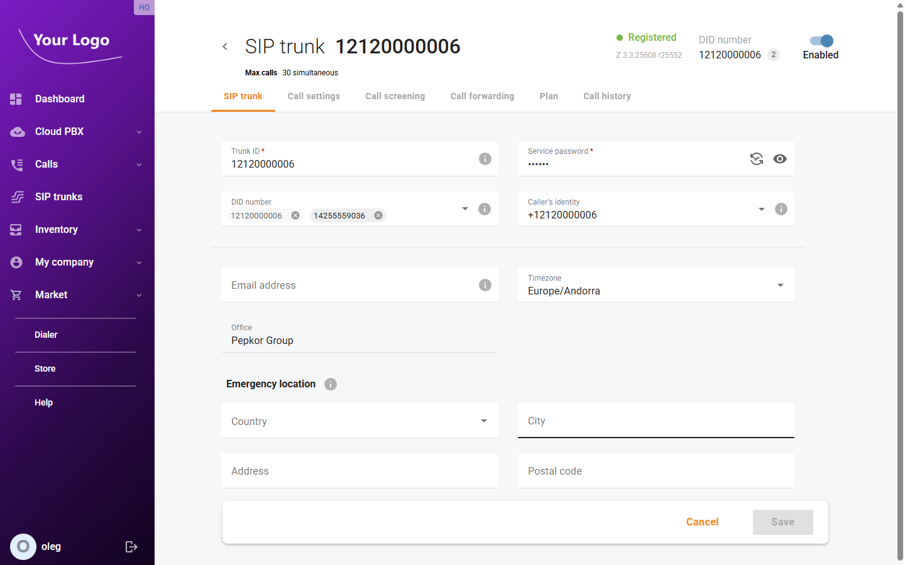
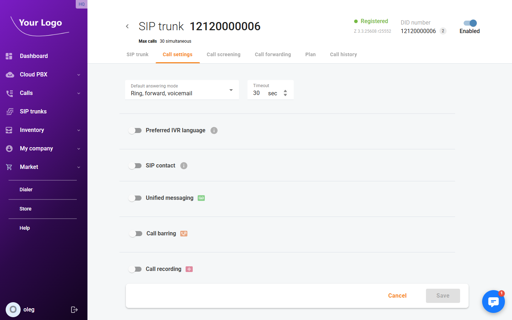
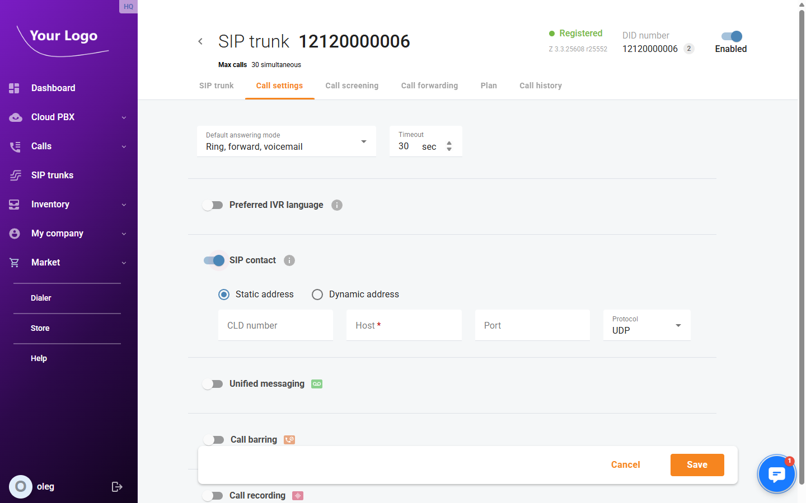
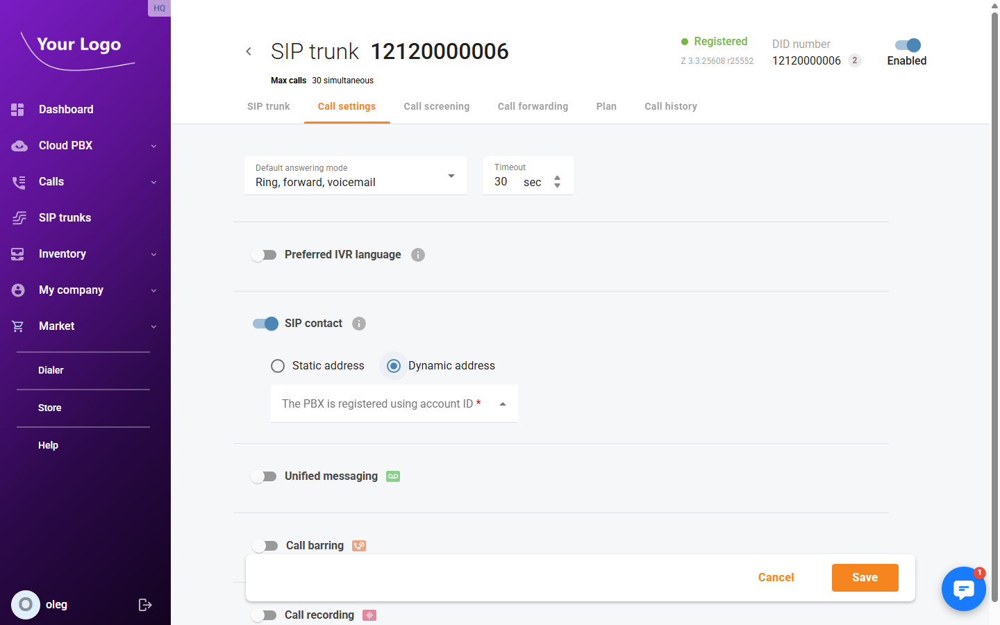
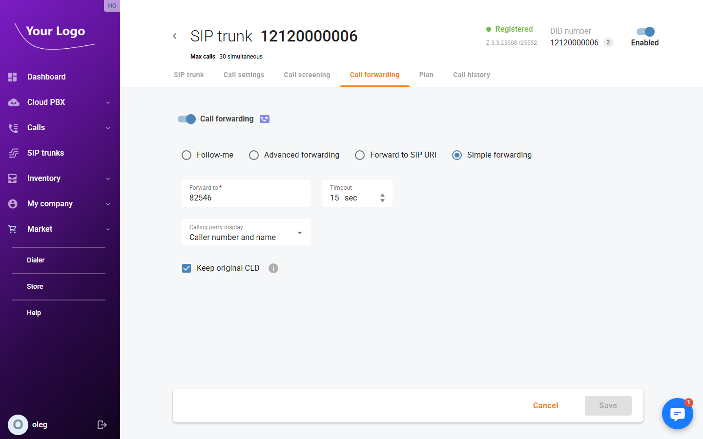
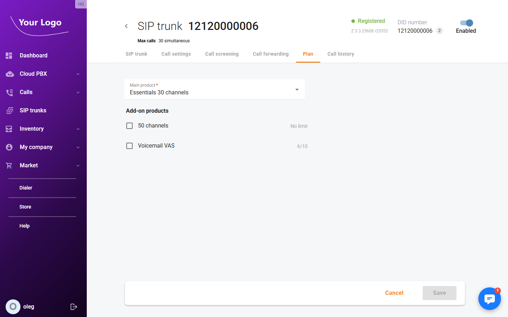
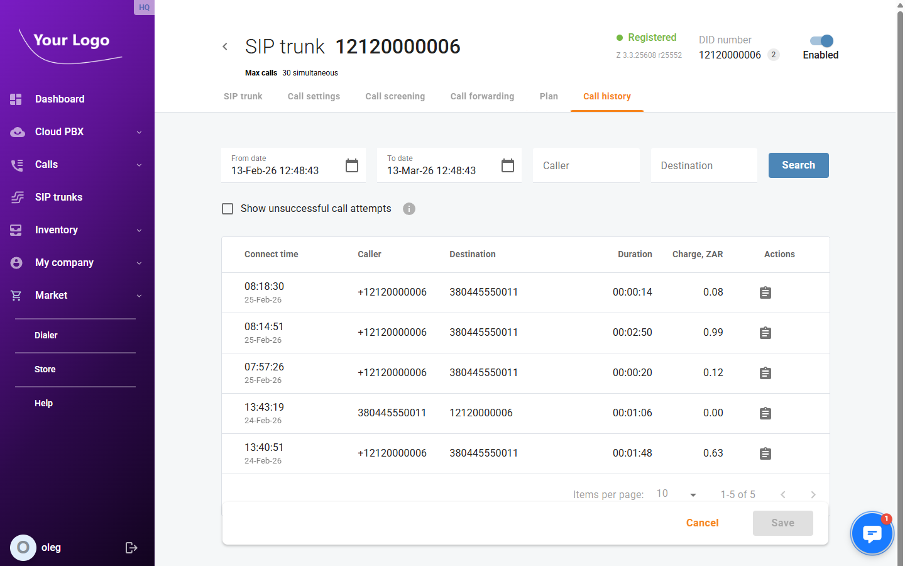

# SIP Trunks

## Overview

A SIP trunk connects your on-premise PBX (office phone system, IP-PBX, or unified communications platform) to the cloud telephony network, giving it access to phone numbers (DIDs), outbound calling routes, and all the calling features of the portal. Unlike extensions — which are assigned to individual users — a SIP trunk serves an entire PBX and can carry many simultaneous calls at once.

Incoming calls to any DID number assigned to the trunk are routed to your PBX. Outgoing calls placed from the PBX are processed and connected through the cloud network. PortaSwitch acts as the intermediary, handling authentication, routing, billing, and all voice features on behalf of your PBX.

## SIP Trunks List

The **SIP trunks** page shows all trunks configured for your company.

Each row displays:

| Column | Description |
|--------|-------------|
| **Trunk ID** | The SIP username used to identify and authenticate the trunk |
| **DID number** | The primary phone number assigned to the trunk |
| **Services / Max calls** | Active service type and the maximum number of simultaneous calls allowed by the plan |
| **Status / Device** | Registration status and the SIP address or device currently connected |
| **Active calls** | Number of calls in progress at this moment |
| **Actions** | Quick-access icons to view call history and edit the trunk |

### Status indicators

| Status | Meaning |
|--------|---------|
| 🟢 **Registered** | The PBX is actively registered and ready to receive calls |
| 🟠 **Unregistered** | The PBX is not currently registered; incoming calls cannot be delivered to it |
| 🔴 **Inactive** | The trunk has been disabled |

To find a specific trunk, enter a **Trunk ID** or **DID number** in the filter fields and click **Search**. Use the **Status** dropdown to narrow results by registration state.

## Adding a SIP Trunk

1. Click **+ Add new** on the SIP trunks page.
2. In the **Add new SIP trunk** dialog, fill in the required fields:
   - **Trunk ID** — a unique identifier for the trunk. For PBX systems that support digest authentication this is the SIP username; for systems that authenticate by IP address, enter the PBX's IP address here.
   - **Service password** — the SIP password used for digest authentication. Click the regenerate icon to auto-generate a strong password.
   - **Main product** — the service plan that defines the number of simultaneous channels and the features available to the trunk.
   - **DID number** — optionally assign one or more phone numbers to the trunk at creation time.
3. Click **Save**.

After saving, you are taken directly to the trunk's detail page where all remaining settings can be configured.

## Configuring a SIP Trunk

Click any trunk in the list to open its detail page. The page header shows the current registration status, the assigned DID number(s), the maximum simultaneous calls, and an **Enabled** toggle.

The detail page has six tabs: **SIP trunk**, **Call settings**, **Call screening**, **Call forwarding**, **Plan**, and **Call history**.

---

### SIP Trunk Tab

The **SIP trunk** tab contains the trunk's core identity and physical location settings.

| Field | Description |
|-------|-------------|
| **Trunk ID** | The SIP username. Can be changed at any time; must remain unique across your account. |
| **Service password** | The SIP authentication password. Use the eye icon to reveal it, or the regenerate icon to replace it with a newly generated password. |
| **DID number** | Phone number(s) assigned to this trunk. You can add additional numbers or remove existing ones (the primary DID cannot be removed). |
| **Caller's identity** | The phone number shown to called parties as the outbound caller ID for calls originating from this trunk. |
| **Email address** | Contact email for the person responsible for managing this trunk. Used for administrative notifications. |
| **Timezone** | The trunk's local timezone. Used by time-based features such as forwarding schedules. |
| **Office** | Read-only. The office this trunk is associated with. |

#### Emergency Location

The **Emergency location** section records the physical address of the PBX connected via this trunk. This address is passed to emergency services when an emergency call (e.g. 911) is placed through the trunk, ensuring that first responders can locate the caller.

| Field | Description |
|-------|-------------|
| **Country** | Country where the PBX is physically located |
| **City** | City |
| **Address** | Street address (max 41 characters) |
| **Postal code** | Postal or ZIP code (max 10 characters) |
| **Province/State** | Province or state; populated automatically based on the selected country |

Click **Save** to apply your changes.

---

### Call Settings Tab

The **Call settings** tab controls how incoming calls are answered and how the system delivers those calls to your PBX.

| Field | Description |
|-------|-------------|
| **Default answering mode** | Determines what happens when an incoming call arrives: ring, forward, go to voicemail, or a combination. |
| **Timeout** | How long (in seconds) the system waits before moving to the next action in the answering sequence. |
| **Preferred IVR language** | Language used for system voice prompts played to callers (e.g. voicemail greetings, hold announcements). |

The tab also contains expandable sections for **SIP contact**, **Unified messaging**, **Call barring**, and **Call recording**.

#### SIP Contact

The SIP contact setting defines how the system delivers incoming calls to your PBX. By default it is disabled, meaning calls are delivered using simple forwarding rules. Enable the **SIP contact** toggle to specify the PBX's address directly.

**Static address** — use when your PBX has a fixed, known IP address or a stable hostname.

| Field | Description |
|-------|-------------|
| **CLD number** | Called-line identification number to include in the SIP INVITE sent to the PBX. Optional. |
| **Host** | The IP address or fully qualified domain name (FQDN) of your PBX. Required. |
| **Port** | The SIP listening port on the PBX (1–65535). Leave blank to use the default SIP port (5060). |
| **Protocol** | Transport protocol for SIP signalling: **UDP** (default) or **TCP**. |

**Dynamic address** — use when your PBX registers with the server and its IP address may change. Incoming calls are delivered to the address from which the PBX last registered.

| Field | Description |
|-------|-------------|
| **The PBX is registered using account ID** | Select the account ID your PBX uses when registering. The dropdown shows the current registration status (Registered / Unregistered) for each account. |

Click **Save** to apply changes on the Call settings tab.

---

### Call Forwarding Tab

The **Call forwarding** tab lets you redirect incoming calls to another number or SIP URI when the trunk is unavailable or when specific conditions are met.

Enable the **Call forwarding** toggle and choose one of four forwarding modes:

| Mode | Description |
|------|-------------|
| **Follow-me** | Ring one or more forwarding destinations in sequence or simultaneously, each with its own timeout. Useful for failover to a mobile or backup PBX. |
| **Advanced forwarding** | Apply different forwarding rules depending on time of day or the caller's number. |
| **Forward to SIP URI** | Deliver calls directly to a SIP address outside the platform. |
| **Simple forwarding** | Redirect all incoming calls unconditionally to a single phone number. |

For **Simple forwarding**, configure the following fields:

| Field | Description |
|-------|-------------|
| **Forward to** | The destination number to which calls are redirected. |
| **Timeout** | Seconds to wait before the forward takes effect. |
| **Calling party display** | What the destination party sees as the caller ID. |
| **Keep original CLD** | When enabled, the original caller's number is passed through to the destination instead of the trunk's DID. |

Click **Save** to apply your forwarding configuration.

---

### Plan Tab

The **Plan** tab shows the service plan assigned to the trunk and lists available add-on products.

| Field | Description |
|-------|-------------|
| **Main product** | The primary service plan. Determines the maximum number of simultaneous calls (channels) and which features are included. |
| **Add-on products** | Optional upgrades such as additional channels or Voicemail. Each add-on shows the number of activations remaining on your account's allocation. |

To activate an add-on, check the box next to it and click **Save**.

---

### Call History Tab

The **Call history** tab provides a searchable log of all calls made and received through this trunk.

Use the filters at the top to narrow the results:

- **From date / To date** — restrict the log to a specific time period.
- **Caller** — filter by the originating number.
- **Destination** — filter by the dialled number.
- **Show unsuccessful call attempts** — when checked, includes calls that were attempted but not connected (busy, no answer, rejected, etc.).

Click **Search** to apply the filters.

Each record in the log shows:

| Column | Description |
|--------|-------------|
| **Connect time** | Date and time when the call was answered |
| **Caller** | Originating phone number |
| **Destination** | Dialled phone number |
| **Duration** | Length of the connected call (hh:mm:ss) |
| **Charge** | Cost of the call charged to the account |
| **Actions** | Download the call recording for this call (available when call recording is enabled for the trunk) |

---

## Enabling and Disabling a SIP Trunk

A trunk can be temporarily taken out of service without deleting it. Use the **Enabled** toggle in the top-right corner of the trunk's detail page. When disabled, the trunk cannot register and incoming calls will not be delivered to the PBX. The trunk's configuration is preserved and it can be re-enabled at any time.
