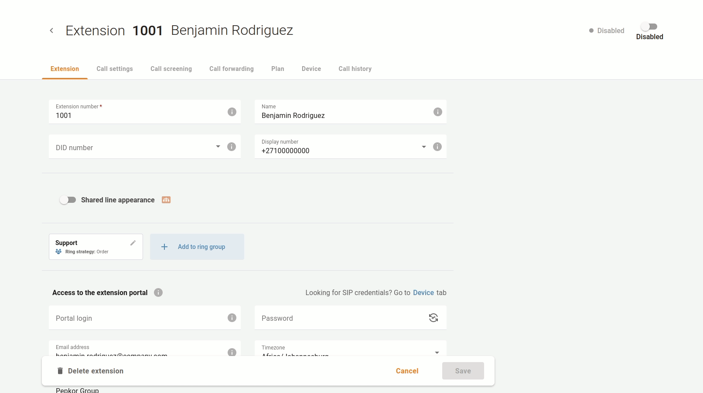

# Blocking phone lines

Sometimes, you may need to block/unblock specific phone lines. For example, your company occasionally hires for seasonal sales campaigns. When a campaign ends and a specialist leaves, your company blocks their extension (the service provider doesn’t charge a subscription fee for the days when a phone line is blocked). You may later unblock it when a specialist starts working again.

| if the phone line is blocked by the service provider, you cannot manage it. |
| --- |

If you temporarily need to block an extension, open menu "**Cloud PBX** \> **Extensions**", select the extension that needs to be blocked, and block it.

Such extension may be later unblocked.

