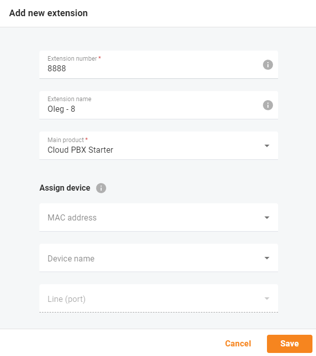
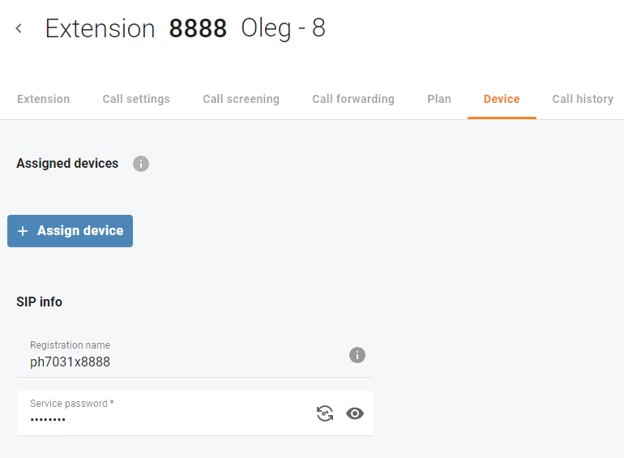

### Create an extension
Most of the users begin with creating an extension.

**CloudPBX --> Extensions --> Add New**

After you created an extension, you can register your extension using
 - IP Phone
 - Softphone
 - Mobile app

### Where to find SIP username and password?
SIP Registration name and Service password are located at Device tab of Extension.

**CloudPBX --> Extension --> Device**

The address of your SIP server is supplied by your provider.