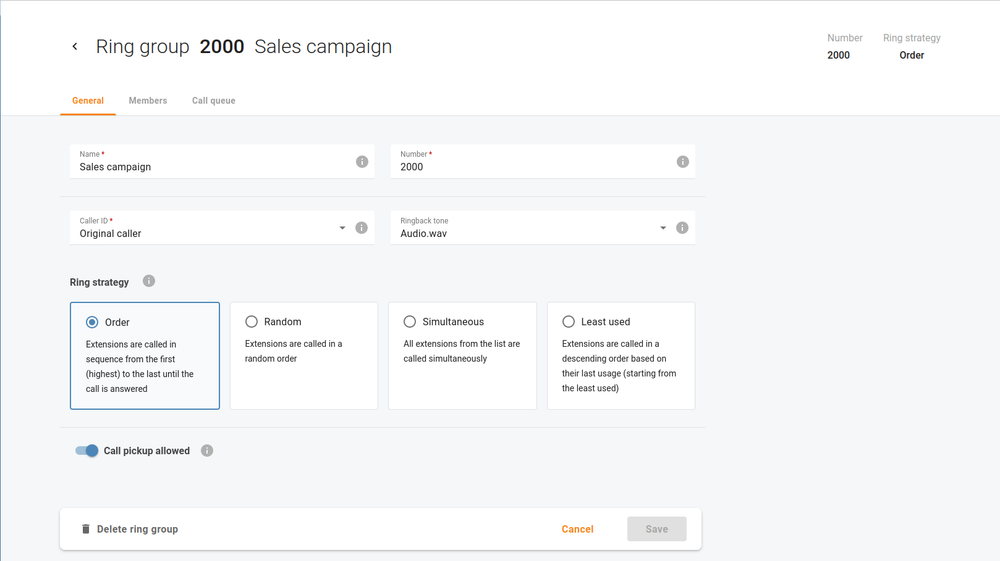
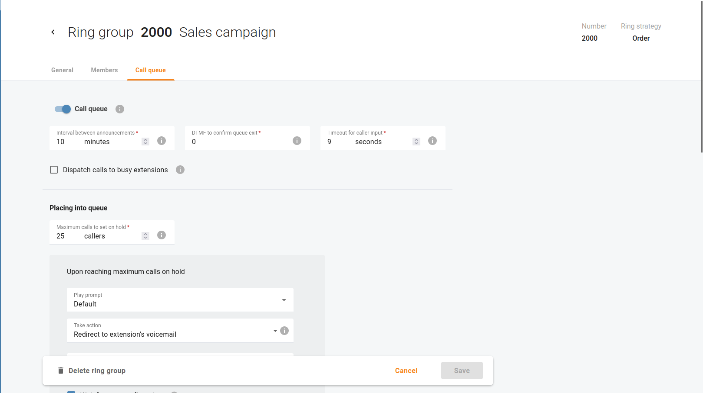

# Automatisierte Anrufverteilung

## Übersicht

In der hektischen Welt der Call-Center soll eine ACD-Lösung (Automated Call Distribution) die Interaktion mit dem Kunden optimieren und die Kundenbindung erhöhen, indem sie die Interaktion mit dem Kunden optimiert. Ihr ACD-System verwaltet eingehende Anrufe nahtlos, leitet sie intelligent weiter und sorgt für eine effiziente Warteschleifenbildung, was die Basis für einen aussergewöhnlichen Kundenservice bildet.

## Unterscheidung zwischen IVR und ACD

Interactive Voice Response (IVR) ist eine Technologie, die dem Benutzer die Interaktion mit einem automatischen System erleichtert, bevor er mit einem Agenten verbunden wird. IVR hilft dabei, die Art der Anfrage des Benutzers zu identifizieren und ihn an die entsprechende Stelle weiterzuleiten.

IVRs erreichen dies, indem sie die Benutzer auffordern, bestimmte Tasten auf ihren Telefonen zu drücken, die ihren Bedürfnissen entsprechen. Ein IVR könnte zum Beispiel die Anweisung geben: „Drücken Sie die 1 für Produktkäufe“. Anschliessend verarbeitet die ACD diese Eingaben, indem sie die Benutzer mit den entsprechenden Vertriebsmitarbeitern verbindet und unnötige Weiterleitungen an andere Abteilungen vermeidet.

In der Regel wird IVR als Instrument zur Datenerfassung verwendet, während ACD diese Informationen zur Organisation und Zuweisung von Anrufen verwendet. Durch die Kombination von IVR und ACD wird sowohl die Kundenzufriedenheit als auch das Engagement der Mitarbeiter in der Call-Center-Umgebung erhöht.

## Wie ACD funktioniert

Der ACD-Arbeitsablauf besteht aus drei verschiedenen Phasen:

1. **Anrufer-Identifizierung:** Wie bereits erwähnt, geht es in der ersten Phase darum, die Absicht des Anrufers durch eine IVR-Interaktion zu erfassen. Ausserdem kann Ihr IVR so konfiguriert werden, dass die Anrufer ihre Sprache wählen können.

*z. B. hören Anrufer ein IVR-Menü auf Englisch, wenn sie die 1 drücken, und müssen die 2 drücken, um ein IVR-Menü auf Deutsch zu wählen.*

Anhand dieser Informationen kann die ACD dem Anrufer einen Agenten zuweisen, der für sein spezifisches Anliegen am besten geeignet ist.

2. **Warteschleife:** Nach der Identifizierung geht es im nächsten Schritt darum, die Anrufer in eine Warteliste einzuteilen: Wenn die Anzahl der eingehenden Anrufe die Anzahl der verfügbaren Agenten (Kundenbetreuer) in einer Abteilung übersteigt, können die eingehenden Anrufe in einer Warteschleife eingereiht werden.
3. **Anrufweiterleitung:** Die Krönung des Prozesses ist die Anrufweiterleitung. In diesem Fall wendet die ACD die von Ihnen gewählte Verteilungsstrategie an, um die Anrufe weiterzuleiten. Wenn Ihr Ziel ein prompter Kundenservice ist, kann die ACD den eingehenden Anruf nahtlos mit einem verfügbaren Agenten verbinden.

Wählen Sie Ihren Weg zur optimalen Anrufverteilung, indem Sie eine entsprechende Klingelstrategie auswählen: Ihr ACD-System bietet eine Reihe von Verteilungsstrategien, um Ihren individuellen Bedürfnissen gerecht zu werden. Öffnen Sie das Menü "**Cloud PBX** => **Rufgruppen**" um eine Rufgruppe auszuwählen und auf "**Bearbeiten**". Aktivieren Sie auf der Registerkarte "**Allgemein**" die am besten geeignete Klingelstrategie.

* Wenn Sie die Option **Wie aufgelistet** wählen, werden die Nebenstellen der Reihe nach von der ersten (obersten) bis zur letzten Nummer angerufen, bis der Anruf angenommen wird.
* Wählen Sie **Zufällig**, wenn Sie eine zufällige Reihenfolge verwenden möchten.
* **Gleichzeitig** ermöglicht gleichzeitige Anrufe zu jeder Nebenstelle in der Liste.
* Wenn Sie **Am wenigsten verwendet** wählen, werden die Telefonleitungen in absteigender Reihenfolge, beginnend mit der letzten Nutzung, sortiert und ein Anruf an die entsprechende Durchwahl zugestellt.

## Anrufwarteschleifen

Wenn Ihr Unternehmen ein hohes Anrufaufkommen von Kunden erhält, stellt die Verwendung von Warteschleifen sicher, dass jeder eingehende Anruf effektiv verwaltet wird, so dass jedem geschätzten Kunden besondere Aufmerksamkeit gewidmet werden kann.

Öffnen Sie das Menü "**Cloud PBX** => **Rufgruppen**", um eine Klingelgruppe auszuwählen und klicken Sie auf "**Bearbeiten**". Auf der Registerkarte "**Warteschleife**" aktivieren Sie die Warteschleife für die ausgewählte Ringgruppe, so dass Anrufer, die Ihr Unternehmen erreichen und an eine Abteilung weitergeleitet werden, in der Warteschleife gehalten werden und darauf warten, dass ein Agent verfügbar wird und den Anruf entgegennimmt.

In der Konfiguration der Anrufwarteschleifen können Sie die folgenden Optionen einstellen:

* **Intervall zwischen Ansagen** – Legen Sie fest, wie oft Anrufer Ansagen über die Anzahl der Anrufer vor ihnen in der Warteschleife und die geschätzte Wartezeit bis zur Bearbeitung hören. Der Standardwert ist 5 Minuten.
* **DTMF zum Bestätigen des Verlassens der Warteschleife** – Geben Sie den DTMF-Code an, den Anrufer wählen sollen, um die Warteschleife zu verlassen und eine bestimmte Aktion durchzuführen, z. B. eine Voicemail zu hinterlassen (die Aktion hängt vom Feld Aktionen durchführen ab). Der Standardcode ist "0".
* **Zeitüberschreitung für Anrufereingabe** – Legen Sie die Zeitspanne fest, in der Anrufer den DTMF-Code wählen können. Der Standardzeitraum beträgt 9 Sekunden nach der Ankündigung, die eine bestimmte Aktion vorschlägt (die Aktion wird in den Feldern Aktion ausführen definiert).
* **Anrufe an besetzte Durchwahlen weiterleiten** – Wenn dieses Kontrollkästchen aktiviert ist, werden die Anrufe aus der Warteschleife an Agenten weitergeleitet, auch wenn diese bereits am Telefon sind.

Es gibt 3 Gruppen von Einstellungen, die die Erfahrung mit der Warteschleife steuern.

### In die Warteschleife stellen

Wenn ein Kunde in Ihrem Unternehmen anruft, sind möglicherweise alle Ihre Mitarbeiter beschäftigt. Legen Sie fest, wie die Warteschleife für besetzte Anrufe in diesem Fall neue eingehende Anrufe behandeln soll.

* **Max. Anzahl Anrufer in der Schleife** – Die maximale Anzahl von Anrufen, die in dieser Warteschleife gehalten werden können.
* **Bei Erreichen der maximalen Anzahl gehaltener Anrufe**
  * **Ansage abspielen** – Sie können eine Datei mit einer benutzerdefinierten Ansage hochladen, damit diese (anstelle der Standardansage) für Benutzer abgespielt wird, wenn ihr Anruf nicht in die Warteschleife gestellt werden kann, weil die maximale Anzahl eingehender Anrufe bereits erreicht wurde.
  * **Massnahmen ergreifen** – Wählen Sie die Massnahmen aus, die automatisch oder nach Bestätigung ergriffen werden sollen, wenn die maximale Anzahl der eingehenden Anrufe erreicht ist (z. B. wenn die maximale Anzahl der gehaltenen Anrufe 100 beträgt und der 101ste Anruf eingeht). Mögliche Massnahmen sind:
    * **Verbindung trennen**
    * **Weiterleitung zur Durchwahl**
    * **Umleitung zur Voicemail der Durchwahl**
    * **Umleitung zu einer anderen Warteschleife**
    * **Zurück zum Menü der automatischen Anrufannahme**
  * **Benutzerbestätigung abwarten** – Wenn dieses Kontrollkästchen aktiviert ist, müssen Anrufer den DTMF-Code, z. B. "0", wählen, um die Aktion auszuführen (der Code wird in der Option **DTMF zur Bestätigung des Verlassens der Warteschleife** angegeben). Standardmässig ist diese Option deaktiviert und die Aktion (definiert im Feld **Massnahme durchführen**) wird automatisch durchgeführt.

### Warten in der Warteschleife

Wenn ein Kunde in Ihrem Unternehmen anruft und alle Agenten besetzt sind, wird dieser Anruf in die Warteschleife gestellt, was bedeutet, dass ein Benutzer warten muss, bis ein Agent verfügbar ist. Legen Sie fest, wie die Warteschlange für besetzte Anrufe in diesem Fall neue eingehende Anrufe behandeln soll.

* **Anzahl der Anrufer, die noch in der Warteschleife stehen, ankündigen** – Wenn dieses Kontrollkästchen aktiviert ist, hören die Anrufer eine Ansage, die die Anzahl der Anrufer vor ihnen in der Warteschleife angibt.
* **Ankündigung der voraussichtlichen Wartezeit** – Wenn dieses Kontrollkästchen aktiviert ist, hören die Anrufer eine Ansage über die geschätzte Wartezeit.
* **Musik in der Warteschleife abspielen** – Mediendatei, die ein Anrufer anstelle des standardmässigen Freizeichentons hören kann. Die maximal zulässige Dateigrösse beträgt 5 MB.
* **Maximale Wartezeit** – Legen Sie fest, wie lange die Anrufer in der Warteschleife warten müssen, bevor sie die Ansage hören, die ihnen eine bestimmte Aktion vorschlägt, z. B. „Weiterleiten an Voicemail“.
* **Wenn die Wartezeit vorbei ist**
  * **Ansage abspielen** – Sie können eine Datei mit einer benutzerdefinierten Ansage hochladen, damit diese (anstelle der Standardansage) für Anrufer in der Warteschleife abgespielt wird.
  * **Massnahme durchführen** – Wählen Sie die Aktion aus, die automatisch oder nach Bestätigung durchgeführt werden soll, wenn das Wartezeitlimit erreicht ist. Mögliche Massnahmen sind:
    * **Keine**
    * **Weiterleitung zur Durchwahl**
    * **Umleitung zur Voicemail der Durchwahl**
    * **Umleitung zu einer anderen Warteschleife**
    * **Zurück zum Menü der automatischen Vermittlung**
* **Benutzerbestätigung abwarten** – Wenn dieses Kontrollkästchen aktiviert ist, müssen Anrufer den DTMF-Code, z. B. "0", wählen, um die Aktion auszuführen (der Code wird in der Option DTMF zur Bestätigung des Verlassens der Warteschleife angegeben). Standardmässig ist diese Option deaktiviert, und die (im Feld "Aktion ausführen" definierte) Aktion wird automatisch ausgeführt

### Klingelndes Personal

Wenn ein Kunde der erste in der Warteschlange ist, aber kein Agent seinen Anruf entgegennimmt, bedeutet dies, dass ein Benutzer warten muss, bis ein Agent antwortet. Legen Sie fest, wie die Warteschleife in diesem Fall Anrufe in der Warteschleife behandeln soll.

* **Maximale Klingeldauer** – Definieren Sie die maximale Zeit, die der erste Anrufer in der Warteschlange (der mit einem bestimmten Agenten verbunden wird) warten kann, bis der Agent den Anruf entgegennimmt.
* **Nach Ablauf der Klingelzeit**
  * **Ansage abspielen** – Sie können eine Datei mit einer benutzerdefinierten Ansage hochladen, damit diese (anstelle der Standardansage) für Anrufer abgespielt wird, die darauf warten, mit einem Agenten verbunden zu werden.
  * **Massnahme durchführen** – Wählen Sie die Aktion aus, die automatisch oder nach Bestätigung durchgeführt werden soll, wenn das Wartezeitlimit erreicht ist. Mögliche Massnahmen sind:
    * **Keine**
    * **Weiterleitung zur Durchwahl**
    * **Umleitung zur Voicemail der Durchwahl**
    * **Umleitung zu einer anderen Warteschleife**
    * **Zurück zum Menü der automatischen Vermittlung**
* **Benutzerbestätigung abwarten** – Wenn dieses Kontrollkästchen aktiviert ist, müssen Anrufer den DTMF-Code, z. B. "0", wählen, um die Aktion auszuführen (der Code wird in der Option DTMF zur Bestätigung des Verlassens der Warteschleife angegeben). Standardmässig ist diese Option deaktiviert, und die (im Feld „Massnahme ausführen“ definierte) Aktion wird automatisch ausgeführt
