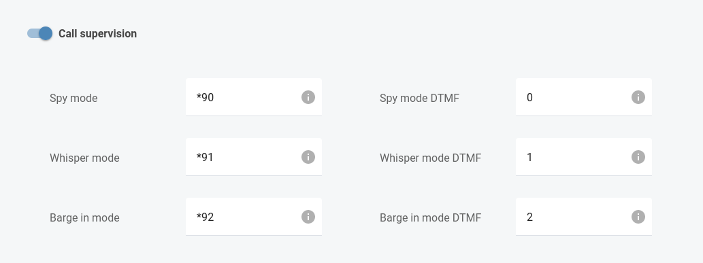
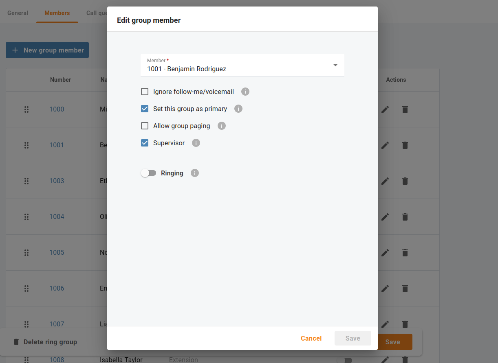
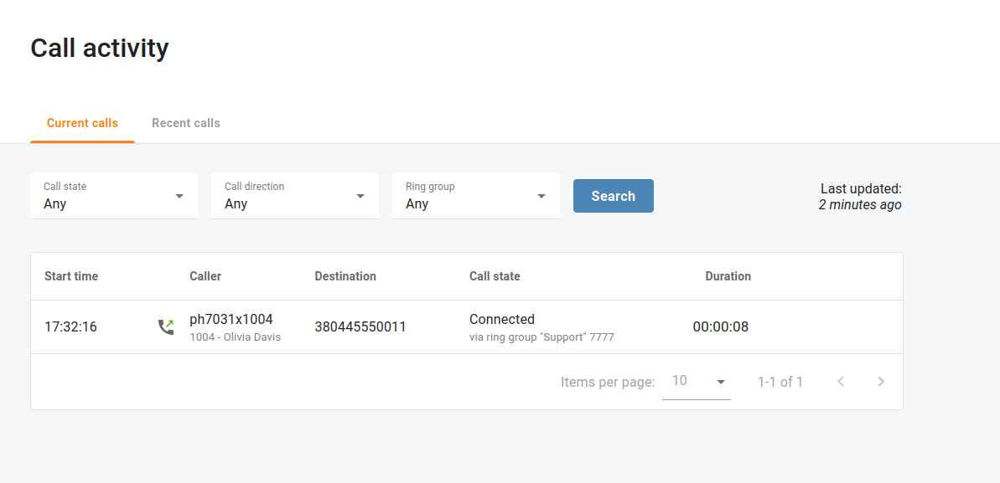

# Überwachung der Anrufe
## Übersicht

Cloud PBX-Manager, die Cloud PBX verwenden, können die Anrufe ihrer Kollegen in Echtzeit überwachen. So kann beispielsweise ein Manager die Anrufe eines Vertriebsmitarbeiters mithören, ihn anleiten und bei Bedarf an den Gesprächen teilnehmen.

| Vergewissern Sie sich, dass „Überwachung des Anrufs“ für Ihre Cloud-Telefonanlage aktiviert ist. |
| ------------------------------------------------------------------------------------------------ |
|                                                                                                  |

Die Anrufüberwachung ist in drei Modi verfügbar:

* **Spionagemodus** – ein Manager kann sich in einen aktiven Anruf einschalten, um das Gespräch zwischen dem Agenten und dem Kunden zu belauschen, ohne dass die Anwesenheit des Managers sichtbar wird. So können Manager beispielsweise Anrufe im Stillen überwachen, um anschließend Feedback zu geben und Verbesserungen der Kommunikationsfähigkeiten der Agenten vorzuschlagen.
* **Flüstermodus** – ein Manager kann direkt mit dem Agenten sprechen, während der Kunde den Manager nicht hört. Der Manager kann den Agenten unterstützen und während des Gesprächs mit dem Kunden Tipps geben. Manager können diesen Modus zum Beispiel bei der Schulung neuer Mitarbeiter verwenden.
* **Barge in Modus** – ein Manager kann mit beiden Parteien sprechen – mit dem Agenten und dem Kunden. Wenn der Agent beispielsweise Schwierigkeiten hat, das Anliegen des Kunden zu bearbeiten, bittet er den Manager um Unterstützung. Der Manager schaltet sich in das Gespräch ein, indem er den Barge in Modus verwendet, um direkt mit dem Kunden zu sprechen.

Ein Manager kann jeden dieser Modi wählen, wenn er einem aktiven Anruf beitritt, und während des Anrufs zwischen den Modi wechseln.

## Service-Codes

Das Menü "**Anrufe** => **Einstellungen** => **Servicecodes**" öffnen, um Ihre Standard-Servicecodes zu überprüfen.

Um beispielsweise einem Anruf eines Agenten mit der Durchwahl 888 im Flüstermodus beizutreten, wählt ein Manager die entsprechende Vorwahl, gefolgt von der Durchwahl: \*91888. Um z. B. vom Flüstermodus in den Spionagemodus zu wechseln, wählt der Manager das DTMF für den Spionagemodus: **0**. Um in den Barge in Modus zu wechseln, wählt der Manager **2**.

## Erteilung von Genehmigungen an Vorgesetzte

Wenn Ihr Unternehmen über ein Call-Center mit Kundensupport- und Vertriebsteams verfügt, müssen Sie denjenigen Benutzern, die andere Mitarbeiter beaufsichtigen dürfen, entsprechende Berechtigungen erteilen. Benjamin ist zum Beispiel Leiter des Kundenserviceteams. Er ist berechtigt, sich in die Anrufe der Agenten einzuschalten, um sie zu unterstützen oder ihnen Feedback zu geben.

Öffnen Sie das Menü „**Cloud PBX** => **Rufgruppen** => **Mitglieder**" und aktivieren Sie das Kontrollkästchen "**Betreuer**“, um Benjamin den Zugriff auf die Anrufe der anderen Ringgruppenmitglieder zu gestatten

## Betreuung von Anrufen

Betrachten wir nun ein Beispiel: Olivia (Durchwahl 1004) ist eine neue Support-Mitarbeiterin, die vor kurzem zu Benjamins Team gestossen ist. Benjamin sieht in der Liste "**Aktuelle Anrufe**" dass Olivia ein aktives Gespräch mit einem Kunden führt.

Benjamin beschliesst zu überprüfen, wie Olivia mit dem Anruf umgeht. Um dem Anruf im Spionagemodus beizutreten, wählt Benjamin \*901004 (wobei \*90 die Vorwahl für den **Spionagemodus** und 1004 Olivias Durchwahl ist). Jetzt kann Benjamin das Gespräch hören.

## Umschalten des Anrufüberwachungsmodus während eines Anrufs

Olivia beantwortet einige der Fragen des Kunden. Wenn der Kunde eine weitere Frage stellt, kann Olivia die gewünschten Informationen nicht finden. Olivia bittet Benjamin im Firmenchat um Hilfe. Benjamin hat dieses Gespräch bereits mitgehört und wechselt in den **Flüstermodus** indem er  **1** wählt. Benjamin sagt Olivia, wie sie die Informationen finden kann.

Der Kunde fragt immer wieder nach den Einzelheiten der Dienstleistung. Benjamin beschliesst, dass Olivia bei der Abwicklung dieses Anrufs Hilfe benötigt. Benjamin wechselt in den **Barge in Modus**, indem er **2** wählt, sich dem Kunden vorstellt und die relevanten Details erklärt. Der Kunde ist mit den bereitgestellten Informationen zufrieden, und das Gespräch wird beendet.
