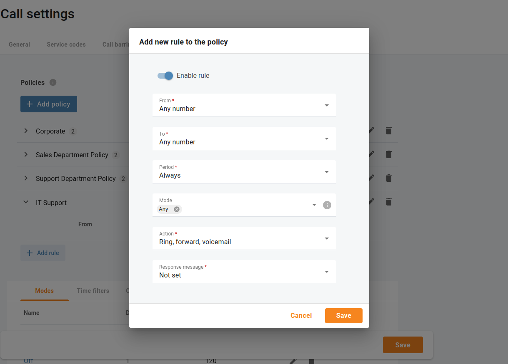

# Anrufe innerhalb und ausserhalb der Geschäftszeiten
## Anruffilter

Manchmal müssen eingehende Anrufe unterschiedlich behandelt werden: Anrufe von Kunden oder Lieferanten sollten Ihre Mitarbeiter werktags auf ihren Bürotelefonen erreichen, während andere Anrufe einfach auf die Mailbox gehen können. Anrufe in den Abendstunden sollten direkt an die Mobiltelefone weitergeleitet werden (es ergibt keinen Sinn, die IP-Telefone anzurufen, wenn die Mitarbeiter nicht im Büro sind), während Anrufe von anonymen Nummern immer abgewiesen werden sollten.

All dies kann mit Hilfe der Regeln für das Anruffiltern in Ihrer Cloud-Telefonanlage erfolgen. Wenn die Anruffilter-Funktion für eine Telefonleitung (z. B. eine Durchwahl oder eine automatische Telefonzentrale) aktiviert ist, können Sie Richtlinien aktivieren, die aus einer Reihe von Regeln bestehen. Solche Regeln werden auf jeden eingehenden Anruf angewendet, wenn bestimmte Bedingungen erfüllt sind:

* **Zeitfilter** – Zeitbedingung aufrufen. Sie können Einschränkungen in Bezug auf die Tageszeit, den Wochentag, den Tag des Monats oder eine Kombination dieser Faktoren festlegen. Dies ist ideal, um sicherzustellen, dass Ihr Telefon nicht mitten in der Nacht klingelt.

* **Anrufernummern (von)** – Bedingung der anrufenden Nummer. Sie können eine Liste von Telefonnummern für einen Anrufer (ANI oder CLI) angeben, die diese Bedingung erfüllen, z. B. können Sie Durchwahlen, Festnetztelefonnummern usw. auflisten. Wenn Sie eine Telefonnummer angeben, können Sie entweder die vollständige Nummer oder ein Muster (z. B. alle Nummern, die mit 1800 beginnen) eingeben.
* **Angerufene Nummern (zu)** – Bedingung für gerufene Nummern. Dies kann nützlich sein, wenn Sie Rufnummern haben, die mit bestimmten Abteilungen verbunden sind. So können Sie beispielsweise eingehende Anrufe an Ihre Supportnummer anders behandeln als Anrufe an Ihre Vertriebstelefonnummer.

### Algorithmus zur Anruffilterung

Wenn ein neuer Anruf bei Ihrer Cloud-Telefonanlage eintrifft, werden die Anrufinformationen nacheinander anhand aller definierten Anrufüberprüfungsregeln überprüft. Die Anrufinformationen (ANI, DNIS und aktuelle Uhrzeit) werden mit den Bedingungen der einzelnen Regeln verglichen. Wenn mindestens eine dieser Regeln nicht übereinstimmt, wird die Regel übersprungen und die Verarbeitung wird mit der nächsten fortgesetzt. Wenn alle drei Bedingungen erfüllt sind, werden die Aktionen der Regel ausgeführt, und es werden keine weiteren Regeln verarbeitet.

| Die Reihenfolge der Regeln ist wichtig. Wenn der Anruf bei der Cloud PBX ankommt, werden die Regeln von oben nach unten überprüft. Die erste Regel, die auf den Anruf zutrifft, wird angewendet, die anderen Regeln werden ignoriert. |
| ------------------------------------------------------------------------------------------------------------------------------------------------------------------------------------------------------------------------------------- |
|                                                                                                                                                                                                                                       |

Öffnen Sie das Menü "**Anrufe** => **Eisntellungen** => **Anruffilter**" und ändern Sie die Reihenfolge der Regeln durch Ziehen und Ablegen.

Wenn keine der Regeln zutrifft (oder wenn keine Regeln für die Anrufverarbeitung definiert wurden), wird die Standardregel wie folgt angewendet:

* Klingeln am IP-Telefon.
* Wenn der Anruf nicht innerhalb einer bestimmten Zeit beantwortet wird (definiert durch den Parameter **Zeitüberschreitung** in "**Anrufeinstellungen**" einer ausgewählten Durchwahl), und wenn die Telefonleitung eine Rufumleitung aktiviert hat, wird versucht, den Anruf mit den dort aufgeführten Telefonnummern zu verbinden.
* Wenn der Anruf immer noch nicht angenommen wird und die Telefonleitung die Funktion "**Unified messaging**" aktiviert hat, leiten Sie den Anruf an die Voicemail weiter; andernfalls lassen Sie den Anruf fallen.

### Modus für die Bearbeitung eingehender Anrufe (Geschäftszeiten, arbeitsfreie Zeiten)

Benutzer von Cloud-Telefonanlagen können den Modus verwenden, um zu steuern, wann und wie Anrufe zu ihrer Telefonleitung durchgestellt werden, und schnell die Art und Weise ändern, wie eingehende Anrufe behandelt werden. Sie können etwa ihren Modus so einstellen, dass sie während der Geschäftszeiten Anrufe annehmen, während der arbeitsfreien Zeit alle Anrufe auf einmal an die Mailbox schicken und im Urlaub die Anrufe an einen anderen Kollegen weiterleiten. Cloud PBX-Benutzer können den Modus für ihre Durchwahl ändern, indem sie das IVR anrufen oder über ihre Web Portal.

Der Cloud PBX-Manager kann schnell die Art und Weise ändern, wie eingehende Anrufe für alle Cloud PBX-Durchwahlen auf einmal behandelt werden. Angenommen, die gesamte Belegschaft muss wegen einer Brandschutzübung weg - der Cloud PBX-Manager öffnet das Menü "**Cloud PBX** => **Durchwahlen**" und klickt auf "**Modus wechseln**" um den Modus von "**Standard**" auf "**Notfall**" zu ändern. Nun werden alle eingehenden Anrufe direkt auf die Mobiltelefone weitergeleitet, und jeder, der im Büro anruft, erhält weiterhin Hilfe.

Das funktioniert folgendermassen:

Angenommen, Ihr Unternehmen hat drei Modi konfiguriert: "**Geschäftszeiten**", "**Arbeitsfreie Zeiten**", und "**Notfall**". Jeder Modus hat einen eindeutigen Dual-Tone Multi-Frequency (DTMF)-Code, der zum Umschalten verwendet wird. Mary, eine Handelsvertreterin, geht zum Geschäftsessen (während der Geschäftszeiten) und möchte nicht, dass ihre Kollegen im Büro durch Anrufe gestört werden. Um also alle Anrufe auf einmal an die Voicemail weiterzuleiten, wählt Mary auf ihrem Telefon \*61 und gibt den DTMF-Code für den Modus "**Arbeitsfreie Zeiten**" an. Sobald der Modus geändert wird, nimmt Mary keine Anrufe mehr entgegen, weder von Kunden noch von anderen Agenten. Alle Anrufe werden an die Voicemail weitergeleitet. In zwei Stunden kommt Mary zurück ins Büro. Sie wählt erneut die Nummer \*61 auf ihrem Telefon und stellt den Modus auf Geschäftszeiten um, so dass sie jetzt Anrufe entgegennehmen kann.

### Einen neuen Modus hinzufügen

| Der Modus "Standard" ist im System vorhanden. Der DTMF-Code des Modus "Standard" ist immer Null (0). Dieser DTMF-Code wird verwendet, um in diesen Modus zu wechseln. Benutzer können vom individuellen Sticky-Modus in den "Standard"-Modus wechseln, um weiterhin Anrufe gemäss den für den "Standard"-Modus festgelegten Regeln zu empfangen. |
| ------------------------------------------------------------------------------------------------------------------------------------------------------------------------------------------------------------------------------------------------------------------------------------------------------------------------------------------------ |
|                                                                                                                                                                                                                                                                                                                                                  |

Öffnen Sie das Menü "**Anrufe** => **Einstellungen** => **Anruffilter**" und klicken Sie auf "**Modus hinzufügen**", um einen neuen Modus zu konfigurieren. Sie können die folgenden Parameter für einen Modus einstellen:

* **DTMF code** – dies ist ein eindeutiger DTMF-Code für den Modus. Die Benutzer wählen sie, um in diesen Modus zu wechseln. Es stehen Ziffern von 1 bis 9 zur Verfügung.
* **Läuft ab nach, Minuten** – dies ist die Dauer des Modus in Minuten, nach der der Modus automatisch in den Modus "**Standard**" wechselt. Zum Beispiel gibt es einen Modus "**Meeting**" mit 60 Minuten Dauer. Wenn Mary um 15 Uhr in den Modus "**Meeting**" wechselt, wechselt der Modus um 16 Uhr in den Modus "**Standard**".
* **Sticky mode** – wenn der Modus als sticky markiert ist, können nur Erweiterungen diesen Modus einstellen. Wenn der Cloud PBX Manager alle Durchwahlen auf einen anderen Modus umstellt, hat diese Änderung keinen Einfluss auf die Durchwahlen mit Sticky-Modus. Diese Durchwahlen verbleiben in diesem Modus, bis sie ihn über IVR oder ihrem Webportal ändern oder die Zeitüberschreitung des Sticky-Modus endet.

### Antwortnachrichten für eingehende Anrufe

Cloud PBX-Benutzer können über IVR eine personalisierte Audionachricht aufzeichnen, die ihren Anrufern vor der Annahme des Anrufs, der Weiterleitung oder der Weiterleitung an die Voicemail vorgespielt wird.

### Eine neue Antwortnachricht hinzufügen

Sie können verschiedene Audiodateien hochladen, die als Antwortnachrichten für Ihr Unternehmen verwendet werden können. Öffnen Sie das Menü "**Anrufe** => **Einstellungen** => **Anruffilter**" und klicken Sie auf "**Nachricht hinzufügen**", um eine neue Audiodatei hochzuladen.

| Die Audionachricht kann im .wav-, .mp3-, .og- oder .au-Format vorliegen und sollte eine Größe von 3 MB nicht überschreiten. |
| --------------------------------------------------------------------------------------------------------------------------- |
|                                                                                                                             |

Die von Cloud PBX-Benutzern hinzugefügte Nachricht überschreibt immer die vom Cloud PBX-Manager hinzugefügte Standardnachricht, unabhängig davon, ob sie über die IVR aufgezeichnet oder über das Webportal hochgeladen wurde.

### Richtlinien

Die Richtlinie enthält eine Reihe von Regeln, die festlegen, ob die Antwortnachricht (personalisierte Audionachricht, die dem Anrufer vor der Beantwortung des Anrufs vorgespielt wird) abgespielt werden soll und welche Anrufaktion angewendet werden soll (z. B. Klingeln, Weiterleiten, Voicemail). Ihre Cloud-Telefonanlage kann mehrere Richtlinien haben, z. B. eine Richtlinie für jede Unternehmensabteilung.

### Eine neue Richtlinie hinzufügen

Öffnen Sie das Menü "**Anrufe** => **Einstellungen** => **Anruffilter**" und klicken Sie auf "**Richtlinie hinzufügen**", um eine neue Richtlinie zu konfigurieren.

*z. B. individuelle Richtlinien für die Vertriebsabteilung, die Support-Abteilung und die IT-Support-Abteilung zur Erfüllung ihrer SLA.*

### Regeln zu Richtlinien hinzufügen

Jede Richtlinie enthält eine Reihe von Regeln. Klicken Sie auf "**Regel hinzufügen**", um eine Regel zu der spezifischen Richtlinie hinzuzufügen, indem Sie die entsprechenden Bedingungen auswählen:

* **Von** – Bedingung für die Rufnummer.
* **Zu** – Bedingung für die Rufnummer.
* **Period** –Aufrufzeitbedingung.
* **Modus** – Modusbedingung.

Legen Sie fest, welche Aktionen bei eingehenden Anrufen ausgeführt werden sollen, und wählen Sie optional die Audiodatei in der Dropdown-Liste "**Antwortnachricht**" aus.

### Richtlinien aktivieren

Öffnen Sie die Registerkarte "**Anruffilter**", um eine Richtlinie für eine bestimmte Nebenstelle oder eine automatische Vermittlung zu aktivieren.

### Service-Codes

Cloud PBX-Benutzer können Servicecodes zur Steuerung des Modus verwenden. Öffnen Sie das Menü "**Anrufe** => **Einstellungen** => **Servicecodes**", um Ihre Standard-Servicecodes zu überprüfen.

*z.B. **62** - Cloud PBX Management Standardcode (bei Aufruf ändert sich die Antwortmeldung für alle Telefonleitungen eines bestimmten Kunden); **61** - individueller Management Standardcode (bei Aufruf ändert sich die Antwortmeldung für eine einzelne Telefonleitung).*
