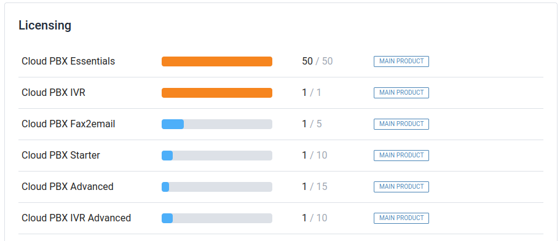
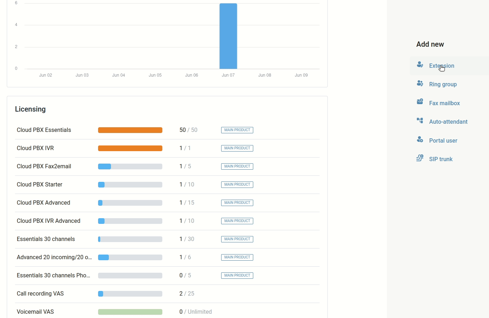
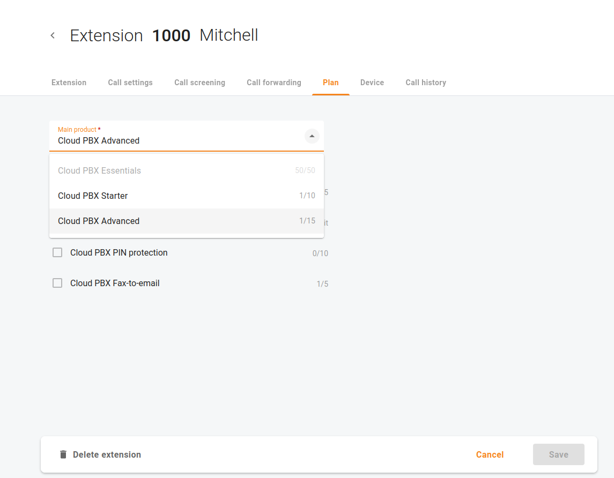
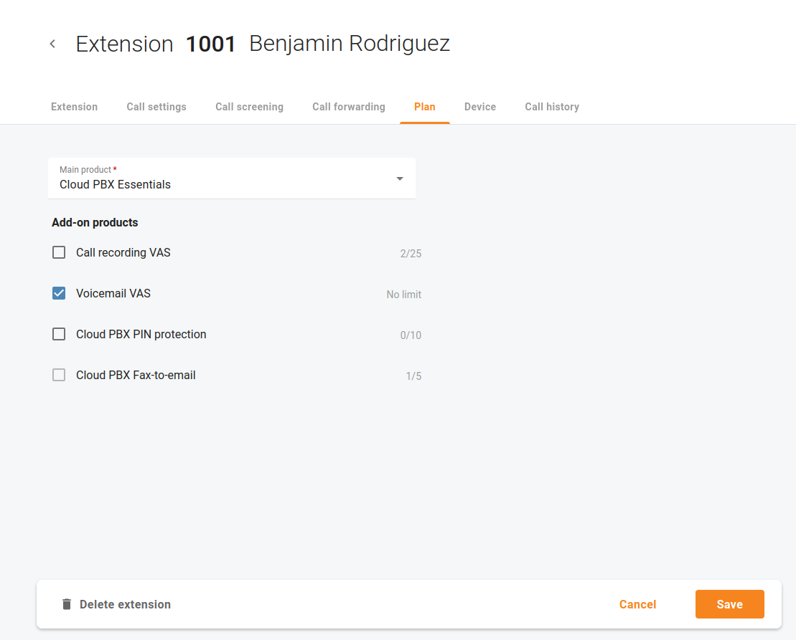

# Lizenzen
## Übersicht

Öffnen Sie die **Übersicht**, um die Bedingungen für die Nutzung von Produkten und Dienstleistungen, einschliesslich der Lizenzbedingungen, zu überprüfen.

## Hauptprodukte

Ihre Lizenzbedingungen definieren die **Hauptprodukte**, die Ihre Administratoren über das Cloud PBX-Portal zu Ihrem Servicepaket hinzufügen können. *z.B. "Bis zu 10 Cloud-PBX-Telefonleitungen für $30/Monat"*

| Auf der Übersicht können Sie die maximale Anzahl der Telefonleitungen für ein bestimmtes Produkt überprüfen, die Ihre Benutzer haben können. |
| -------------------------------------------------------------------------------------------------------------------------------------------- |
|                                                                                                                                              |

### Eine neue Durchwahl hinzufügen

Öffnen Sie die **Übersicht** oder das Menü "**Cloud PBX** => **Durchwahlen**".  Fügen Sie neue Durchwahl hinzu, indem Sie das Produkt auswählen, das am besten passt.

Klicken Sie auf "**Hinzufügen**", um eine Telefonleitung für einen Benutzer einzurichten.

Sie können dieser Durchwahl ein IP-Telefon zuweisen, um sicherzustellen, dass das Telefon automatisch mit allen Netzwerkeinstellungen ausgestattet wird

### Ändern Sie das Hauptprodukt

Öffnen Sie die Registerkarte "**Plan**", um das Hauptprodukt für eine ausgewählte Durchwahl zu ändern.

| Informieren Sie sich über die maximale Anzahl von Telefonanschlüssen für ein bestimmtes Produkt, die Ihre Benutzer haben können. |
| -------------------------------------------------------------------------------------------------------------------------------- |
|                                                                                                                                  |

### Eine neue automatische Vermittlung (Rezeptionist) hinzufügen

Öffnen Sie die **Übersicht** oder das Menü "**Cloud PBX** => **Rezeptionist**". Fügen Sie einen neuen automatischen Vermittlungsdienst (Rezeptionist) hinzu, indem Sie das Hauptprodukt und eine oder mehrere Rufnummern auswählen, die Anrufer wählen sollen, wenn sie Sie kontaktieren möchten. Klicken Sie auf "**Hinzufügen**", um einen Rezeptionisten einzurichten.

Sie können die Geschäftszeiten festlegen, zu denen die automatische Vermittlung (Rezeptionist) verschiedene Aktionen auslösen soll.

*z. B. Montag-Freitag, von 8 Uhr bis 17 Uhr, eine Begrüssung abspielen und die verfügbaren Optionen für Anrufer ankündigen*

## Zusätzliche Produkte

Ihre Lizenzbedingungen definieren auch die Menge der **Zusatzprodukte**, die Ihre Administratoren für Ihre Benutzer und Telefonleitungen aktivieren können.

*z. B. „Unbegrenzte Anzahl von Voicemailboxen, 5 $/Monat pro Stück“*

| Auf der Übersichtsseite können Sie die maximale Anzahl der Telefonleitungen für ein bestimmtes Produkt überprüfen, die Ihre Benutzer haben können. |
| -------------------------------------------------------------------------------------------------------------------------------------------------- |
|                                                                                                                                                    |

Zusatzprodukte können auf der Registerkarte "**Plan**" aktiviert werden.

Wählen Sie ein entsprechendes Zusatzprodukt aus, um Mehrwertdienste zu aktivieren wie:

* Voicemail
* PIN Schutz
* Anrufaufzeichnung
* Zusätzliche Kanäle für SIP-Trunks