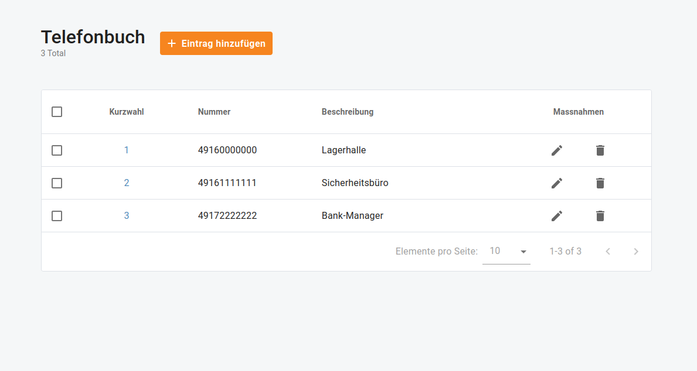
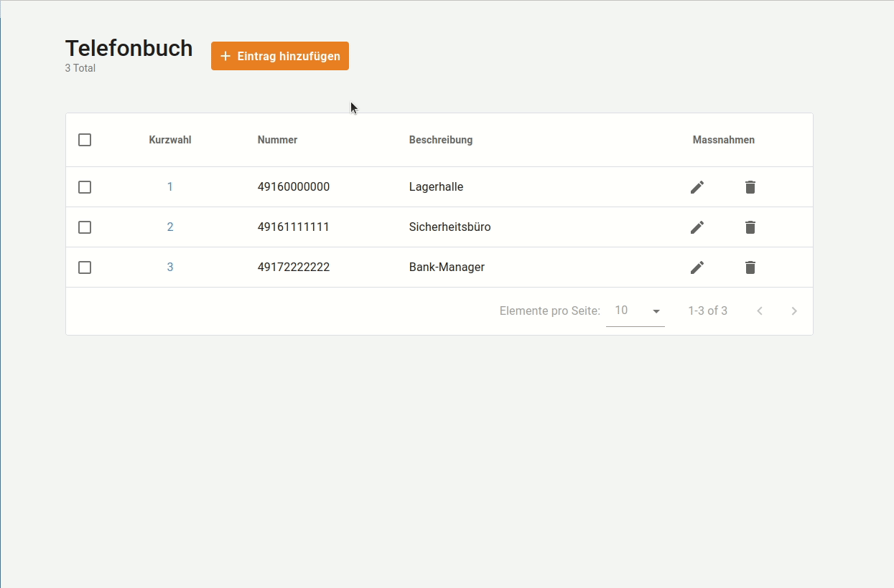
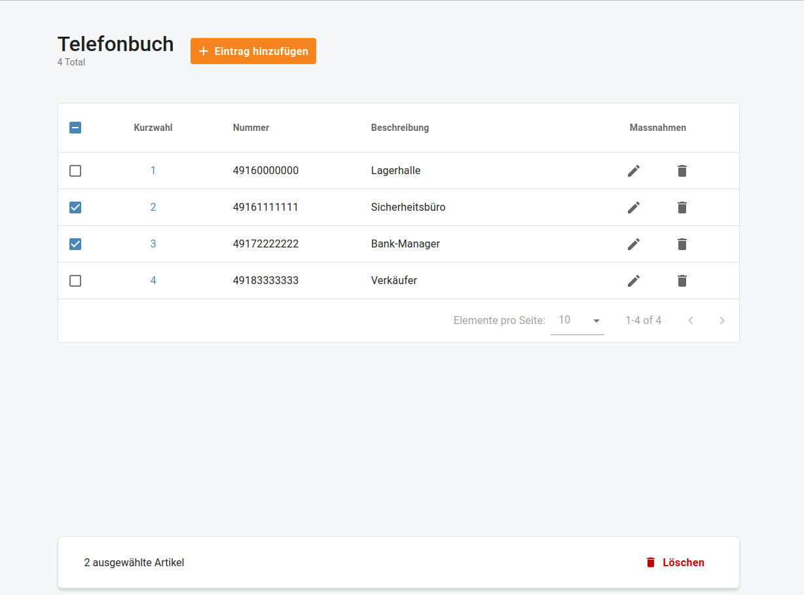

# Telefonbuch

## Übersicht

Benutzen Sie **Telefonbuch** um häufig verwendete Telefonnummern in einem allgemeinen Verzeichnis zu organisieren und es Benutzern zu ermöglichen, diese mit kurzen Nummern (auch bekannt als _Kurzwahl-Nummern_) anzuwählen.

Hier können Sie eine Liste von Telefon-Durchwahlen für Ihre Cloud PBX definieren und zusätzlich Kurzwahlen für externe Telefonnummern erstellen.

Sie können Wählregeln als internationales Präfix einrichten, als externes Präfix, Direktnummer (z. B. 911) oder als abgekürztes Wählen für Ihre Konten.

| Telefonnummern müssen im Format E.164 eingegeben werden. |
| -------------------------------------------------------- |

## Neuen Telefonbucheintrag hinzufügen

Menü "**Cloud PBX** > **Telefonbuch**" öffnen.  Klicken Sie auf "**Eintrag hinzufügen**", um eine neue Kurzwahlnummer hinzuzufügen.

Sie können eine Kurzwahl Nummer zuweisen, die die Endbenutzer an Ihrem Telefon wählen. Die maximale Zahlenlänge ist auf 15 Zeichen begrenzt.

| Die Nummer, die die Endbenutzer auf ihren Telefonen wählen werden. Eine Kurzwahlnummer darf nicht mit einer Durchwahlnummer übereinstimmen, damit das System die Wahl korrekt umsetzen und den Anruf entsprechend weiterleiten kann. |
| ------------------------------------------------------------------------------------------------------------------------------------------------------------------------------------------------------------------------------------ |

Als nächstes geben Sie die tatsächliche Zielnummer ein, bei der der Anruf im Format E.164 weitergeleitet wird. Geben Sie optional eine Beschreibung dieser Nummer an, z.B. "John's IP Telefon"

## Telefonbucheinträge löschen

Öffne das Menü "**Cloud PBX** > **Telefonbuchbuch**", um bestimmte Telefonbucheinträge zu löschen.

| Ein Kontrollkästchen oben neben "**Speed Dial**" erlaubt es Ihnen, alle Telefonbucheinträge von der aktuellen Seite auszuwählen. |
| -------------------------------------------------------------------------------------------------------------------------------- |

Wählen Sie einen oder mehrere Telefonbucheinträge aus und klicken Sie auf "**Löschen**".

