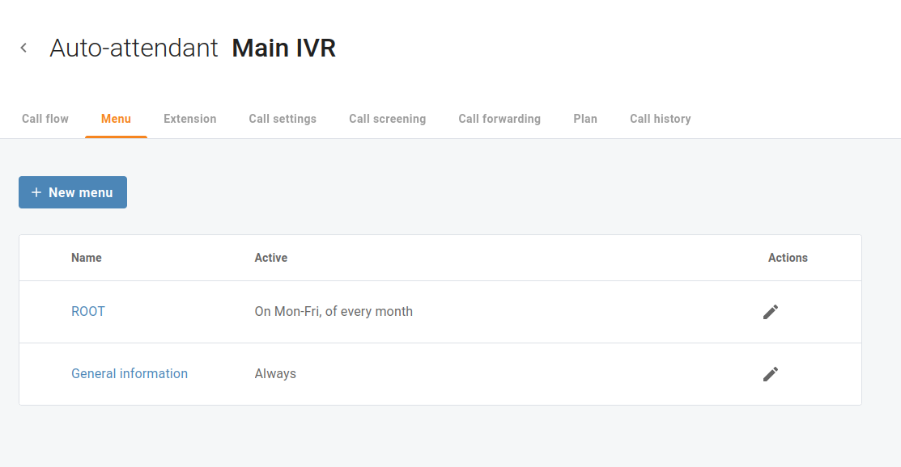
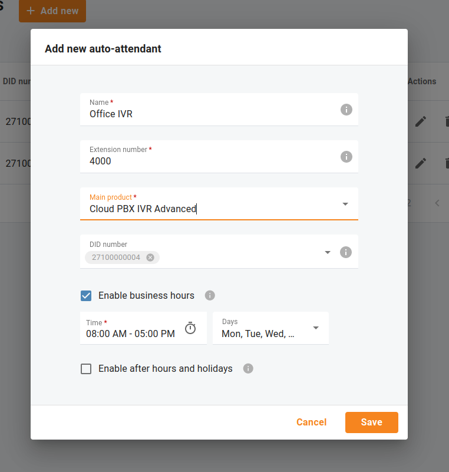

# Programmierung automatische Vermittlung (Rezeptionist)
## Übersicht

Mit der automatischen Vermittlungsfunktion (Rezeptionist) können Anrufer automatisch an eine Durchwahl weitergeleitet werden, ohne dass sie vorher einen Telefonisten oder eine Empfangsdame anrufen müssen. Damit ein Anrufer einen Benutzer in einer Telefonanlage finden kann, steht in der Regel ein Namensverzeichnis zur Verfügung. Mit dieser Funktion werden die Benutzer namentlich aufgelistet, so dass der Anrufer eine Taste drücken kann, um automatisch die Durchwahl des Benutzers anzurufen, sobald die automatische Vermittlung diese angesagt hat. Der automatische Vermittlungsdienst kann Anrufe auch an Mobiltelefone, virtuelle VoIP-Telefone, andere automatische Vermittlungsdienste oder andere Standorte mit herkömmlichen Festnetztelefonen weiterleiten. Wenn ein Benutzer nicht verfügbar ist, leitet die automatische Telefonzentrale den Anrufer an die entsprechende Mailbox weiter, damit er eine Voicemail-Nachricht hinterlassen kann.

Öffnen Sie das Menü "**Cloud PBX** => **Rezeptionist**", um die für Ihre Cloud PBX konfigurierten Rezeptionist(en) anzuzeigen.

Die automatische Anrufannahme kann aus einer Reihe unabhängiger Menüs bestehen (z. B. kann ein Menü für die Weiterleitung von Anrufen innerhalb der Support-Abteilung und ein anderes für die Verkaufsabteilung verwendet werden). Alle sind in jeder Hinsicht identisch, mit Ausnahme des Menüs ROOT, das immer vorhanden ist, nicht gelöscht werden kann und dessen Name nicht geändert werden kann.

## Automatische Vermittlung (Rezeptionist) mit immer aktiven Menüs

Der Ablauf von eingehenden Anrufen an eine automatische Vermittlung wird immer zuerst zum Menü "**ROOT**" geleitet.

Wenn Sie ein Menü konfigurieren möchten, das immer aktiv ist, bewegen Sie den Mauszeiger über das Menü "**ROOT**" und klicken Sie auf "**Bearbeiten**".

Wählen Sie auf der Registerkarte "**Einstellungen**" die Optionsschaltfläche "**Immer**", um dieses Menü so einzustellen, dass es immer aktiv ist.

Auf der Registerkarte "**Ansagen**" können Sie Optionen zum Hochladen von Ansagen und Anleitungen für Anrufer Ihrer Nummer aktivieren.

* **Einleitung** – diese Ansage wird abgespielt, wenn das Menü zum ersten Mal aufgerufen wird.

*z. B. "Willkommen bei ACME, einem Unternehmen für Sicherheitslösungen!"*

* **Menü** – die Menüführung, die den Anrufer leitet.

*z. B. "Drücken Sie die 1 für den Vertrieb, die 2 für den technischen Support".*

* **Bei Zeitüberschreitung** – die Ansage, die den Anrufern hilft, wenn sie die Wartezeit überschreiten.
* **Bei nicht vorhandener Auswahl** – die Eingabeaufforderung, die den Anrufern hilft, wenn sie eine falsche Taste drücken.

Klicken Sie auf "**+**" auf der Registerkarte "**Anrufablauf**" oder öffnen Sie ein ausgewähltes Menü und öffnen Sie die Registerkarte "**Aktionen**", um den verschiedenen Ereignissen Aktionen zuzuweisen.

*z. B. Wenn ein Anrufer die 1 drückt, leiten Sie ihn zur Warteschlange "Support" um.*

| Aktivieren Sie die Option „Wiedergabe vor der Aktion“, um eine Aufforderung hochzuladen, die vor der ausgewählten Aktion abgespielt werden muss. |
| ------------------------------------------------------------------------------------------------------------------------------------------------ |
|                                                                                                                                                  |

## Automatische Vermittlung (Rezeptionist) mit Menüs, die benutzerdefinierte Zeitpläne haben

Die automatische Vermittlung (Rezeptionist) kann aus einer Reihe unabhängiger Menüs bestehen, die zu unterschiedlichen Zeiten aktiv sein können.

*Ein Menü kann z. B. während der Geschäftszeiten verwendet werden, ein anderes ausserhalb der Geschäftszeiten und an Wochenenden.*

Nehmen wir folgendes Beispiel: Ihr Unternehmen möchte die automatische Vermittlung (Rezeptionist) so konfigurieren, dass Anrufe während und ausserhalb der Geschäftszeiten von unterschiedlichen Menüs entgegengenommen werden. Während der Geschäftszeiten soll der Anrufer ausserdem zuerst eine Begrüssungsansage und dann die Menüansage hören. Ihr Unternehmen hat zwei Abteilungen (Vertrieb und Support), die Sie dem Anrufer zur Verfügung stellen möchten. Wenn ein Anrufer von einem Festnetzanschluss aus wählt, hört er eine aufgezeichnete Sprachansage, die Verbindungsoptionen anbietet, wie z. B. "Hallo! Sie haben SmartCall Ltd. erreicht. Um die Verkaufsabteilung zu erreichen, drücken Sie die 1, um die Support-Abteilung zu erreichen, drücken Sie die 2. Wenn Sie die Durchwahl der Person kennen, die Sie erreichen wollen, können Sie diese jetzt wählen.

Wenn Sie eine neue automatische Vermittlung (Rezeptionist) hinzufügen, können Sie die Geschäftszeiten Ihres Unternehmens festlegen. Sie können die Öffnungs- und Schliesszeiten für die gesamte Woche angeben.

*z.B. Geschäftszeiten sind 08:00* *- 17:00, Montag bis Freitag.*

Wenn Sie die Geschäftszeiten für einen bestimmten Tag ändern müssen, können Sie den "**Benutzerdefinierten Zeitplan**" für das Menü, das während der Geschäftszeiten aktiv ist, neu definieren.

*z.B. Geschäftszeiten sind normalerweise 08:00* *- 17:00 PM, Montag bis Freitag, ausser Dienstag. Am Dienstag ist die Geschäftszeit von 11:00 bis 19:59 Uhr.*

Öffnen Sie das Menü, das während der Geschäftszeiten aktiv ist, und entfernen Sie das Kontrollkästchen "**Dienstag**" für die Option "**Tage**". Klicken Sie dann auf "**Intervall hinzufügen**", um die Öffnungs- und Schliesszeit am Dienstag hinzuzufügen.

| Ausnahmen/Feiertage können im Menü "ROOT" definiert werden. |
| ----------------------------------------------------------- |
|                                                             |

So können Sie das Menü "**ROOT**" für die Bearbeitung von Anrufen am Wochenende (und an Feiertagen) und das alternative Menü für die Bearbeitung von Anrufen während der Geschäftszeiten konfigurieren, und es gibt ein weiteres Menü für die Bearbeitung von Anrufen nach den Geschäftszeiten.

Der Ablauf von eingehenden Anrufen an eine automatische Vermittlung wird immer zuerst an das Menü "**ROOT**" weitergeleitet. Wenn das Menü "**ROOT**" nicht aktiv ist, werden die Anrufe von dem in der Menüoption "**Wenn das Menü inaktiv ist**"angegebenen Alternativmenü bearbeitet.

Ist auch das Alternativmenü nicht aktiv, werden die Anrufe an das Menü weitergeleitet, das in der Option "**Wenn das Menü inaktiv ist**" des Alternativmenüs angegeben ist usw.

| Aktivieren Sie die Option "Menüs erweitern", um zu sehen, wie verschiedene Menüs logisch miteinander verbunden sind. |
| -------------------------------------------------------------------------------------------------------------------- |
|                                                                                                                      |

