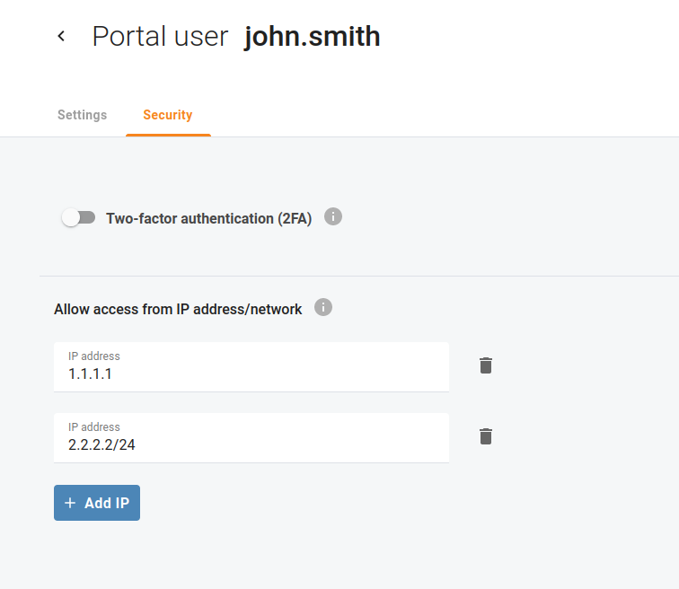

# Webzugriff nur von vertrauenswürdigen IP-Adressen erlauben

Aus Sicherheitsgründen können Sie Ihren eigenen Benutzer oder anderen Portalbenutzern den Zugriff auf das Cloud-PBX-Portal nur von vertrauenswürdigen IP-Adressen gestatten, z. B. IP-Adressen, die zu Ihrem Büronetzwerk gehören. Öffnen Sie das Menü "**Mein Unternehmen** > **Portalnutzer**" und wählen Sie einen Portalbenutzer, für den Sie vertrauenswürdige IP-Adressen definieren müssen. Öffnen Sie den Tab "**Security**" und klicken Sie auf "**IP hinzufügen**", um eine IP-Adresse oder ein Netzwerk anzugeben. Sie können mehr als eine vertrauenswürdige IP-Adresse oder ein Netzwerk hinzufügen.

| Wenn ein Benutzer versucht, sich von ausserhalb Ihres Netzwerks anzumelden, verweigert das Cloud-PBX-Portal seinen Zugang und der Benutzer kann sich nicht anmelden. |
| -------------------------------------------------------------------------------------------------------------------------------------------------------------------- |

Diese IP-Einschränkungen fügen dem regulären Login und Passwort eine zusätzliche Sicherheitsstufe hinzu.
