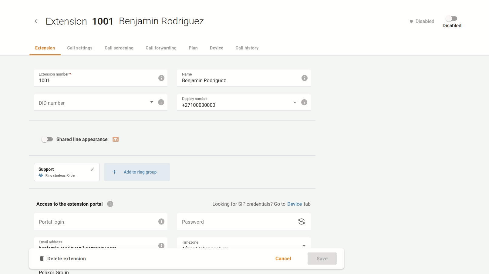

# Telefonleitungen blockieren

Manchmal müssen Sie bestimmte Telefonleitungen sperren/entsperren. Zum Beispiel stellt Ihr Unternehmen gelegentlich Mitarbeiter für saisonale Verkaufskampagnen ein. Wenn eine Kampagne zu Ende geht und ein Spezialist ausscheidet, sperrt Ihr Unternehmen dessen Durchwahl (der Dienstanbieter erhebt für die Tage, an denen eine Telefonleitung gesperrt ist, keine Abonnementgebühr). Sie können die Sperrung später aufheben, wenn ein Spezialist seine Arbeit wieder aufnimmt.

| Wenn die Telefonleitung vom Dienstanbieter gesperrt ist, können Sie sie nicht verwalten. |
| ---------------------------------------------------------------------------------------- |
|                                                                                          |

Wenn Sie eine Durchwahl vorübergehend sperren müssen, öffnen Sie das Menü "**Cloud PBX** => **Durchwahlen**", wählen Sie die Durchwahl aus, die gesperrt werden muss, und sperren Sie sie.

Diese Durchwahl kann später wieder freigegeben werden.

