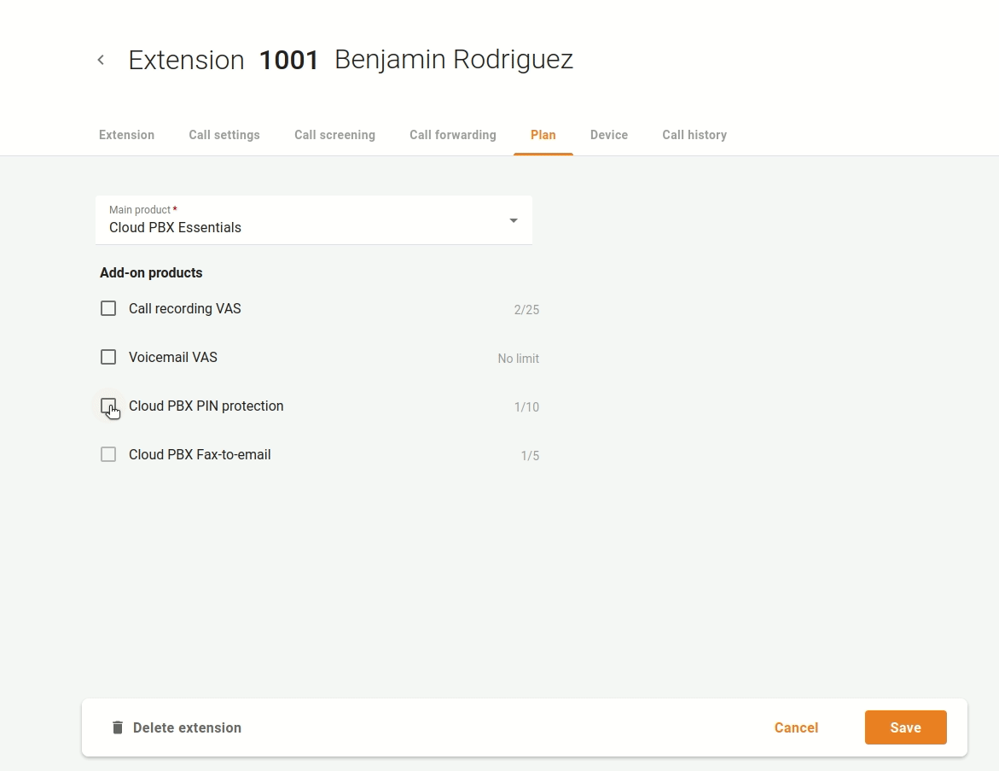

# PIN-Schutz für ausgehende kostenpflichtige Anrufe ausserhalb Ihrer Cloud PBX

Oftmals verlangen Unternehmen eine zusätzliche Genehmigung für abgehende Gebühren bei Auslandsgesprächen. Vor allem dann, wenn ein einziges Telefon von mehreren Nutzern verwendet wird. Der PIN-Schutz kann für ein bestimmtes Produkt (Haupt- oder Zusatzprodukt) aktiviert werden, das den Durchwahlen zugeordnet ist.

| Wenden Sie sich an den Dienstanbieter, um zu prüfen, ob der PIN-Schutz für Ihr Unternehmen verfügbar ist. |
| --------------------------------------------------------------------------------------------------------- |
|                                                                                                           |

Wenn Sie für eine bestimmte Durchwahl eine zusätzliche Autorisierung für abgehende kostenpflichtige Anrufe erzwingen müssen, bitten Sie den Dienstanbieter, diese zuerst zu aktivieren. Dann öffnen Sie das Menü "**Cloud PBX** => **Durchwahlen**", wählen Sie die Durchwahl, die zusätzliche Autorisierung, für ausgehende kostenpflichtige Anrufe ausserhalb Ihrer Cloud PBX erfordert und öffnen Sie die Registrierkarte "**Anrufeinstellungen**", um die Option "**IVR-Authentifizierung** " zu aktivieren. Geben Sie einen Code zur Entsperrung des Dienstes ein, den ein Benutzer eingeben muss, um einen gebührenpflichtigen Anruf zu tätigen.

| Anrufe zwischen Cloud PBX-Durchwahlen und Anrufe zu anderen IVR-Anwendungen (z. B. zu Voicemail) umgehen die zusätzliche Autorisierung. |
| --------------------------------------------------------------------------------------------------------------------------------------- |
|                                                                                                                                         |

Wenn diese Durchwahl das nächste Mal verwendet wird, um einen abgehenden kostenpflichtigen Anruf ausserhalb Ihrer Cloud-Telefonanlage zu tätigen, wird der Benutzer aufgefordert, einen PIN-Code einzugeben.
