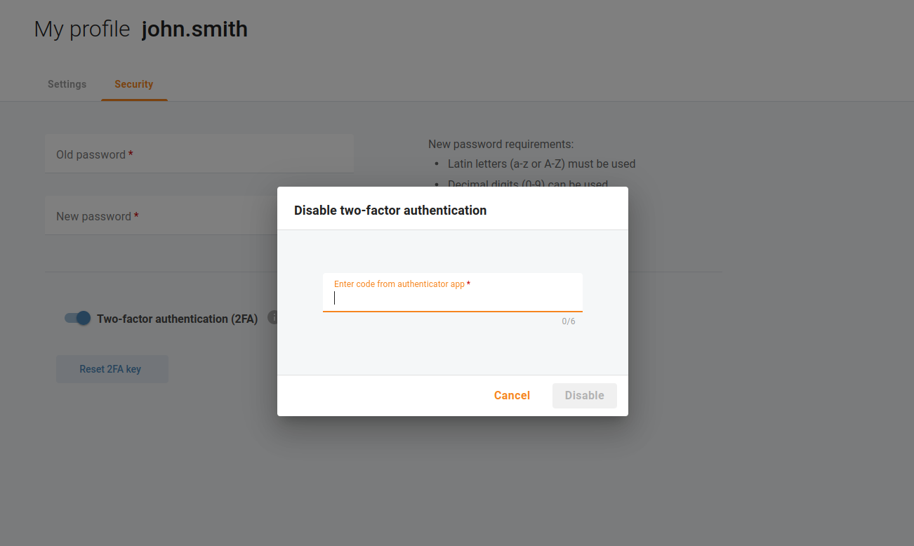

# Zwei-Faktor-Authentifizierung

Sie können das Sicherheitsniveau des Zugriffs Ihrer Portalbenutzer auf das Cloud PBX-Portal erheblich erhöhen, indem Sie die Zwei-Faktor-Authentifizierung (2FA) verwenden. Bei aktivierter 2FA können sich Benutzer nur anmelden, wenn sie zusätzlich zu ihrem Login und ihrem regulären Passwort ein gültiges Einmalpasswort (OTP) eingeben. Das zeitbasierte OTP wird von einer 2FA-Anwendung wie Google Authenticator generiert, die auf dem Smartphone des Benutzers installiert ist. Selbst wenn also eine unbefugte Person Zugang zu den Benutzerdaten erhält, kann sie ohne das OTP nicht auf das Cloud PBX-Portal zugreifen.

## Aktivieren Sie die Zwei-Faktor-Authentifizierung für Ihren eigenen Benutzer

Wenn Sie Ihrem Login und Ihrem Passwort eine zusätzliche Sicherheitsstufe hinzufügen möchten, installieren Sie eine Authentifizierungsanwendung auf Ihrem mobilen Gerät (z. Google Authenticator: [Android](https://play.google.com/store/apps/details?id=com.google.android.apps.authenticator2), [iOS](https://apps.apple.com/app/google-authenticator/id388497605)) und öffnen Sie das Menü "**Unternehmen** => **Mein Profil**" oder klicken Sie einfach auf Ihren Login in der linken unteren Ecke der Seite. Öffnen Sie die Registerkarte "**Sicherheit**", um die Zwei-Faktor-Authentifizierung (2FA) für Ihren eigenen Benutzer zu aktivieren. Scannen Sie den QR-Code oder geben Sie den angezeigten Schlüssel manuell in Ihre Authentifizierungsanwendung ein. Die Authenticator-Anwendung generiert dann ein einmaliges Passwort, das Sie unter dem QR-Code eingeben müssen.

Jetzt wurde die Zwei-Faktor-Authentifizierung (2FA) für Ihre Anmeldung konfiguriert.

Beim nächsten Anmeldeversuch werden Sie aufgefordert, einen OTP-Code einzugeben.

| Wenn Sie den Zugriff auf Ihre Authenticator-App verloren haben, wenden Sie sich an den Dienstanbieter oder einen anderen Portalbenutzer, der Ihren 2FA-Schlüssel zurücksetzen kann. |
| ----------------------------------------------------------------------------------------------------------------------------------------------------------------------------------- |
|                                                                                                                                                                                     |

## Aktivieren der Zwei-Faktor-Authentifizierung für andere Benutzer

Möglicherweise möchten Sie die Zwei-Faktor-Authentifizierung für andere Portalbenutzer aktivieren. Öffnen Sie das Menü "**Unternehmen** => **Portalbenutzer**" und wählen Sie einen Portalbenutzer, für den Sie die Zwei-Faktor-Authentifizierung aktivieren müssen. Öffnen Sie die Registerkarte "**Sicherheit**", um die Zwei-Faktor-Authentifizierung (2FA) für den ausgewählten Benutzer zu aktivieren.

Beim nächsten Anmeldeversuch dieses Benutzers wird er aufgefordert, einen QR-Code zu scannen und einen OTP-Code einzugeben.

## Zurücksetzen eines Schlüssels für die Zwei-Faktor-Authentifizierung

Wenn Sie Ihr mobiles Gerät, auf dem Sie Ihre Authentifizierungsanwendung installiert haben, ersetzen müssen, können Sie den Schlüssel für die Zwei-Faktor-Authentifizierung zurücksetzen. Öffnen Sie das Menü  "**Unternehmen** => **Mein Profil**" oder klicken Sie einfach auf Ihr Login in der linken unteren Ecke der Seite. Öffnen Sie die Registerkarte "**Sicherheit**", um den Schlüssel für die Zwei-Faktor-Authentifizierung (2FA) für Ihren eigenen Benutzer zurückzusetzen. Sie werden aufgefordert, einen OTP-Code einzugeben.

| Wenn ein gültiger OTP-Code eingegeben wird, werden Sie abgemeldet und müssen sich erneut anmelden. |
| -------------------------------------------------------------------------------------------------- |
|                                                                                                    |

Beim nächsten Anmeldeversuch werden Sie aufgefordert, einen QR-Code zu scannen und dann einen OTP-Code einzugeben.

## Deaktivieren Sie die Zwei-Faktor-Authentifizierung für Ihren eigenen Benutzer

Wenn Sie die Zwei-Faktor-Authentifizierung für Ihren eigenen Benutzer deaktivieren möchten, öffnen Sie das Menü "**Unternehmen** => **Mein Profil**" oder klicken Sie einfach auf Ihr Login in der linken unteren Ecke der Seite. Öffnen Sie die Registerkarte "**Sicherheit**", um die Zwei-Faktor-Authentifizierung (2FA) für Ihren eigenen Benutzer zu deaktivieren. Sie werden aufgefordert, einen OTP-Code einzugeben.

## Deaktivieren der Zwei-Faktor-Authentifizierung für andere Benutzer

Möglicherweise möchten Sie die Zwei-Faktor-Authentifizierung für andere Portalbenutzer deaktivieren. Öffnen Sie das Menü "**Unternehmen** => **Portalbenutzer**" und wählen Sie einen Portalbenutzer, für den Sie die Zwei-Faktor-Authentifizierung deaktivieren müssen. Öffnen Sie die Registerkarte "**Sicherheit**", um die Zwei-Faktor-Authentifizierung (2FA) für den ausgewählten Benutzer zu deaktivieren.

