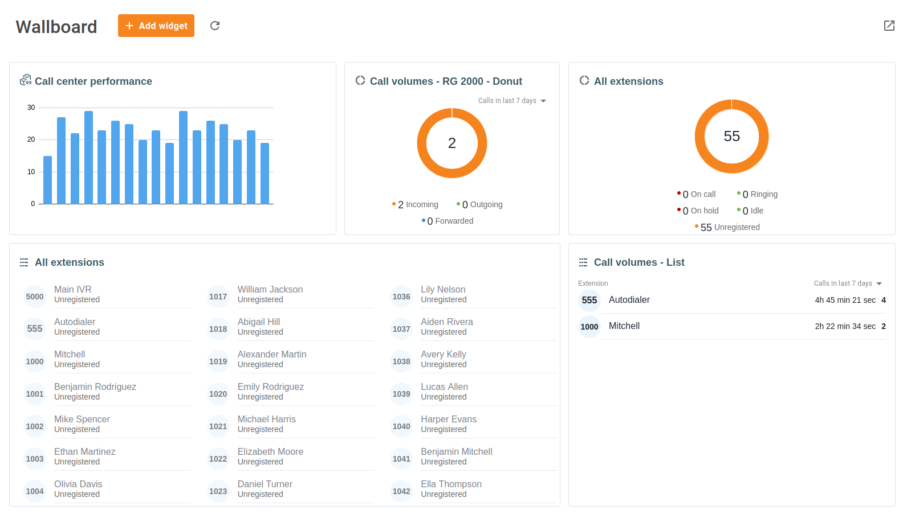
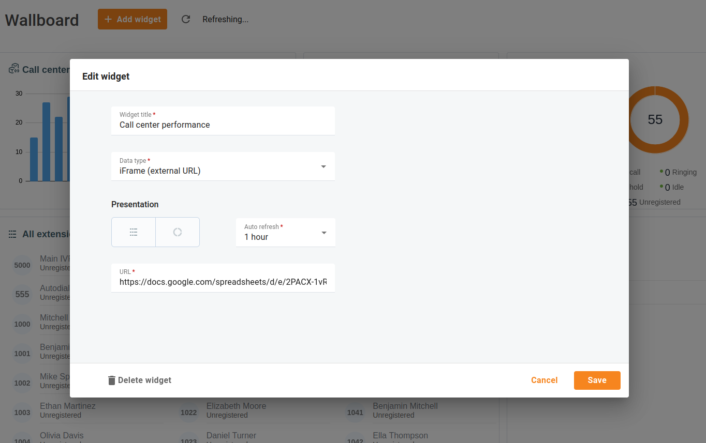

# Wallboard
## Übersicht

Die Wallboard-Funktionalität ist ein leistungsstarkes Tool, mit dem Manager die Leistung der Agenten überwachen, Einblicke in das Anrufvolumen gewinnen und sogar externe Systeme integrieren können, um einen umfassenden Überblick über die Abläufe in ihrem Call-Center zu erhalten.

| Wählen Sie aus, ob die Widget-Daten als Tabelle oder Donut-Diagramm dargestellt werden sollen. |
| ---------------------------------------------------------------------------------------------- |
|                                                                                                |

Öffnen Sie das Menü "**Cloud PBX** => **Wallboard**".

Passen Sie das Wallboard an, indem Sie Widgets verschiedener Typen hinzufügen. Das Wallboard kann auf grossen Bildschirmen in den Räumlichkeiten des Call-Centers angezeigt werden, so dass jeder Agent einfachen Zugriff auf die Statistiken und Berichte hat.

*Call-Center können z. B. Wand montierte TV-Geräte oder Monitore, Videowände oder digitale Beschilderung verwenden.*

Klicken Sie auf "**Widget hinzufügen**", um ein neues Widget hinzuzufügen, seinen Typ auszuwählen und festzulegen, wie häufig die Daten aktualisiert werden müssen.

## Präsenz der Durchwahl

Konfigurieren Sie ein Widget und wählen Sie bestimmte Durchwahlen oder eine Gruppe von Durchwahlen aus, die Sie überwachen möchten. Das Widget "**Durchwahlanwesenheit**" aktualisiert regelmässig die Informationen und zeigt an, ob Agenten angerufen werden oder verfügbar sind. Auf diese Weise erhalten die Manager einen Echtzeit-Überblick über den Status ihrer Mitarbeiter.

## Anrufvolumen

Gewinnen Sie Einblicke in das Anrufvolumen und den gesamten Anrufverkehr, indem Sie das Widget "**Anrufvolumen**" konfigurieren. Das Widget zeigt an, wie viele Anrufe, sowohl eingehende als auch ausgehende, innerhalb eines ausgewählten Zeitraums bearbeitet wurden. Sie liefert auch die Gesamtdauer pro Bearbeiter.

## iFrame (externe URL)

Sie können sich auf verschiedene CRM- und Berichtssoftware-Tools verlassen, die möglicherweise nicht direkt mit Ihrer Cloud-Telefonanlage integriert sind. Dies kann es für Sie manchmal schwierig machen, alle benötigten Informationen an einem Ort zu finden. Durch die Konfiguration des "**iFrame**" Widgets und das Hinzufügen der URL zu dem benötigten CRM-Bericht können Sie nahtlos auf Statistiken und Berichte zugreifen, die in externen Systemen erstellt wurden.

