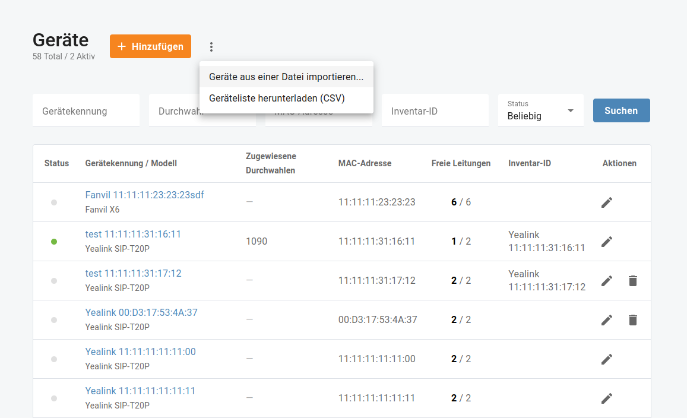

# Erste Schritte

## Überblick

Konfigurieren Sie innerhalb kürzester Zeit die Grundfunktionen Ihrer Cloud-Telefonanlage, einer Kommunikationslösung für Unternehmen, die Sie begeistern wird.

## Rufnummern

Menü "**Inventar** => **Rufnummern**" erleichtert die Arbeit mit der Liste der Rufnummern für die direkte Durchwahl (DID), die Ihrer Cloud-Telefonanlage zugewiesen sind. Hier können Sie eine Liste der aktuell bereitgestellten Nummern sehen (und welche Telefonleitungen ihnen zugewiesen sind).

Dieses Menü kann für geografische und nicht geografische Rufnummern sowie für gebührenfreie und Premium-Nummern verwendet werden. Einige Rufnummern werden auf der Basis einer „festen monatlichen Gebühr“ angeboten, so dass Sie die monatlichen Gebühren für solche Rufnummern angezeigt bekommen.

### Neue Rufnummer hinzufügen

Um Ihre Kommunikationsmöglichkeiten zu verbessern und Ihre Geschäftsabläufe zu rationalisieren, ist die Aktivierung von Rufnummern in der Cloud-Telefonanlage ein wichtiger Schritt. Rufnummern ermöglichen es Ihren Benutzern, Anrufe direkt entgegenzunehmen, ohne dass ein Rezeptionist oder Vermittler benötigt wird. Dieser Abschnitt führt Sie durch den Prozess der Aktivierung von Rufnummern in der Cloud PBX.

Menü öffnen "**Inventar** => **Rufnummern**" und klicken Sie "**Hinzufügen**". Bei der Aktivierung einer neuen Rufnummer haben Sie normalerweise die Möglichkeit, das Land und das Gebiet für die Nummer auszuwählen. Wählen Sie das entsprechende Land und Gebiet auf der Grundlage Ihres Standorts oder der Präferenzen Ihrer Zielgruppe. Nachdem Sie das gewünschte Gebiet und Land ausgewählt haben, wird Ihnen in der Regel eine Liste der verfügbaren Nummern angezeigt, aus der Sie wählen können. Nehmen Sie sich einen Moment Zeit, um die Optionen zu prüfen und eine Nummer auszuwählen, die Ihren Anforderungen am besten entspricht.

| Informieren Sie sich über die einmaligen Aktivierungsgebühren und die monatlich wiederkehrenden Gebühren für die ausgewählte Rufnummer. |
| --------------------------------------------------------------------------------------------------------------------------------------- |
|                                                                                                                                         |

Sie können eine ausgewählte Rufnummer sofort einer beliebigen vorhandenen Durchwahl zuweisen. Wenn Ihre Cloud-Telefonanlage noch keine Durchwahlen hat, können Sie diese später hinzufügen und dann die ausgewählten Rufnummern für die richtige Anrufweiterleitung zuweisen: Menü öffnen "**Inventar** => **Rufnummern**", und klicken Sie "**Bearbeiten**", wählen Sie eine Durchwahl für die Zuweisung der Rufnummer aus.

### Rufnummer löschen

Wenn Sie eine Rufnummer nicht mehr benötigen, können Sie sie an Ihren Dienstanbieter zurückgeben. Menü öffnen "**Inventar** => **Rufnummern**" und klicken Sie "**Löschen**". Eine gelöschte Rufnummer wird sofort von Ihrem Telefonanschluss entfernt.

### Hauptnummer des Unternehmens

Menü öffnen "**Anrufe** => **Einstellungen** => **Allgemein**", um die Hauptnummer des Unternehmens auszuwählen, die als Anrufer-Identität für ausgehende Anrufe von allen Ihren Durchwahlen angezeigt wird (sofern dieser Wert nicht für eine bestimmte Nebenstelle überschrieben wurde). Sie können nur aus Rufnummern auswählen, die Ihrer Cloud-Telefonanlage zugewiesen sind.

## Geräte

Sie können Ihre SIP-Telefone automatisch einrichten lassen, ohne jedes Gerät einzeln konfigurieren zu müssen.

Menü öffnen "**Inventar** => **Geräte**" und klicken Sie "**Hinzufügen**". Wählen Sie das Modell Ihres Geräts aus und geben Sie die Details zu Ihrem SIP-Telefon ein, einschließlich seiner MAC-Adresse.

| Überprüfen Sie die MAC-Adresse Ihres SIP-Telefons, die auf einem Etikett am Gerät aufgedruckt ist: Suchen Sie auf der Rückseite, der Unterseite oder den Seiten des Telefons nach Aufklebern oder Etiketten, auf denen die MAC-Adresse angegeben ist. In der Regel handelt es sich um eine Kombination aus Buchstaben und Zahlen, die durch Doppelpunkte oder Bindestriche getrennt sind. |
| ----------------------------------------------------------------------------------------------------------------------------------------------------------------------------------------------------------------------------------------------------------------------------------------------------------------------------------------------------------------------------------------- |
|                                                                                                                                                                                                                                                                                                                                                                                           |

Sie können einen Gerätenamen erzeugen, der aus dem Modell und der MAC-Adresse besteht.

*z.B. Yealink 22:33:AD:44:55:66*

Durch die Unterstützung von Bring-Your-Own-Device (BYOD) ist es möglich, eigene IP-Telefone zu verwalten:

1. Hinzufügen/Hochladen Ihrer IP-Telefone im Menü "**Inventar** => **Geräte**". Um die IP-Telefone hochzuladen, können Sie zunächst die Dateivorlage herunterladen (mit allen verfügbaren Spalten in der erforderlichen Reihenfolge) und dann die Pflichtspalten ausfüllen:

* Action ("add" oder "+")
* Geräte Name
* Gerätemodell
* MAC-Adresse

2. Ändern Sie die Adresse des Provisioning-Servers auf den IP-Telefonen (erkundigen Sie sich bei Ihrem Dienstanbieter).
3. Weisen Sie die IP-Telefone den Telefonleitungen (Durchwahlen) der Mitarbeiter zu.

## Portalbenutzer

Ihre Cloud-Telefonanlage kann von mehreren Benutzern mit unterschiedlichen, durch ihre Rolle definierten Berechtigungen verwaltet werden.

### Neuen Portalbenutzer hinzufügen

Öffnen Sie **Übersicht** oder Menü "**Unternehmen** => **Portalbenutzer**". Fügen Sie neue Portalbenutzer hinzu, indem Sie ihre Rollen auswählen. Wenn Sie eine E-Mail-Adresse für einen neuen Benutzer festlegen, erhält dieser eine E-Mail-Benachrichtigung mit den erforderlichen Anmeldeinformationen für den Zugriff auf Ihr Cloud PBX-Portal.

| Die derzeit unterstützten Sprachen sind Englisch, Deutsch und brasilianisches Portugiesisch. Wenn Sie andere Sprachen für Portalbenutzer einstellen, wird Englisch für sie verwendet. |
| ------------------------------------------------------------------------------------------------------------------------------------------------------------------------------------- |
|                                                                                                                                                                                       |

Sie können das Aktivierungsdatum eines Portalbenutzerkontos einrichten oder festlegen, wann dieser Benutzer keinen Zugriff mehr hat. Wenn Sie das Ablaufdatum leer lassen, wird der Zugriff für den Benutzer nicht ablaufen.
